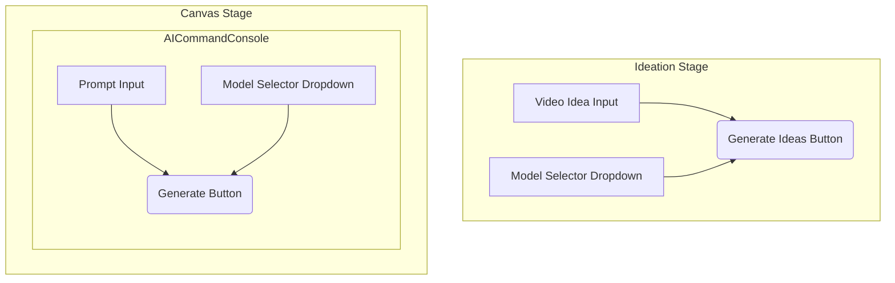

# Clickatron Model Integration Specification

This document outlines the technical architecture for integrating a multi-model selector into the Clickatron application.

## 1. Model Configuration

A new configuration file, `lib/config/clickatron-models.ts`, will be created to store model information. This file will export a configuration object providing a single source of truth for all model-related details.

### 1.1. Data Structures

The following Zod schemas and TypeScript types will define the structure of the model configuration.

```typescript
// lib/config/clickatron-models.ts

import { z } from 'zod';

/**
 * Defines the stages where a model can be used.
 * - 'ideation': For generating initial concepts.
 * - 'edit': For generative edits in the canvas.
 */
export const ModelStageSchema = z.enum(['ideation', 'edit']);
export type ModelStage = z.infer<typeof ModelStageSchema>;

/**
 * Defines the type of model.
 * - 'text-to-image': Generates an image from a text prompt.
 * - 'image-to-image': Generates an image from a text prompt and a source image.
 */
export const ModelTypeSchema = z.enum(['text-to-image', 'image-to-image']);
export type ModelType = z.infer<typeof ModelTypeSchema>;

/**
 * Defines the schema for a single AI model's configuration.
 */
export const ModelConfigSchema = z.object({
  id: z.string().min(1),
  name: z.string().min(1),
  stages: z.array(ModelStageSchema).min(1),
  type: ModelTypeSchema,
  isDefault: z.boolean().optional(),
  parameters: z.object({
    prompt: z.string().min(1),
    image_url: z.string().optional(),
    image_urls: z.array(z.string()).optional(),
    aspect_ratio: z.string().optional(),
  }),
  constraints: z.object({
    promptMaxLength: z.number().optional(),
    allowedAspectRatios: z.array(z.string()).optional(),
    maxImages: z.number().optional(),
  }),
});

export type ModelConfig = z.infer<typeof ModelConfigSchema>;

/**
 * A map of all available models, keyed by their unique ID.
 */
export const CLICKATRON_MODELS: Record<string, ModelConfig> = {
  // Model definitions will go here
};
```

### 1.2. Example Model Definitions

Here are examples of how different models would be defined within `CLICKATRON_MODELS`.

```typescript
// lib/config/clickatron-models.ts

// ... (imports and type definitions from above)

export const CLICKATRON_MODELS: Record<string, ModelConfig> = {
  'fal-ai/flux-kontext/dev': {
    id: 'fal-ai/flux-kontext/dev',
    name: 'Flux Kontext Dev',
    stages: ['ideation', 'edit'],
    type: 'image-to-image',
    isDefault: true,
    parameters: {
      prompt: 'prompt',
      image_url: 'image_url',
      aspect_ratio: 'aspect_ratio',
    },
    constraints: {
      promptMaxLength: 1024,
      allowedAspectRatios: ['1:1', '16:9', '9:16', '4:3', '3:4'],
      maxImages: 1,
    },
  },
  'fal-ai/stable-diffusion-xl': {
    id: 'fal-ai/stable-diffusion-xl',
    name: 'Stable Diffusion XL',
    stages: ['ideation'],
    type: 'text-to-image',
    parameters: {
      prompt: 'prompt',
      aspect_ratio: 'aspect_ratio',
    },
    constraints: {
      promptMaxLength: 512,
      allowedAspectRatios: ['1:1', '16:9', '9:16'],
    },
  },
};
---

## 2. Schema and API Endpoint Modifications

To support model selection, the `Variation` schema and associated API endpoints will be updated to include the `modelId`.

### 2.1. Schema Changes (`schemas/Clickatron.ts`)

The `Variation` interface and Zod schema in `schemas/Clickatron.ts` will be updated to make the `modelId` a required field. The existing `modelUsed` field will be renamed to `modelId` for clarity and consistency.

**Current `Variation` interface:**
```typescript
export interface Variation {
  // ... existing fields
  modelUsed?: string;
  // ... existing fields
}
```

**Proposed `Variation` interface:**
```typescript
export interface Variation {
  // ... existing fields
  modelId: string; // Renamed from modelUsed and now required
  // ... existing fields
}
```

The corresponding Mongoose schema (`ClickatronSchema`) will be updated to reflect this change, making `modelId` a required string.

### 2.2. API Endpoint Changes

The following API endpoints will be modified to accept a `modelId`.

#### 2.2.1. `POST /api/services/clickatron/session/:id/ideas/select`

This endpoint, used during the Ideation stage, will be updated to accept a `modelId`. If no `modelId` is provided, the default model will be used.

**Updated `SelectIdeaRequest` in `types/clickatron.ts`:**
```typescript
export interface SelectIdeaRequest {
  selectedIdea: Idea;
  modelId?: string; // Optional: If not provided, the default model is used
}

export const SelectIdeaRequestSchema = z.object({
  selectedIdea: z.object({
    id: z.string(),
    title: z.string(),
    description: z.string(),
    prompt: z.string(),
  }),
  modelId: z.string().optional(),
});
```

#### 2.2.2. `POST /api/services/clickatron/session/:id/variation`

This endpoint, used for generative edits in the Canvas stage, will be updated to require a `modelId`.

**Updated `CreateVariationRequest` in `types/clickatron.ts`:**
```typescript
export interface CreateVariationRequest {
  prompt: string;
  modelId: string; // Now required
  parentVariationId?: string;
  fineTuning?: FineTuningControls;
  referenceImages?: string[];
  metadata?: Record<string, any>;
}

export const CreateVariationRequestSchema = z.object({
  prompt: z.string().min(1, "Prompt is required"),
  modelId: z.string().min(1, "Model ID is required"),
  parentVariationId: z.string().optional(),
  // ... other fields remain the same
});
```
---

## 3. Backend Worker Logic (`/api/internal/workers/clickatron/variation/route.ts`)

The QStash worker is responsible for processing the image generation job. It will be modified to dynamically construct the payload for the `fal.stream` or `fal.subscribe` call based on the `modelId` and the model configuration.

### 3.1. Dynamic Payload Construction

The worker will perform the following steps:

1.  **Retrieve Model Configuration**: Look up the model's configuration from `CLICKATRON_MODELS` using the `modelId` from the variation.
2.  **Validate Inputs**: Before making the API call, validate the inputs (e.g., prompt length, aspect ratio) against the constraints defined in the model's configuration.
3.  **Construct Payload**: Dynamically build the payload for the `fal` API call using the parameter names defined in the model's configuration.

### 3.2. Pseudocode for Worker Modifications

The following pseudocode illustrates the required changes to the worker's logic.

```typescript
// /api/internal/workers/clickatron/variation/route.ts

import { CLICKATRON_MODELS } from '@/lib/config/clickatron-models';
import { fal } from '@/lib/fal'; // Assuming a fal client library

// ... (existing worker code)

export async function POST(req: Request) {
  // ... (existing job retrieval and validation logic)

  const { variationId, sessionId, userId, prompt } = await req.json();

  // 1. Fetch the variation from the database to get the modelId
  const variation = await getVariation(sessionId, variationId);
  const modelId = variation.modelId;

  // 2. Retrieve the model configuration
  const modelConfig = CLICKATRON_MODELS[modelId];

  if (!modelConfig) {
    // Handle error: model not found
    return new Response(`Model with ID ${modelId} not found.`, { status: 400 });
  }

  // 3. Construct the payload dynamically
  const payload: Record<string, any> = {
    [modelConfig.parameters.prompt]: prompt,
  };

  if (modelConfig.parameters.aspect_ratio && variation.aspectRatio) {
    payload[modelConfig.parameters.aspect_ratio] = variation.aspectRatio;
  }

  if (modelConfig.type === 'image-to-image' && variation.parentVariationId) {
    const parentVariation = await getVariation(sessionId, variation.parentVariationId);
    if (parentVariation && parentVariation.imageRef) {
      // Assuming imageRef is a URL accessible by the AI model
      payload[modelConfig.parameters.image_url] = parentVariation.imageRef;
    }
  }

  // 4. Call the AI model API
  try {
    const result = await fal.subscribe(modelConfig.id, {
      input: payload,
      // ... other options
    });

    // ... (handle the result and update the variation status)

  } catch (error) {
    // ... (handle errors)
  }

  // ... (existing worker code)
}
```
---

## 4. UI/UX Design for Model Selector

The model selector will be a simple dropdown menu, providing a consistent user experience at both the Ideation and Canvas stages.

### 4.1. Ideation Stage

-   **Location**: A dropdown menu will be placed prominently within the Ideation stage UI, likely near the "Generate Ideas" button.
-   **Content**: The dropdown will list all available models that are designated for the `ideation` stage in their configuration.
-   **Behavior**:
    -   The default model will be selected initially.
    -   When the user selects a different model, its `modelId` will be stored in the component's state.
    -   When the user selects an idea, the `modelId` will be included in the `selectIdea` API call.

### 4.2. Canvas Stage (`AICommandConsole`)

-   **Location**: A dropdown menu will be added to the `AICommandConsole` component, likely next to the prompt input field.
-   **Content**: The dropdown will only show models that are suitable for the `edit` stage (i.e., image-to-image models). This will be determined by filtering the models from `CLICKATRON_MODELS` based on the `stages` property.
-   **Behavior**:
    -   The default model for the `edit` stage will be selected initially.
    -   When the user selects a different model, its `modelId` will be stored in the component's state.
    -   When the user submits a prompt, the selected `modelId` will be included in the `createVariation` API call.

### 4.3. Component Mockup (Mermaid Diagram)

The following diagram illustrates the placement of the model selector in both stages.

