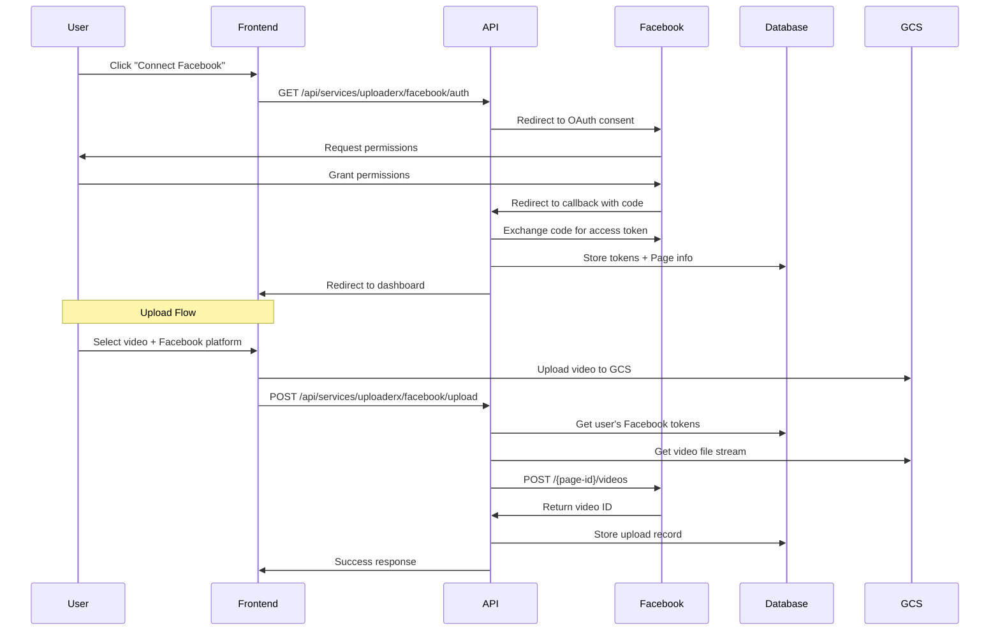
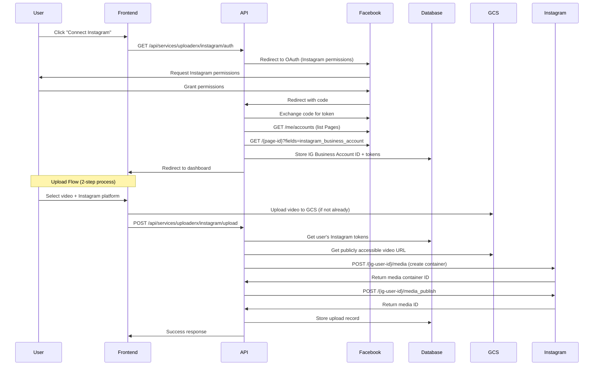

# Facebook & Instagram Posting Integration Plan

## Executive Summary

This document outlines the complete implementation plan for adding Facebook and Instagram posting capabilities to the UploaderX service, alongside the existing YouTube functionality. The integration will support platform-specific settings, OAuth authentication, and automated posting workflows.

---

## 1. Current Architecture Analysis

### Existing Implementation (YouTube)
- **Frontend**: React components with platform selection UI
- **Backend**: Node.js API routes with Google OAuth2
- **Storage**: Google Cloud Storage (GCS) for video files
- **Database**: MongoDB for tracking uploads and user tokens
- **Authentication**: Clerk for user management + OAuth tokens stored per user

### Current Flow:
1. User uploads video to GCS via signed URL
2. Video metadata stored in MongoDB (`uploaderxes` collection)
3. User authenticates with YouTube via OAuth
4. OAuth tokens stored in user document
5. Video posted to YouTube using stored tokens

---

## 2. Platform APIs Overview

### 2.1 Instagram Graph API (Business/Creator Accounts)

**Required Access:**
- Instagram Business or Creator account
- Facebook Page linked to Instagram account
- Facebook App with Instagram Graph API permissions

**Key APIs:**
- `POST /{ig-user-id}/media` - Create media container
- `POST /{ig-user-id}/media_publish` - Publish the media
- `GET /{ig-user-id}/media` - Get media status

**Content Requirements:**
- **Reels**: MP4, max 60 seconds, 1080x1920 (9:16)
- **Feed Videos**: MP4, 3-60 minutes, various aspect ratios
- **Stories**: MP4, max 15 seconds, 1080x1920 (9:16)

**Rate Limits:**
- 25 API calls per IG User per 24 hours for media publishing
- 200 API calls per hour per app

### 2.2 Facebook Graph API (Pages)

**Required Access:**
- Facebook Page (personal profiles cannot post via API)
- Facebook App with Pages API permissions
- Page access token

**Key APIs:**
- `POST /{page-id}/videos` - Upload and publish video
- `POST /{page-id}/video_reels` - Post Reels
- `GET /{page-id}/videos` - List videos

**Content Requirements:**
- **Reels**: MP4, 3-90 seconds, 1080x1920 (9:16)
- **Feed Videos**: MP4, up to 10GB, various aspect ratios
- File size: Max 10GB for regular uploads

**Rate Limits:**
- 200 API calls per hour per user
- 75 videos per 20 minutes per page

---

## 3. Required Credentials & App Setup

### 3.1 Facebook App Configuration

**You'll need to create a Facebook App at:** https://developers.facebook.com/apps/

**Required App Settings:**
1. **App Type**: Business
2. **App ID & Secret** (for OAuth)
3. **Add Products**:
   - Facebook Login
   - Instagram Graph API (for Instagram posting)
   - Pages API (for Facebook posting)

**Permissions Needed:**

For **Instagram**:
- `instagram_basic` - Basic profile info
- `instagram_content_publish` - Publish content
- `pages_read_engagement` - Read Page content
- `pages_show_list` - List Pages user manages

For **Facebook**:
- `pages_manage_posts` - Create, edit and delete Posts
- `pages_read_engagement` - Read Page content
- `pages_show_list` - List Pages
- `publish_video` - Upload and publish videos

**App Review**:
- Standard permissions don't require review
- Advanced permissions (e.g., `pages_manage_posts`) **require Facebook App Review**
- Review process can take 1-3 weeks
- Must provide detailed use case, screen recordings, test credentials

### 3.2 Instagram Business Account Setup

**Prerequisites**:
1. Instagram account must be a **Business** or **Creator** account
2. Instagram account must be connected to a Facebook Page
3. User must have admin/editor role on that Page

**Setup Steps**:
1. Convert Instagram to Business account (in app settings)
2. Connect to Facebook Page via Instagram settings
3. Ensure Page has proper permissions

### 3.3 Environment Variables Required

```env
# Facebook/Instagram OAuth
FACEBOOK_APP_ID=your_facebook_app_id
FACEBOOK_APP_SECRET=your_facebook_app_secret
FACEBOOK_REDIRECT_URI=https://yourdomain.com/api/services/uploaderx/facebook/callback

# Instagram Graph API
INSTAGRAM_GRAPH_API_VERSION=v21.0

# Facebook Graph API
FACEBOOK_GRAPH_API_VERSION=v21.0

# App Access Token (optional, for certain operations)
FACEBOOK_APP_ACCESS_TOKEN=your_app_access_token
```

---

## 4. Implementation Architecture

### 4.1 Database Schema Updates

**Update `uploaderx.ts` schema:**

```typescript
export interface IUploaderX extends Document {
  // ... existing fields
  
  // Add platform-specific tokens
  facebookTokens?: {
    accessToken: string;
    expiresAt: Date;
    scopes: string[];
    pageId?: string;
    pageName?: string;
  };
  
  instagramTokens?: {
    accessToken: string;
    expiresAt: Date;
    scopes: string[];
    instagramBusinessAccountId?: string;
    instagramUsername?: string;
    facebookPageId?: string; // Required for Instagram posting
  };
  
  // Platform-specific upload history
  platformUploads?: {
    platform: 'youtube' | 'facebook' | 'instagram';
    platformVideoId: string;
    uploadedAt: Date;
    status: 'pending' | 'processing' | 'published' | 'failed';
    metadata?: any;
  }[];
}
```

### 4.2 API Routes Structure

```
app/api/services/uploaderx/
├── facebook/
│   ├── auth/route.ts           # Initiate Facebook OAuth
│   ├── callback/route.ts       # Handle OAuth callback
│   ├── pages/route.ts          # List user's Pages
│   ├── upload/route.ts         # Upload video to Facebook
│   └── status/route.ts         # Check connection status
├── instagram/
│   ├── auth/route.ts           # Initiate Instagram OAuth (via Facebook)
│   ├── callback/route.ts       # Handle OAuth callback
│   ├── accounts/route.ts       # List connected IG Business accounts
│   ├── upload/route.ts         # Upload video to Instagram
│   └── status/route.ts         # Check connection status
└── gcs/
    └── ... (existing GCS routes)
```

### 4.3 Frontend Components

**New Components Needed:**

1. **FacebookConnectionStatus.tsx**
   - Show connected Page info
   - Authenticate/disconnect button
   - Display permissions granted

2. **InstagramConnectionStatus.tsx**
   - Show connected IG Business account
   - Authenticate/disconnect button
   - Display account username and Page linkage

3. **PlatformSelector.tsx** (update existing)
   - Add Facebook/Instagram checkboxes
   - Show connection status for each platform
   - Quick connect buttons

4. **Platform-Specific Settings** (already exists in PlatformEditor.tsx)
   - ✅ Instagram settings already designed
   - ✅ Facebook settings already designed

---

## 5. Implementation Flow

### 5.1 Facebook Posting Flow



### 5.2 Instagram Posting Flow



---

## 6. Detailed Implementation Steps

### Phase 1: Facebook Integration (Week 1-2)

#### Step 1.1: Create Facebook App
- [ ] Go to https://developers.facebook.com/apps/
- [ ] Create new app (Business type)
- [ ] Add Facebook Login product
- [ ] Configure OAuth redirect URIs
- [ ] Add `pages_manage_posts`, `pages_show_list` permissions
- [ ] Submit for App Review (if needed)

#### Step 1.2: Backend - OAuth Routes
```typescript
// app/api/services/uploaderx/facebook/auth/route.ts
export async function GET(req: Request) {
  const authUrl = `https://www.facebook.com/v21.0/dialog/oauth?` +
    `client_id=${process.env.FACEBOOK_APP_ID}` +
    `&redirect_uri=${encodeURIComponent(process.env.FACEBOOK_REDIRECT_URI!)}` +
    `&scope=pages_manage_posts,pages_read_engagement,pages_show_list` +
    `&state=${generateState()}`;
  
  return NextResponse.redirect(authUrl);
}
```

#### Step 1.3: Backend - Callback Handler
```typescript
// app/api/services/uploaderx/facebook/callback/route.ts
export async function GET(req: Request) {
  const { code } = await req.json();
  
  // Exchange code for access token
  const tokenResponse = await fetch(
    `https://graph.facebook.com/v21.0/oauth/access_token?` +
    `client_id=${process.env.FACEBOOK_APP_ID}` +
    `&client_secret=${process.env.FACEBOOK_APP_SECRET}` +
    `&redirect_uri=${process.env.FACEBOOK_REDIRECT_URI}` +
    `&code=${code}`
  );
  
  const { access_token, expires_in } = await tokenResponse.json();
  
  // Get user's Pages
  const pagesResponse = await fetch(
    `https://graph.facebook.com/v21.0/me/accounts?access_token=${access_token}`
  );
  
  const { data: pages } = await pagesResponse.json();
  
  // Store token in DB
  await UploaderX.findOneAndUpdate(
    { email: userEmail },
    {
      facebookTokens: {
        accessToken: pages[0].access_token, // Use Page token
        expiresAt: new Date(Date.now() + expires_in * 1000),
        pageId: pages[0].id,
        pageName: pages[0].name,
      }
    }
  );
}
```

#### Step 1.4: Backend - Upload Route
```typescript
// app/api/services/uploaderx/facebook/upload/route.ts
export async function POST(req: Request) {
  const { gcsPath, title, description, videoUuid } = await req.json();
  
  // Get user tokens
  const user = await UploaderX.findOne({ email: userEmail });
  const { accessToken, pageId } = user.facebookTokens;
  
  // Get video URL (must be publicly accessible)
  const videoUrl = await getPublicGCSUrl(gcsPath);
  
  // Upload to Facebook
  const response = await fetch(
    `https://graph.facebook.com/v21.0/${pageId}/videos`,
    {
      method: 'POST',
      headers: { 'Content-Type': 'application/json' },
      body: JSON.stringify({
        access_token: accessToken,
        file_url: videoUrl,
        title,
        description,
      })
    }
  );
  
  const { id: facebookVideoId } = await response.json();
  
  // Save to DB
  await UploaderX.findOneAndUpdate(
    { videoUuid },
    {
      $push: {
        platformUploads: {
          platform: 'facebook',
          platformVideoId: facebookVideoId,
          uploadedAt: new Date(),
          status: 'published'
        }
      }
    }
  );
}
```

#### Step 1.5: Frontend - Connection Component
```typescript
// components/dashboard/UploaderX/FacebookConnectionStatus.tsx
export function FacebookConnectionStatus() {
  const [connected, setConnected] = useState(false);
  const [pageInfo, setPageInfo] = useState(null);
  
  const handleConnect = () => {
    window.location.href = '/api/services/uploaderx/facebook/auth';
  };
  
  return (
    <Card>
      {connected ? (
        <div>
          <CheckCircle className="text-green-500" />
          <p>Connected to {pageInfo.name}</p>
        </div>
      ) : (
        <Button onClick={handleConnect}>
          <Facebook /> Connect Facebook Page
        </Button>
      )}
    </Card>
  );
}
```

### Phase 2: Instagram Integration (Week 3-4)

#### Step 2.1: Update Facebook App
- [ ] Add Instagram Graph API product
- [ ] Add Instagram permissions: `instagram_basic`, `instagram_content_publish`
- [ ] Submit for App Review with Instagram permissions

#### Step 2.2: Backend - OAuth Routes
```typescript
// app/api/services/uploaderx/instagram/auth/route.ts
export async function GET(req: Request) {
  // Instagram OAuth goes through Facebook with IG permissions
  const authUrl = `https://www.facebook.com/v21.0/dialog/oauth?` +
    `client_id=${process.env.FACEBOOK_APP_ID}` +
    `&redirect_uri=${encodeURIComponent(process.env.FACEBOOK_REDIRECT_URI!)}` +
    `&scope=instagram_basic,instagram_content_publish,pages_show_list,pages_read_engagement` +
    `&state=${generateState()}`;
  
  return NextResponse.redirect(authUrl);
}
```

#### Step 2.3: Backend - Instagram Upload Route (2-Step Process)
```typescript
// app/api/services/uploaderx/instagram/upload/route.ts
export async function POST(req: Request) {
  const { gcsPath, caption, videoType } = await req.json();
  
  // Get user tokens
  const user = await UploaderX.findOne({ email: userEmail });
  const { accessToken, instagramBusinessAccountId } = user.instagramTokens;
  
  // Get publicly accessible video URL
  const videoUrl = await getPublicGCSUrl(gcsPath);
  
  // Step 1: Create media container
  const mediaType = videoType === 'reel' ? 'REELS' : 'VIDEO';
  const containerResponse = await fetch(
    `https://graph.facebook.com/v21.0/${instagramBusinessAccountId}/media`,
    {
      method: 'POST',
      body: JSON.stringify({
        media_type: mediaType,
        video_url: videoUrl,
        caption,
        access_token: accessToken,
      })
    }
  );
  
  const { id: containerId } = await containerResponse.json();
  
  // Step 2: Publish media (after Instagram processes it)
  // Note: May need to poll for container status first
  await waitForContainerReady(containerId, accessToken);
  
  const publishResponse = await fetch(
    `https://graph.facebook.com/v21.0/${instagramBusinessAccountId}/media_publish`,
    {
      method: 'POST',
      body: JSON.stringify({
        creation_id: containerId,
        access_token: accessToken,
      })
    }
  );
  
  const { id: instagramMediaId } = await publishResponse.json();
  
  return NextResponse.json({ success: true, mediaId: instagramMediaId });
}
```

### Phase 3: Platform-Specific Settings (Week 5)

#### Step 3.1: Update UploadForm.tsx
```typescript
// Add platform-specific validation
const handleSubmit = async () => {
  // Validate based on selected platforms
  if (selectedPlatforms.instagram) {
    if (videoFile.duration > 90) {
      toast({ title: "Instagram Error", description: "Reels must be under 90 seconds" });
      return;
    }
  }
  
  if (selectedPlatforms.facebook) {
    if (videoFile.size > 10 * 1024 * 1024 * 1024) {
      toast({ title: "Facebook Error", description: "File too large (max 10GB)" });
      return;
    }
  }
  
  // Upload logic...
};
```

#### Step 3.2: Update PlatformEditor.tsx
- [✅] Instagram settings UI already exists
- [✅] Facebook settings UI already exists
- [ ] Add API integration to save/load platform-specific data

### Phase 4: Testing & Edge Cases (Week 6)

#### Step 4.1: Token Refresh Logic
```typescript
// Implement automatic token refresh for expired tokens
async function refreshFacebookToken(userId: string) {
  const user = await UploaderX.findById(userId);
  const { accessToken } = user.facebookTokens;
  
  const response = await fetch(
    `https://graph.facebook.com/v21.0/oauth/access_token?` +
    `grant_type=fb_exchange_token` +
    `&client_id=${process.env.FACEBOOK_APP_ID}` +
    `&client_secret=${process.env.FACEBOOK_APP_SECRET}` +
    `&fb_exchange_token=${accessToken}`
  );
  
  const { access_token, expires_in } = await response.json();
  
  await UploaderX.findByIdAndUpdate(userId, {
    'facebookTokens.accessToken': access_token,
    'facebookTokens.expiresAt': new Date(Date.now() + expires_in * 1000)
  });
}
```

#### Step 4.2: Error Handling
- [ ] Handle rate limit errors (429)
- [ ] Handle permission errors (403)
- [ ] Handle token expiration
- [ ] Handle video processing delays (Instagram)
- [ ] Handle file size/format validation

#### Step 4.3: Testing Checklist
- [ ] Test Facebook Page posting
- [ ] Test Instagram Reels posting
- [ ] Test Instagram Feed video posting
- [ ] Test multi-platform simultaneous upload
- [ ] Test token refresh
- [ ] Test error scenarios
- [ ] Test with different video formats/sizes

---

## 7. Technical Challenges & Solutions

### Challenge 1: Instagram Requires Public URLs
**Problem**: Instagram Graph API requires publicly accessible video URLs

**Solutions**:
1. **Generate signed GCS URLs with longer expiration**
   ```typescript
   const [signedUrl] = await bucket.file(gcsPath).getSignedUrl({
     version: 'v4',
     action: 'read',
     expires: Date.now() + 60 * 60 * 1000, // 1 hour
   });
   ```

2. **Make bucket/file temporarily public**
   ```typescript
   await bucket.file(gcsPath).makePublic();
   // Upload to Instagram
   await bucket.file(gcsPath).makePrivate();
   ```

3. **Use a proxy endpoint** (recommended for security)
   ```typescript
   // app/api/services/uploaderx/proxy/[videoUuid]/route.ts
   export async function GET(req: Request, { params }) {
     const { videoUuid } = params;
     const file = await getGCSFile(videoUuid);
     const stream = file.createReadStream();
     
     return new Response(stream, {
       headers: {
         'Content-Type': 'video/mp4',
         'Content-Length': file.metadata.size,
       }
     });
   }
   ```

### Challenge 2: Instagram Two-Step Upload Process
**Problem**: Instagram requires creating a container, waiting for processing, then publishing

**Solution**: Implement polling mechanism
```typescript
async function waitForContainerReady(containerId: string, token: string) {
  let attempts = 0;
  const maxAttempts = 30;
  
  while (attempts < maxAttempts) {
    const response = await fetch(
      `https://graph.facebook.com/v21.0/${containerId}?fields=status_code&access_token=${token}`
    );
    
    const { status_code } = await response.json();
    
    if (status_code === 'FINISHED') return true;
    if (status_code === 'ERROR') throw new Error('Instagram processing failed');
    
    await sleep(2000); // Wait 2 seconds
    attempts++;
  }
  
  throw new Error('Container processing timeout');
}
```

### Challenge 3: Token Management
**Problem**: Multiple platforms with different token expiration times

**Solution**: Unified token manager
```typescript
// lib/tokenManager.ts
export class TokenManager {
  async getValidToken(userId: string, platform: 'youtube' | 'facebook' | 'instagram') {
    const user = await UploaderX.findById(userId);
    const tokens = user[`${platform}Tokens`];
    
    if (!tokens) throw new Error(`No ${platform} token found`);
    
    if (new Date() >= tokens.expiresAt) {
      return await this.refreshToken(userId, platform);
    }
    
    return tokens.accessToken;
  }
  
  async refreshToken(userId: string, platform: string) {
    // Platform-specific refresh logic
  }
}
```

---

## 8. Security Considerations

### 8.1 OAuth State Parameter
- Generate and validate CSRF tokens for OAuth flows
- Store state in Redis with short TTL

### 8.2 Token Storage
- Encrypt tokens at rest in MongoDB
- Never expose tokens in API responses
- Use environment variables for app secrets

### 8.3 Rate Limiting
- Implement request throttling per user
- Queue uploads to avoid hitting rate limits
- Show clear error messages when limits exceeded

### 8.4 Permissions Scope
- Request minimum required permissions
- Allow users to revoke access easily
- Display what data is accessed

---

## 9. UI/UX Enhancements

### 9.1 Connection Status Dashboard
```tsx
<div className="grid grid-cols-3 gap-4">
  <YouTubeConnectionStatus />
  <FacebookConnectionStatus />
  <InstagramConnectionStatus />
</div>
```

### 9.2 Upload Progress Indicators
- Show per-platform upload status
- Display processing status for Instagram
- Show published URLs/links

### 9.3 Platform Requirements Warning
```tsx
{selectedPlatforms.instagram && videoFile?.duration > 90 && (
  <Alert variant="destructive">
    Instagram Reels must be under 90 seconds
  </Alert>
)}
```

---

## 10. Testing Strategy

### 10.1 Development Testing
- Use Facebook Test Users
- Use Instagram Test accounts
- Test in Sandbox mode before production

### 10.2 Manual Testing Checklist
- [ ] OAuth flow for each platform
- [ ] Token refresh mechanism
- [ ] Video upload to each platform
- [ ] Platform-specific settings application
- [ ] Multi-platform simultaneous upload
- [ ] Error handling (network, API errors)
- [ ] Rate limit handling

### 10.3 Automated Tests (Future)
- Unit tests for token management
- Integration tests for API routes
- End-to-end tests for upload flow

---

## 11. Deployment Checklist

### 11.1 Pre-Deployment
- [ ] Create Facebook App
- [ ] Submit for App Review
- [ ] Add environment variables to Vercel/hosting
- [ ] Update MongoDB schema
- [ ] Test in staging environment

### 11.2 Deployment
- [ ] Deploy backend API routes
- [ ] Deploy frontend components
- [ ] Monitor error logs
- [ ] Test OAuth flows in production

### 11.3 Post-Deployment
- [ ] Monitor API usage
- [ ] Track upload success rates
- [ ] Gather user feedback
- [ ] Optimize performance

---

## 12. Required Company Credentials Summary

### From Facebook Developers:
1. **Facebook App ID** - From app dashboard
2. **Facebook App Secret** - From app settings
3. **App Review** - For production use of certain permissions

### From Users (OAuth):
1. **Facebook Page Access** - User must be admin/editor of a Page
2. **Instagram Business Account** - User's IG must be business account linked to Page

### GCP Configuration:
- Existing GCS setup will work
- May need to configure CORS for public URL access
- Consider signed URL duration settings

### MongoDB:
- Schema updates for new token fields
- No additional credentials needed

---

## 13. Estimated Timeline

| Phase | Duration | Description |
|-------|----------|-------------|
| **Phase 1**: Facebook Integration | 2 weeks | OAuth, upload API, frontend |
| **Phase 2**: Instagram Integration | 2 weeks | OAuth, 2-step upload, frontend |
| **Phase 3**: Platform Settings | 1 week | UI polish, settings persistence |
| **Phase 4**: Testing & QA | 1 week | Edge cases, error handling |
| **Phase 5**: App Review | 1-3 weeks | Facebook's review process |
| **Total** | **7-9 weeks** | |

---

## 14. Alternative Approaches

### Option A: Use Third-Party Services
**Services**: Buffer, Hootsuite API, Later API

**Pros**:
- Simpler implementation
- Handles token refresh automatically
- Multi-platform support out of the box

**Cons**:
- Additional cost per user
- Less control over upload flow
- Dependency on third-party service

### Option B: Direct API Integration (Recommended)
**Current Plan**

**Pros**:
- Full control
- No per-user costs
- Better user experience
- Direct integration

**Cons**:
- More development time
- Need to handle token management
- App review process

---

## 15. Future Enhancements

### Phase 2 Features:
- [ ] TikTok integration
- [ ] Twitter/X video posting
- [ ] LinkedIn video posting
- [ ] Cross-posting analytics
- [ ] Scheduled posting
- [ ] Bulk upload
- [ ] Video editing before upload
- [ ] Auto-generate captions per platform
- [ ] Hashtag suggestions
- [ ] Performance analytics dashboard

---

## 16. Documentation & Resources

### Official Documentation:
- [Facebook Graph API](https://developers.facebook.com/docs/graph-api)
- [Instagram Graph API](https://developers.facebook.com/docs/instagram-api)
- [Facebook Marketing API](https://developers.facebook.com/docs/marketing-apis)
- [Facebook App Review](https://developers.facebook.com/docs/app-review)

### Code Examples:
- [Facebook SDK for Node.js](https://github.com/node-facebook/facebook-nodejs-sdk)
- [Instagram Basic Display API](https://developers.facebook.com/docs/instagram-basic-display-api)

### Testing Tools:
- [Facebook Graph API Explorer](https://developers.facebook.com/tools/explorer/)
- [Access Token Debugger](https://developers.facebook.com/tools/debug/accesstoken/)

---

## 17. Support & Maintenance

### Monitoring:
- Track OAuth success/failure rates
- Monitor upload success rates per platform
- Alert on token expiration issues
- Track API rate limit usage

### User Support:
- Help docs for connecting accounts
- Troubleshooting guide for common issues
- Video tutorials for setup process

---

## Conclusion

This comprehensive plan provides a clear roadmap for implementing Facebook and Instagram posting capabilities. The integration leverages your existing GCS and MongoDB infrastructure while adding robust OAuth handling and platform-specific features.

**Key Success Factors:**
1. Proper Facebook App configuration and review
2. Secure token management
3. Robust error handling
4. Clear user guidance for account connection
5. Testing across all edge cases

**Next Steps:**
1. Create Facebook App and configure settings
2. Begin Phase 1 (Facebook Integration)
3. Test extensively with test accounts
4. Submit for App Review
5. Deploy to production

The estimated timeline of 7-9 weeks accounts for development, testing, and the Facebook App Review process. The architecture is designed to be scalable and maintainable, with clear separation of concerns between platforms.
