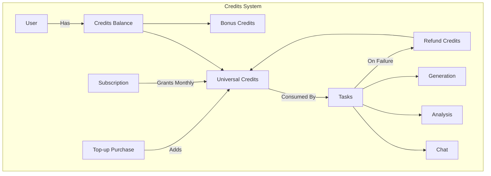
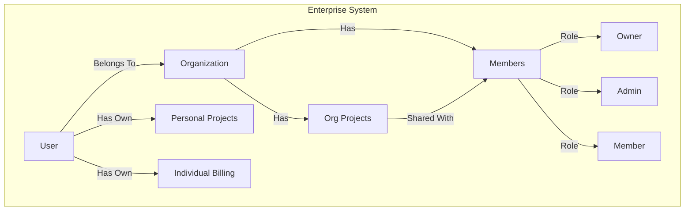

# Feature Feasibility Assessment

## Executive Summary

Both features are **feasible** and well-suited to your current architecture. The credits system is a natural evolution of your existing service usage tracking. The enterprise system requires new schema additions but has minimal impact on existing code.

---

## Feature 1: Credits-Based Usage Billing

### Current State Analysis

Your current billing architecture is already sophisticated:

| Component | Current Implementation |
|-----------|----------------------|
| **Service Limits** | Per-service limits tracked in [serviceLimits.ts](file:///Users/akshit2434/github/Front-end/lib/config/serviceLimits.ts) with categories: count, duration, storage |
| **Usage Tracking** | Comprehensive [serviceUsageService.ts](file:///Users/akshit2434/github/Front-end/lib/services/serviceUsageService.ts) (638 lines) with auto-reset, lazy reset, and period-based resets |
| **Subscriptions** | Razorpay via [paymentService.ts](file:///Users/akshit2434/github/Front-end/lib/services/paymentService.ts) with webhooks in [route.ts](file:///Users/akshit2434/github/Front-end/app/api/webhooks/razorpay/route.ts) |
| **Refunds** | [refundService.ts](file:///Users/akshit2434/github/Front-end/lib/services/refundService.ts) with full/partial refund support |
| **Plans** | Free, Plus, Pro, Premium with multi-currency pricing (8 currencies) |
| **Services** | Alyzitron, Editron, ThinkForge, Musitron, Clickatron, Shield |

### Why This Is Feasible ✅

1. **ServiceUsageService already tracks usage per task** - the `useService()` method increments usage atomically
2. **Auto-reset logic exists** - can be adapted for credit expiry
3. **Refund infrastructure is in place** - can be repurposed for credit refunds on task failures
4. **Multi-currency support** - already handles 8 currencies for credit purchases

### Proposed Architecture



### Schema Changes Required

```typescript
// NEW: Credits schema (add to user.ts)
interface ICreditsBalance {
  universalCredits: number;
  bonusCredits: number;
  lastTopupDate?: Date;
  creditHistory: ICreditTransaction[];
}

interface ICreditTransaction {
  id: string;
  type: 'subscription_grant' | 'topup' | 'usage' | 'refund' | 'expiry';
  amount: number;
  service?: string;
  taskId?: string;
  model?: string;
  timestamp: Date;
  balanceAfter: number;
}

// NEW: Credit cost configuration
interface ICreditCost {
  service: string;
  action: string;
  baseCost: number;
  modelMultipliers: Record<string, number>; // e.g., {"gpt-4": 2, "gpt-3.5": 1}
}
```

### Implementation Status ✅

| Phase | Task | Status | Effort | Notes |
|-------|------|--------|--------|-------|
| 1 | Add `creditsBalance` to User schema | ✅ DONE | Low | Implemented in `schemas/user.ts` |
| 2 | Create `creditsService.ts` with balance/deduct/refund | ✅ DONE | Medium | Implemented in `lib/services/creditsService.ts` |
| 3 | Create credit cost config per service/model | ✅ DONE | Low | Configured in `lib/config/creditCosts.ts` |
| 4 | Modify service endpoints to check/deduct credits | ✅ DONE | Medium | Integrated in Alyzitron, Musitron, ThinkForge, Clickatron |
| 5 | Add webhook handler for subscription credits | ✅ DONE | Low | Added to Razorpay webhooks handler |
| 6 | Add top-up purchase flow (Razorpay) | ✅ DONE | Medium | Top-up modal and API routes implemented |
| 7 | Add credit refund on task failure | ✅ DONE | Medium | Auto-refund in `handleTaskFailure` and cron job |
| 8 | Create credits dashboard UI | ✅ DONE | Medium | `CreditsCard` and `CreditsBadge` components added |
| **9** | **Editron Token-Based Integration** | ✅ DONE | High | Implemented with `TokenTracker` and Gemini `usageMetadata` |

### Benefits Over Current System

| Current | Credits System |
|---------|---------------|
| Per-service limits (confusing) | Universal credits (simple) |
| Weekly/monthly resets | No forced resets, use what you buy |
| Hard upgrade/downgrade | Flexible credit purchases |
| Complex refund logic | Task-level automatic refunds |

### Estimated Effort

- **Backend:** 3-4 days
- **Frontend:** 2-3 days
- **Testing/Migration:** 2 days

**Total: ~1.5 weeks**

---

## Feature 2: Enterprise System (B2B Organizations)

### Current State Analysis

| Aspect | Finding |
|--------|---------|
| **Organization Support** | ❌ None - users are individual only |
| **Project Ownership** | Single user via `userId` in [project-service.ts](file:///Users/akshit2434/github/Front-end/lib/editron/services/project-service.ts#L83) |
| **Auth Provider** | Clerk - **has built-in organization support** |
| **Asset Ownership** | Per-user GCS paths |

### Why This Is Feasible ✅

1. **Clerk Organizations** - Your auth provider (Clerk) has native org support with invitations, roles, and member management
2. **Individual billing scope** - You specified billing stays at individual level, avoiding complex org billing
3. **Project sharing model** - Simple ownership transfer pattern

### Proposed Architecture



### Schema Changes Required

```typescript
// NEW: Organization schema (new file: schemas/Organization.ts)
interface IOrganization {
  _id: ObjectId;
  clerkOrgId: string;        // Synced from Clerk
  name: string;
  slug: string;
  createdBy: string;         // clerkUserId of creator
  createdAt: Date;
  updatedAt: Date;
  settings: {
    allowMemberProjects: boolean;
    defaultRole: 'admin' | 'member';
  };
}

// NEW: Organization membership (tracked in Clerk, synced to MongoDB for queries)
interface IOrgMember {
  clerkUserId: string;
  clerkOrgId: string;
  role: 'owner' | 'admin' | 'member';
  joinedAt: Date;
  invitedBy?: string;
}

// MODIFY: Project schema - add org context
interface Project {
  // ... existing fields
  orgId?: string;              // NEW: null = personal project
  sharedWith?: string[];       // NEW: explicit user access list
}

// MODIFY: User schema - add org relationships
interface IUser {
  // ... existing fields
  organizations: {
    clerkOrgId: string;
    role: 'owner' | 'admin' | 'member';
    joinedAt: Date;
  }[];
}
```

### Implementation Approach

| Phase | Task | Effort | Risk |
|-------|------|--------|------|
| 1 | Enable Clerk Organizations in Clerk Dashboard | Low | Low |
| 2 | Add Clerk org webhook handlers | Low | Low |
| 3 | Create Organization schema & sync service | Medium | Low |
| 4 | Modify project queries to support org-level access | Medium | Medium |
| 5 | Create org management API routes (`/api/org/[orgId]/members`, etc.) | Medium | Low |
| 6 | Update project-service.ts for org ownership | Medium | Medium |
| 7 | Create org dashboard UI (member list, invite flow) | Medium | Low |
| 8 | Add org context switcher in navbar | Low | Low |

### Key Implementation Details

#### Project Access Control Update

```typescript
// BEFORE (project-service.ts:94)
if (project.userId !== userId) {
  return null; // Access denied
}

// AFTER
async canAccessProject(userId: string, project: Project): Promise<boolean> {
  // Owner always has access
  if (project.userId === userId) return true;
  
  // Check org membership if project belongs to org
  if (project.orgId) {
    const org = await this.getOrganization(project.orgId);
    return org?.members.some(m => m.clerkUserId === userId) ?? false;
  }
  
  // Check explicit sharing
  if (project.sharedWith?.includes(userId)) return true;
  
  return false;
}
```

#### Clerk Webhook Events to Handle

| Event | Action |
|-------|--------|
| `organization.created` | Create org in MongoDB |
| `organization.deleted` | Handle org data cleanup |
| `organizationMembership.created` | Add member to org |
| `organizationMembership.deleted` | Remove member from org |
| `organizationInvitation.accepted` | Update invite status |

### Billing Clarification

Since billing remains **individual**:
- Each org member pays for their own subscription
- Credits are personal, not pooled
- Org admins cannot manage member billing
- This keeps the billing system **unchanged** ✅

### Estimated Effort

- **Backend:** 4-5 days
- **Frontend:** 3-4 days
- **Clerk Config:** 1 day
- **Testing:** 2 days

**Total: ~2 weeks**

---

## Comparison & Recommendation

| Factor | Credits System | Enterprise System |
|--------|---------------|-------------------|
| Complexity | Medium | Medium |
| Risk | Low | Medium |
| Impact on Existing Code | Low | Medium |
| Revenue Impact | Direct monetization | Enables B2B sales |
| Dependencies | None | Clerk Organizations |

### Recommended Order

1. **Credits System First** (1.5 weeks)
   - Standalone improvement
   - Simplifies billing complexity
   - Foundation for per-usage pricing

2. **Enterprise System Second** (2 weeks)
   - Builds on stable credit system
   - Can integrate credit sharing later if needed

---

## Risks & Mitigations

### Credits System Risks

| Risk | Mitigation |
|------|------------|
| Migration of existing users | Grandfather existing limits, auto-convert to credits |
| Credit cost balancing | Start conservative, adjust based on usage data |
| Task failure detection | Wrap all AI calls in consistent error handling |

### Enterprise System Risks

| Risk | Mitigation |
|------|------------|
| Project access conflicts | Clear ownership model with org > user > shared hierarchy |
| Data isolation | Query filters always include org context |
| Clerk dependency | All org data synced to MongoDB for resilience |

---

## Finalized Specifications ✅

| Decision | Choice |
|----------|--------|
| **Credit Expiry** | Subscription-granted credits expire monthly; top-up credits never expire |
| **Model Pricing** | Yes - different credit costs per AI model |
| **Org Access** | Invite-only (no open join requests) |
| **Project Sharing** | No cross-org personal project sharing - org projects are org-owned |

---

## Additional Recommendations

### Credits System Details

| Recommendation | Rationale |
|---------------|-----------|
| **Consume subscription credits first** | They expire monthly - use them before they're lost; top-up credits serve as a non-expiring buffer |
| **Credit balance display** | Show separate subscription vs top-up balances in dashboard |
| **Low credit warnings** | Alert at 20% remaining, block at 0 with upsell prompt |
| **Usage analytics** | Track credits per service/model for pricing optimization |

### Credit Cost Structure (Framework)

> [!NOTE]
> Exact multipliers to be determined based on implemented models in codebase.

| Service | Billing Basis | Notes |
|---------|--------------|-------|
| **ThinkForge** | Per message/action | Multiplier TBD per model (check implemented models in code) |
| **Alyzitron** | Per minute analyzed | Single model currently, flat rate per minute |
| **Editron** | Token-based (input + output) | Like ChatGPT billing - based on tokens consumed by AI operations |
| **Musitron** | Per generation | Multiplier TBD per model |
| **Clickatron** | Per request | Multiplier TBD per model and request type (variation, generation, etc.) |

### Enterprise System Details

| Recommendation | Rationale |
|---------------|-----------|
| **Org roles** | Owner (1, cannot leave), Admin (can manage members), Member (can access projects) |
| **Org project ownership** | Projects created in org context are owned by org, not individual |
| **Member removal** | Removed members lose access immediately but their personal projects remain |
| **Org audit log** | Track member joins, leaves, project creation for compliance |
| **Max orgs per user** | 5 (prevents abuse, can increase for enterprise clients) |
| **Max members per org** | 50 on free tier, unlimited on paid (org-level upgrade potential later) |

### Migration Strategy

1. **Existing users**: Grant credits equivalent to their current plan limits
2. **Existing service usage**: Convert current `currentUsage` to credit consumption history
3. **Transition period**: Run both systems in parallel for 1 billing cycle
