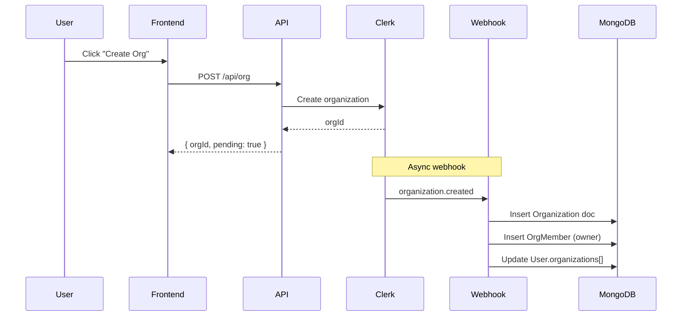

# Enterprise Organizations System

**Status:** ✅ Plan Approved - Ready for Implementation  
**Last Updated:** January 20, 2026

---

## Industry Validation ✅

> [!NOTE]
> This feature follows **standard SaaS B2B patterns** used by major platforms.

Our design aligns with industry best practices:

| Pattern | Our Implementation | Industry Examples |
|---------|-------------------|-------------------|
| **Multi-tenant organizations** | Clerk Organizations with separate data isolation | Slack (workspaces), Vercel (teams), Notion (workspaces) |
| **Role-based access (RBAC)** | Owner → Admin → Member hierarchy | Universal across B2B SaaS |
| **Invite-only membership** | Email invitations via Clerk | Standard for enterprise security |
| **Individual billing per user** | Each member pays own subscription | Figma, Canva, Miro |
| **Org context switching** | OrgSwitcher component in navbar | Slack, Discord, Vercel |
| **Pre-built UI components** | Using Clerk's `<OrganizationSwitcher />`, etc. | Recommended by Clerk |

**Clerk's Organizations feature is specifically designed for this exact use case** - B2B SaaS team collaboration with multi-tenancy.

---

## Overview

B2B Organizations feature enabling team collaboration through Clerk Organizations. Users can create/join organizations, share projects within orgs, and collaborate while maintaining individual billing.

### Key Decisions

| Decision | Choice |
|----------|--------|
| **Auth Provider** | Clerk (native org support) |
| **Billing Model** | Individual (each member pays own subscription) |
| **Org Access** | Invite-only (no open join requests) |
| **Project Sharing** | Org projects are org-owned, personal projects stay personal |
| **Max Orgs per User** | 5 (configurable for enterprise clients) |
| **Max Members per Org** | 50 (Free tier), unlimited (Paid org plans - future) |

---

## Implementation Status

### ✅ Phase 1: Clerk Configuration & Webhooks
| Task | Status | Effort | Notes |
|------|--------|--------|-------|
| Enable Clerk Organizations in Dashboard | ⏳ TODO | Low | **Required: Enable in Clerk Dashboard** |
| Define org roles in Clerk (owner, admin, member) | ⏳ TODO | Low | Clerk Dashboard config |
| Add `organization.*` webhook events | ✅ DONE | Low | Added to `route.ts` |
| Add `organizationMembership.*` webhook events | ✅ DONE | Low | Added to `route.ts` |
| Add `organizationInvitation.*` webhook events | ✅ DONE | Low | Added to `route.ts` |

### ✅ Phase 2: Database Schema
| Task | Status | Effort | Notes |
|------|--------|--------|-------|
| Create `Organization` schema | ✅ DONE | Medium | `schemas/Organization.ts` |
| Create `OrgMember` schema | ✅ DONE | Medium | `schemas/OrgMember.ts` |
| Add `organizations[]` to User schema | ✅ DONE | Low | `IUserOrganization` interface |
| Add `orgId` field to Project schema | ✅ DONE | Low | In `project-service.ts` |
| Add `sharedWith[]` field to Project | ✅ DONE | Low | In `project-service.ts` |
| Create DB indexes for org queries | ✅ DONE | Low | Compound indexes added |

### ✅ Phase 3: Backend Services
| Task | Status | Effort | Notes |
|------|--------|--------|-------|
| Create `organizationService.ts` | ✅ DONE | High | Full CRUD + Clerk sync |
| Create `orgMemberService.ts` | ✅ DONE | Medium | Member management + roles |
| Update `project-service.ts` for org access | ✅ DONE | Medium | `canAccessProject()`, `listOrgProjects()` |
| Create `useOrganization.ts` hook | ✅ DONE | Medium | React Query hooks |

### ✅ Phase 4: API Routes
| Task | Status | Effort | Notes |
|------|--------|--------|-------|
| `GET /api/org` | ✅ DONE | Low | List user's orgs |
| `POST /api/org` | ✅ DONE | Low | Validation for org creation |
| `GET /api/org/[orgId]` | ✅ DONE | Low | Get org details |
| `PATCH /api/org/[orgId]` | ✅ DONE | Medium | Update settings |
| `GET /api/org/[orgId]/members` | ✅ DONE | Low | List members |
| `PATCH /api/org/[orgId]/members/[memberId]` | ✅ DONE | Medium | Update role |
| `DELETE /api/org/[orgId]/members/[memberId]` | ✅ DONE | Medium | Remove member |
| `GET /api/org/[orgId]/projects` | ✅ DONE | Low | List org projects |
| `POST /api/org/[orgId]/projects` | ✅ DONE | Medium | Create org project |

### ⏳ Phase 5: Frontend Components
| Task | Status | Effort | Notes |
|------|--------|--------|-------|
| `OrgSwitcher` component (navbar) | ⏳ TODO | Medium | Context switching |
| `OrgDashboard` page | ⏳ TODO | High | Main org management |
| `MemberList` component | ⏳ TODO | Medium | List with actions |
| `InviteMemberModal` component | ⏳ TODO | Medium | Email invite flow |
| `OrgProjectsList` component | ⏳ TODO | Medium | Org-scoped projects |
| `CreateOrgModal` component | ⏳ TODO | Medium | Org creation flow |
| Update project cards for org context | ⏳ TODO | Low | Visual indication |

### ⏳ Phase 6: Testing & Polish
| Task | Status | Effort | Notes |
|------|--------|--------|-------|
| Integration tests for org CRUD | ⏳ TODO | Medium | API testing |
| Integration tests for member management | ⏳ TODO | Medium | Role-based access |
| Integration tests for project sharing | ⏳ TODO | Medium | Access control |
| E2E flow testing | ⏳ TODO | High | Full user journey |
| Documentation update | ⏳ TODO | Low | User docs |

---

## Technical Specifications

### New Schemas

#### Organization Schema
```typescript
// NEW: schemas/Organization.ts
interface IOrganization {
  _id: ObjectId;
  clerkOrgId: string;        // Synced from Clerk
  name: string;
  slug: string;
  imageUrl?: string;
  createdBy: string;         // clerkUserId of creator
  memberCount: number;       // Cached for performance
  settings: {
    allowMemberProjects: boolean;  // Can members create org projects?
    defaultRole: 'admin' | 'member';
  };
  createdAt: Date;
  updatedAt: Date;
}
```

#### OrgMember Schema
```typescript
// NEW: schemas/OrgMember.ts
interface IOrgMember {
  _id: ObjectId;
  clerkUserId: string;
  clerkOrgId: string;
  role: 'owner' | 'admin' | 'member';
  email: string;             // For display
  username?: string;
  imageUrl?: string;
  joinedAt: Date;
  invitedBy?: string;
}
```

### Schema Modifications

#### User Schema Addition
```typescript
// ADD to schemas/user.ts
organizations: {
  clerkOrgId: string;
  role: 'owner' | 'admin' | 'member';
  joinedAt: Date;
}[];
```

#### Project Schema Addition
```typescript
// ADD to lib/editron/services/project-service.ts
interface Project {
  // ... existing fields
  orgId?: string;              // null = personal project
  sharedWith?: string[];       // explicit user access list
  visibility: 'private' | 'org' | 'shared';
}
```

---

## Key Implementation Details

### Project Access Control Update

```typescript
// BEFORE (project-service.ts:94)
if (project.userId !== userId) {
  return null; // Access denied
}

// AFTER
async canAccessProject(userId: string, project: Project): Promise<boolean> {
  // Owner always has access
  if (project.userId === userId) return true;
  
  // Check org membership if project belongs to org
  if (project.orgId) {
    const isMember = await orgMemberService.isMember(userId, project.orgId);
    return isMember;
  }
  
  // Check explicit sharing
  if (project.sharedWith?.includes(userId)) return true;
  
  return false;
}
```

### Clerk Webhook Events to Handle

| Event | MongoDB Action |
|-------|----------------|
| `organization.created` | Create org document |
| `organization.updated` | Update org details (name, slug) |
| `organization.deleted` | Remove org + cleanup |
| `organizationMembership.created` | Add member document + update user |
| `organizationMembership.updated` | Update member role |
| `organizationMembership.deleted` | Remove member document + update user |
| `organizationInvitation.accepted` | (Handled via membership.created) |

### Org Roles & Permissions

| Permission | Owner | Admin | Member |
|------------|-------|-------|--------|
| View org projects | ✅ | ✅ | ✅ |
| Create org projects | ✅ | ✅ | ⚙️ (setting) |
| Edit any org project | ✅ | ✅ | ❌ (own only) |
| Delete any org project | ✅ | ✅ | ❌ |
| Invite members | ✅ | ✅ | ❌ |
| Remove members | ✅ | ✅ | ❌ |
| Change member roles | ✅ | ❌ | ❌ |
| Update org settings | ✅ | ❌ | ❌ |
| Delete organization | ✅ | ❌ | ❌ |
| Transfer ownership | ✅ | ❌ | ❌ |

---

## Billing Clarification

> [!IMPORTANT]
> **Billing remains individual** - no org-level billing pool.

- Each org member pays their own subscription
- Credits are personal, not pooled
- Org admins cannot manage member billing
- This keeps the credits system **unchanged**
- Future: Potential org-level credit pools (not in scope)

---

## Key Files Reference

```
schemas/
├── Organization.ts         # [NEW] Org schema
├── OrgMember.ts            # [NEW] Member schema
└── user.ts                 # [MODIFY] Add organizations[]

lib/
├── services/
│   ├── organizationService.ts    # [NEW] Org CRUD
│   └── orgMemberService.ts       # [NEW] Member management
└── editron/services/
    └── project-service.ts        # [MODIFY] Org access

app/
├── api/
│   ├── org/
│   │   ├── route.ts              # [NEW] List/create orgs
│   │   └── [orgId]/
│   │       ├── route.ts          # [NEW] Get/update/delete org
│   │       ├── members/
│   │       │   ├── route.ts      # [NEW] List members
│   │       │   └── [userId]/
│   │       │       └── route.ts  # [NEW] Manage member
│   │       ├── invite/
│   │       │   └── route.ts      # [NEW] Send invite
│   │       └── projects/
│   │           └── route.ts      # [NEW] Org projects
│   └── webhooks/
│       └── clerk/
│           └── route.ts          # [MODIFY] Add org events
└── dashboard/
    └── org/
        ├── page.tsx              # [NEW] Org list/create
        └── [orgId]/
            ├── page.tsx          # [NEW] Org dashboard
            ├── members/
            │   └── page.tsx      # [NEW] Member management
            └── projects/
                └── page.tsx      # [NEW] Org projects

components/
├── org/
│   ├── OrgSwitcher.tsx           # [NEW] Navbar switcher
│   ├── OrgDashboard.tsx          # [NEW] Main dashboard
│   ├── MemberList.tsx            # [NEW] Member list
│   ├── InviteMemberModal.tsx     # [NEW] Invite flow
│   └── CreateOrgModal.tsx        # [NEW] Create org
└── shared/
    └── OrgBadge.tsx              # [NEW] Org indicator badge
```

---

## User Flow Diagrams

### Create Organization Flow


### Project Access Check Flow
```mermaid
flowchart TD
    A[Request to access project] --> B{Is user the owner?}
    B -->|Yes| C[✅ Grant Access]
    B -->|No| D{Project has orgId?}
    D -->|No| E{In sharedWith[]?}
    E -->|Yes| C
    E -->|No| F[❌ Deny Access]
    D -->|Yes| G{User is org member?}
    G -->|Yes| C
    G -->|No| F
```

---

## Environment Variables

```bash
# Already configured
CLERK_WEBHOOK_SECRET=xxx       # Existing - expands events
NEXT_PUBLIC_CLERK_PUBLISHABLE_KEY=xxx
CLERK_SECRET_KEY=xxx

# No new env vars required - Clerk handles org auth
```

---

## Testing Checklist

### Organization CRUD
- [ ] Create org → Synced to MongoDB via webhook
- [ ] Update org name/settings → Synced
- [ ] Delete org → Cleanup triggered

### Member Management
- [ ] Invite user by email → Clerk invitation sent
- [ ] User accepts invite → Membership created
- [ ] Remove member → Access revoked immediately
- [ ] Role change → Permissions updated

### Project Access
- [ ] Create org project → Visible to all members
- [ ] Personal project → Only owner sees it
- [ ] Member leaves org → Loses org project access
- [ ] Share project explicitly → Specific user access

### Edge Cases
- [ ] Owner tries to leave → Blocked (must transfer first)
- [ ] Last admin removed → Auto-promote a member?
- [ ] Org deleted with active projects → Projects orphaned or reassigned?

---

## Estimated Effort

| Phase | Effort |
|-------|--------|
| Phase 1: Clerk Config | 1 day |
| Phase 2: Schemas | 1 day |
| Phase 3: Backend Services | 3 days |
| Phase 4: API Routes | 2 days |
| Phase 5: Frontend | 4 days |
| Phase 6: Testing | 2 days |

**Total: ~2 weeks**

---

## Risks & Mitigations

| Risk | Mitigation |
|------|------------|
| Clerk webhook latency | Show "syncing" states, retry logic |
| Project access conflicts | Clear hierarchy: owner > org > shared |
| Data isolation bugs | Query filters always include org context |
| Clerk dependency | All org data synced to MongoDB for resilience |
| Member removal edge cases | Immediate access revocation, clear UI feedback |

---

## Future Enhancements (Out of Scope)

- [ ] Org-level credit pools
- [ ] Org billing with invoicing
- [ ] Custom org roles (viewer, editor, etc.)
- [ ] Org-level audit logs
- [ ] SSO/SAML for enterprise orgs
- [ ] Cross-org project sharing
