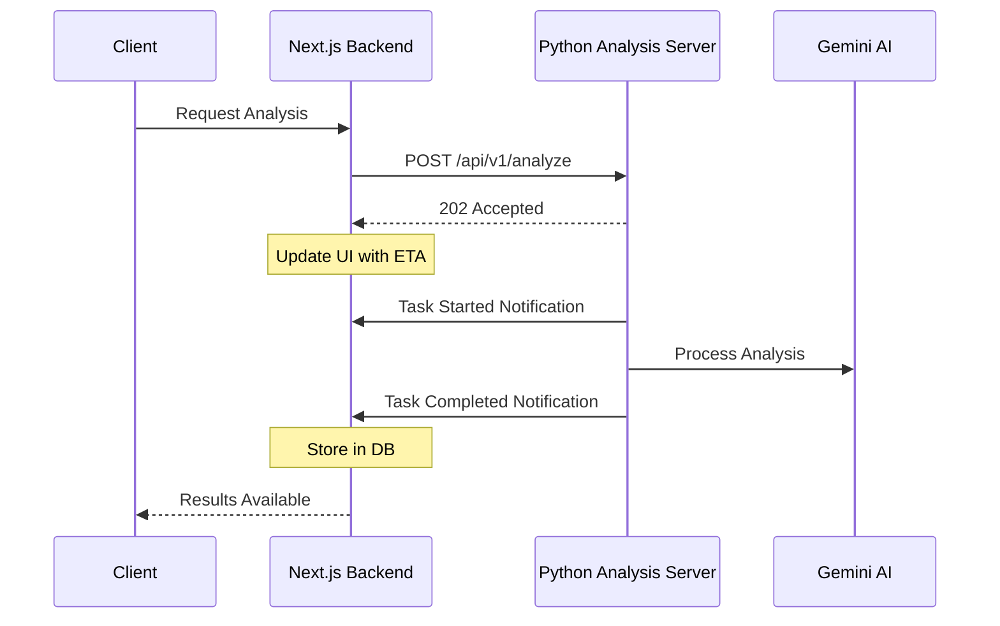

# Video Analysis API Documentation

This is an internal service that provides video analysis capabilities through Gemini AI. It is designed to be called only by a single Next.js backend application.

## System Architecture



## Core Endpoints

### POST /api/v1/analyze

Analyzes a YouTube video and provides detailed metrics and feedback.

#### Request Format

```json
{
    "type": "SHORT_FORM",
    "video_url": "https://www.youtube.com/watch?v=xxx",
    "user_id": "string", // required - ID of the user initiating the request
    "title": "", //optional
    "description":"", //optional
    "niche":"", //optional
    "target_audience":"", //optional
    "additional_details":"", //optional
}
```

### DELETE /api/v1/task/{task_id}

Cancels a queued task that hasn't started processing yet.

#### Path Parameters
- task_id (string, required) - The ID of the task to cancel

#### Response Format

##### Success Response (200 OK)
```json
{
    "success": true,
    "message": "Task successfully cancelled",
    "task_id": "550e8400-e29b-41d4-a716-446655440000",
    "estimated_time": 60,
}
```

##### Error Responses

1. Task Not Found (404)
```json
{
    "success": false,
    "error": {
        "code": "TASK_NOT_FOUND",
        "message": "The specified task does not exist",
        "action": "Please verify the task ID and try again"
    }
}
```

2. Task Already Processing (400)
```json
{
    "success": false,
    "error": {
        "code": "TASK_PROCESSING",
        "message": "Cannot cancel task that is already being processed",
        "action": "Wait for the task to complete"
    }
}
```

#### Video Types

- `SHORT_FORM`: Short-form videos (YouTube Shorts, TikTok style)
- `EDUCATIONAL`: Educational/tutorial content
- `ENTERTAINMENT`: General entertainment videos
- `MUSIC`: Music videos and performances
- `PRODUCT_REVIEW`: Product reviews and demonstrations
- `VLOG`: Vlog-style personal content

## Response Flow

### 1. Immediate Response (202 Accepted)
```json
{
  "success": true,
  "status": "queued",
  "estimated_wait": 60
}
```

### 2. Task Status Updates

#### Task Started (POST /api/services/alyzitron/callback/started)
```json
{
    "taskId": "string",
    "userId": "string",
    "status": "started",
    "expectedDurationSeconds": 120
}
```

#### Task Completed & Errors (POST /api/services/alyzitron/callback/finished)
```json
{
    "taskId": "string",
    "userId": "string",
    "status": "completed",
    "results": {
        "category 1": { // category 1 is for example. There can be multiple categories with multiple metrics, depending on video type
            // Metrics specific to video type
            "metric1": {
                "score":3,
                "description": "blah blah"
            },
            "metric2": {
                "score":10,
                "description": "blah blah2"
            },
        },
        "creator_feedback": {
            "strengths": [
                // List of strengths
            ],
            "improvements": [
                // List of improvement suggestions
            ]
        },
        "compliance_risks": {
            "copyright_risk": {
                "score": 25,
                "description": "Low risk - no copyrighted content detected"
            },
            "guidelines_incompliance": {
                "score": 90,
                "description": "High compliance with platform guidelines"
            },
            "social_risk": {
                "score": 15,
                "description": "Low risk of social backlash"
            }
        }
    }
}
```

### Error Response Format (in callbacks)
```json
{
    "taskId": "string",
    "userId": "string",
    "status": "failed",
    "error": {
        "code": "ERROR_CODE",
        "message": "Human readable error message"
    }
}
```

## Error Codes

- `INVALID_VIDEO_TYPE`: The provided video type is not recognized
- `INVALID_VIDEO_URL`: The URL must be either a valid YouTube video URL (youtube.com or youtu.be) or an internal storage URL starting with "gs://alyzitron-prod/services/alyzitron/"
- `PROCESSING_ERROR`: Error occurred during video analysis
- `GEMINI_ERROR`: Error with Gemini API calls
- `COMPLETION_ERROR`: Error in processing analysis results
- `INTERNAL_ERROR`: Unexpected server error