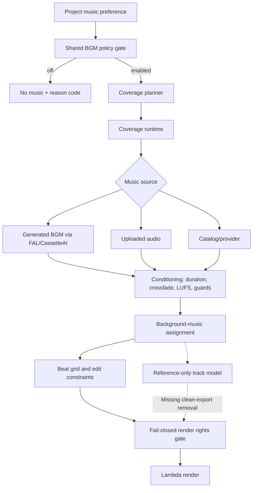
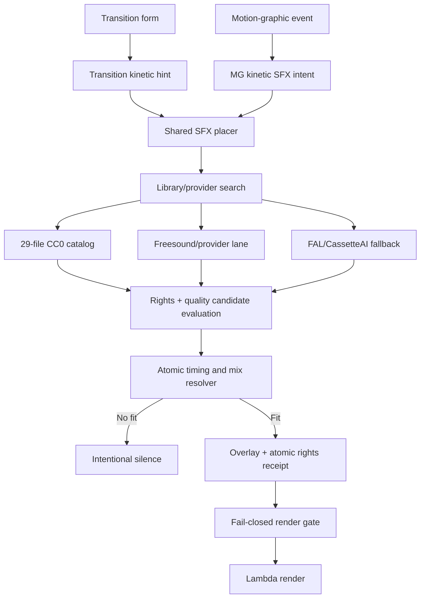
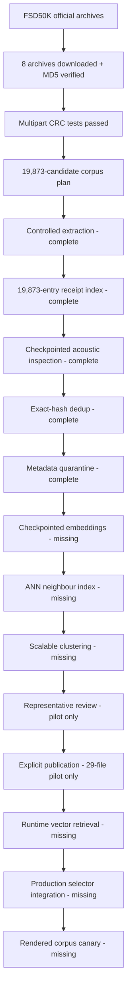

# Editron Music and SFX Production Audit

Date: 2026-07-28

Scope: Editron music, BGM, uploaded/reference music, transition SFX, motion-graphic
SFX, audio rights enforcement, and the large FSD50K corpus lane.

This is a reconciled record of the external Claude audit supplied on 2026-07-28.
It intentionally excludes ThinkForge, Brand Vault, video-generation providers, and
trend-reference work except where those systems directly produce music or SFX
timeline events.

## Executive Summary

Editron is building an audio brain with three responsibilities:

1. Place the right music under the right timeline spans at a controlled loudness.
2. Place context-appropriate SFX on transitions and motion graphics, or intentionally
   choose silence.
3. Prevent audio without sufficient rights evidence from entering a final render.

The core music plumbing is real. Exact-duration conditioning, crossfades, LUFS
normalization, music coverage, beat information, music-off policy, uploaded-audio
assignment, and fail-closed render rights checks exist in production-facing code.

The transition/MG SFX chain is also substantially wired:

```text
event
  -> kinetic SFX intent
  -> library/provider search
  -> rights and quality evaluation
  -> atomic timing and mix resolution
  -> silence or overlay
  -> rights receipt
  -> render gate
```

The large SFX corpus is not production-live. The official FSD50K archives are fully
downloaded, integrity-verified, and exactly reconciled into 19,873 candidate WAVs.
Full-corpus acoustic inspection and exact-hash deduplication are complete.
Checkpointed embeddings, ANN neighbour indexing, representative review, publication,
and runtime vector retrieval remain.

The most important product gap outside the corpus lane is reference-only music. The
data model can describe a chart song used as an editing reference, but the audit found
no complete strip-before-render and platform-handoff path. The expected clean-export
workflow is therefore not yet production-ready.

## Evidence Corrections

The supplied audit contained three claims that conflict with independently verified
evidence. They are corrected here rather than copied as fact.

### FSD50K multipart integrity

The Claude audit reported that the multipart file counts and CRC result could not be
found in `archive-probe-receipt.json`. That observation about the probe receipt is
correct: the probe receipt only proves remote size/range behavior.

However, the archive sets were subsequently tested directly with 7-Zip:

- Dev: six volumes, 40,966 files, 25,641,601,540 uncompressed bytes,
  `Everything is Ok`.
- Eval: two volumes, 10,231 files, 8,842,417,020 uncompressed bytes,
  `Everything is Ok`.

The download receipt and disk inventory also reconcile exactly:

- Archives: 8
- Partial files: 0
- Receipt bytes: 24,671,691,926
- Disk bytes: 24,671,691,926

The controlled extraction now emits a machine-readable receipt that pins the
candidate-pool hash, archive-set hash, download-receipt hash, archive sizes and MD5s,
per-file sizes and SHA-256 hashes, and a whole-extraction digest.

### Provider environment configuration

The audit said Epidemic Sound, MusicBrainz, CassetteAI, and FAL were unconfigured.
The Vercel preview environments show otherwise:

| Provider/configuration | Current evidence | Correct classification |
| --- | --- | --- |
| `EPIDEMIC_SOUND_API_KEY` | Present for `infrastructure-improvs-+Editron` preview | Configured; live partner behavior not battle-tested |
| `MUSICBRAINZ_USER_AGENT` | Present for the branch preview | Configured; live behavior not battle-tested here |
| `FAL_AI_API_KEY` | Present for Preview | Configured; used by BGM and SFX services |
| `FREESOUND_API_KEY` | Present for Preview | Configured |
| `YOUTUBE_API_KEY` | Present for Production/Preview | Configured |
| Apple Music | No token observed | Configuration missing |
| Soundstripe | No production provider observed | Not implemented/configured |

Key presence is not equivalent to a successful provider canary or commercial partner
entitlement. Provider lanes remain "configured, live behavior unverified" until a
controlled canary proves authentication, search/download behavior, rights metadata,
and failure handling.

### CassetteAI key ownership

CassetteAI uses FAL rather than a separate Cassette key:

- `lib/pipeline/sfx-service.ts` reads `FAL_AI_API_KEY`, configures the FAL client,
  and invokes `cassetteai/sound-effects-generator`.
- `lib/pipeline/bgm-service.ts` uses the same FAL credential path for BGM.
- `lib/editron/agent/tools.ts` gates the chat-edit Cassette branch on
  `FAL_AI_API_KEY`.

The key source is therefore resolved. Whether every deployed consumer receives the
same environment and whether paid generation succeeds remain canary questions.

## Capability Classification

Classification terms:

- **Production-wired**: an actual production producer reaches the final consumer.
- **Implemented**: code exists, but live control flow or deployment remains unproven.
- **Partial**: the core model/plumbing exists but an essential workflow is absent.
- **Pilot-only**: proven on the 35-file pilot, not the full corpus.
- **Configured/unverified**: required environment exists but live provider behavior
  has not been canaried.
- **Not implemented**: no complete owner/control flow was found.

## Music and BGM Truth

| Capability | Classification | Current behavior | Evidence | Remaining gap |
| --- | --- | --- | --- | --- |
| Exact-duration loop/trim | Production-wired | Decoded PCM is fitted to the target duration | `lib/pipeline/audio-conditioning.ts` | No material gap found |
| Equal-power crossfade | Production-wired | Looped boundaries use crossfade conditioning | `lib/pipeline/audio-conditioning.ts` | No material gap found |
| Pre-render LUFS | Production-wired | Loudness is measured and normalized before render | `audio-conditioning.ts`, `media/ffmpeg-runtime.ts` | Maintain platform-target tests |
| Silence/clipping guards | Production-wired | Conditioned audio fails quality gates | `audio-conditioning.ts` | Full-path canary |
| Shared BGM policy | Production-wired | Music paths pass through a shared conditioning contract | `lib/pipeline/bgm-conditioning-contract.ts` | Verify every future writer uses it |
| Music preference `none` | Production-wired, live proof pending | Planner/contract suppress music | `music-coverage-planner.ts`, `bgm-conditioning-contract.ts` | Reconfirm storyboard-finalize deployment |
| Coverage none/sections/full | Implemented and wired | Planner emits coverage applied by runtime | `music-coverage-planner.ts`, `music-coverage-runtime.ts` | Live render proof |
| Beat grid/BPM | Implemented and consumed | Beat data reaches constraints and Director consumers | `music-beat-grid.ts`, `beat-detection-service.ts` | Verify real-song accuracy |
| Speech ducking | Partial | Static levels are selected from editorial energy | `bgm-mix-levels.ts`, `audio-standards.ts` | Dynamic speech-gap envelope |
| Uploaded music | Implemented and wired | Upload can be assigned as background music | `uploaded-audio-assignment.ts` | Full rights-mode UX canary |
| Audio rights provenance | Production-wired | Native/uploaded audio carries rights evidence | `native-video-audio-rights.ts`, attestation service | Extend consistently to every uploaded sound |
| Render rights gate | Production-wired, fail-closed | Playable audio without sufficient rights throws | `render-request-payload.ts` | Preserve regression tests |
| Reference-only chart song | Partial | Assignment can produce a `referenceTrack` model | `background-music-assignment.ts` | Complete preview, stripping, receipt, and handoff |
| Clean export of reference track | Not implemented | No proven pre-render strip path | `render-request-payload.ts` audit | Must remove reference audio before Lambda |
| Editor waveform/preview | Unverified | UI labels mention reference state | `timeline-item-label.tsx` | Verify real waveform/playback control flow |
| YouTube discovery | Configured/unverified | Provider and environment exist | `music-discovery/youtube-provider.ts` | No-credit auth/config canary |
| MusicBrainz identity | Configured/unverified | Provider and branch user agent exist | `musicbrainz-provider.ts` | No-credit request canary |
| Epidemic catalog | Configured/unverified | Large provider implementation and branch key exist | `music-catalog/epidemic-provider.ts` | Prove partner entitlement and rights receipt |
| Apple Music | Configuration missing | Provider may exist without deployment token | provider code | Defer |
| Soundstripe | Not implemented | No production provider found | repository search | Defer |
| Instagram/TikTok handoff | Not implemented | No complete delivery-cue workflow found | repository audit | Build after clean-export contract |

## SFX Truth

| Capability | Classification | Current behavior | Evidence | Remaining gap |
| --- | --- | --- | --- | --- |
| Event to atomic overlay | Production-wired | Intent, search, evaluation, timing/mix, overlay and receipt are connected | `transition-sfx-placer.ts` | Rendered production canary |
| Transition SFX | Production-wired | Director and SFX service call placement | `director-agent.ts`, `sfx-service.ts` | Direction and dissolve consistency audit |
| Motion-graphic SFX | Production-wired | MG runner/artifacts call placement | `mg-render-job-runner.ts`, `sequence-artifacts.ts` | Missing vocabulary and semantic preservation |
| Atomic timing/mix ownership | Production-wired | `sfx-form` owns concrete timing and levels | `transition-sfx-placer.ts`, `sfx-form` | Prevent shadow planners |
| Intentional silence | Implemented | Resolver can produce `atomic-form-resolved-silence` | `kinetic-sfx-service.ts` | Preserve density tests |
| Rights receipts | Production-wired | Placement builds receipts consumed by render gate | atomic overlay core, `render-request-payload.ts` | Live canary |
| Starter catalog | Production-live | 29 approved CC0 assets in controlled manifest | `public/sfx/manifest.json` | Inventory remains small |
| Freesound | Configured | API key and provider path exist | Vercel Preview, library service | Provider behavior canary |
| CassetteAI SFX | Configured/unverified | FAL-backed generated fallback is wired | `sfx-service.ts`, `agent/tools.ts` | Paid canary and rights verification |
| Epidemic SFX | Configured/unverified | Shared provider key exists | Epidemic provider | Confirm SFX entitlement/API support |
| Uploaded SFX | Partial/unverified | Conditioning primitive exists | `audio-conditioning.ts` | Provenance, assignment and render path audit |
| Unlicensed SFX render | Blocked | Fail-closed render gate rejects it | `render-request-payload.ts` | Preserve critical regression |

## Actual Architecture

### Music and BGM



### Transition and Motion-Graphic SFX



### Large Corpus



## Full-Corpus Scalability Finding

The pilot embedding implementation must not be run unchanged over 19,873 sounds.

`clusterEmbeddingEntries` in `lib/pipeline/sfx-audio-embedding.ts` performs a
literal all-pairs comparison. For 19,873 entries:

```text
n * (n - 1) / 2 = 197,458,128 candidate pairs
```

At a 512-dimensional embedding this produces roughly 101 billion scalar comparison
operations. More importantly:

- Embedding has no durable per-asset checkpoint.
- A late process failure can force expensive recomputation.
- Exact-hash duplicates are discovered inside the quadratic loop instead of through
  an O(n) hash map before embedding.
- Cluster accumulation uses repeated array spreading and can create another
  avoidable quadratic cost for large clusters.
- Runtime retrieval still has no vector index.

The production sequence should be:

```text
candidate extraction
  -> exact source hash
  -> exact-hash grouping
  -> checkpointed acoustic inspection per unique hash
  -> per-source metadata decision receipts
  -> checkpointed pinned embedding
  -> ANN/vector neighbour index
  -> neighbour-only clustering
  -> representative review
  -> explicit publication
  -> runtime vector retrieval
```

## Genuinely Completed

1. **Corpus source acquisition**
   - Commits: `4721fd20`, `bd1d6760`
   - Eight official archives
   - Pinned MD5, byte totals, archive-set hash and candidate-pool hash
   - Multipart CRC validation completed

2. **Candidate planning**
   - 19,873 CC0 candidates
   - Publication explicitly disallowed at this stage
   - Production catalog mutation explicitly disallowed

3. **Controlled full-corpus extraction**
   - 19,873 allowlisted WAVs extracted and uniquely receipt-indexed
   - 14,959 dev and 4,914 eval candidates
   - 13,456,611,058 extracted bytes
   - Zero missing, unexpected or unsafe paths
   - Per-file SHA-256 plus whole-extraction digest
   - 100-file cross-split canary and idempotent full-corpus reuse verified

4. **Checkpointed full-corpus acoustic inspection and exact dedup**
   - 19,873 durable source checkpoints
   - 19,865 unique audio hashes
   - Eight exact-duplicate pairs collapsed before embedding
   - 12,300 sources accepted for embedding
   - 1,256 uploader-metadata-risk sources quarantined for classification
   - 777 authoritative speech/music-labelled sources rejected
   - 5,540 acoustic rejections with explicit reason codes
   - 13,552 unique audio assets in the P3 embedding queue
   - Mid-run resume, stale-lock recovery, live-owner refusal and zero-reanalysis
     full-corpus reuse verified

5. **Music conditioning**
   - Exact duration
   - Crossfades
   - LUFS normalization
   - Silence and clipping guards

6. **Shared BGM policy**
   - Music-off and coverage decisions use shared policy/runtime owners

7. **Fail-closed render rights**
   - Renderable audio without sufficient rights evidence throws before Lambda

8. **SFX placement chain**
   - Transition/MG intent reaches selection, atomic form resolution, overlay and receipt
   - Silence is a first-class outcome

9. **Starter catalog**
   - 29 individually approved CC0 files published
   - Content hashes and controlled asset URLs recorded

10. **Pilot corpus factory**
   - 35-source sampling and conditioning
   - Pinned CLAP screening
   - Representative review
   - Individual publication approval

## False-Completion Risks

1. **Inspected corpus is not a live database.**
   Acoustic inspection and exact deduplication do not imply semantic classification,
   review, publication, or runtime retrieval.

2. **Provider code plus an API key is not a live provider.**
   Authentication, entitlement, download, rights receipts and failure behavior require
   a controlled canary.

3. **Reference-track data is not clean export.**
   The track must be available for preview/edit timing and then deterministically removed
   before rendering.

4. **Static ducking level is not dynamic speech ducking.**
   Current level selection does not prove a speech-gap envelope.

5. **Pilot clustering is not full-corpus clustering.**
   The current all-pairs algorithm is not the production owner for 19,873 assets.

6. **A 29-file manifest proves the publication path, not editorial coverage.**
   Designed risers, logo stings and polished UI sounds remain inventory gaps.

## Remaining Work

### P1: Controlled extraction - completed 2026-07-28

Target scope: no more than five files.

Expected owners:

- `lib/pipeline/sfx-fsd50k-extract.ts`
- `lib/pipeline/sfx-fsd50k-candidate-index.ts`
- `scripts/extract-fsd50k-corpus.ts`
- Focused extraction tests

Requirements:

- Extract only paths present in the 19,873-entry corpus plan.
- Reject archive path traversal.
- Never write outside the controlled extraction root.
- Reconcile every extracted path to exactly one candidate.
- Emit per-file size and SHA-256.
- Emit a machine-readable multipart/source integrity section.
- Fail unless extracted count is exactly 19,873.
- Support a 100-candidate canary before full extraction.

Exit criterion:

```text
19,873 planned
19,873 extracted
19,873 uniquely indexed
0 missing
0 unexpected
0 unsafe paths
```

Verified result:

```text
19,873 planned
19,873 extracted and uniquely receipt-indexed
14,959 dev / 4,914 eval
13,456,611,058 bytes
0 missing / 0 unexpected / 0 unsafe paths
selection SHA-256 6de36e6a9814cc7c8c51f4ca3f6d5e26228ce09b277e8cb65d9d823913bac386
extraction SHA-256 1460a8c0328e8cb1e1b3d2dd2b8dc9f37ce7bee7510f7d3f5cf12dffe6b979c2
```

The 100-file canary covered both source splits (85 dev, 15 eval). A second
full-corpus invocation rehashed all candidates and returned `reusedExisting: true`
with the same extraction digest.

### P2: Exact-hash dedup and checkpointed inspection - completed 2026-07-28

- Store one receipt per completed source.
- Resume without recomputing completed IDs.
- Decode and measure each asset.
- Reject corrupt, silent, clipped, vocal-heavy or otherwise unsuitable sources according
  to explicit policy.
- Group exact duplicates before embedding.
- Prove kill-and-resume behavior.

Verified result:

```text
19,873 source checkpoints
19,865 unique audio hashes
8 duplicate groups / 16 members / 8 duplicates beyond canonical
12,300 accepted for embedding
1,256 metadata-quarantined for P3 classification
777 authoritative metadata rejections
5,540 acoustic rejections
13,552 unique P3 queue entries
analysis SHA-256 1eedc918a33ae74b613c20806628d24244e8dc1d640dd51df428f3c3130474b1
```

Acoustic rejection reasons were 5,401 catalog true-peak ceiling violations,
136 silent sources, and three invalid PCM sources. Every source file was hash-verified.
Each unique hash was decoded and measured once; duplicate members retained separate
source receipts and metadata decisions. A full reuse pass loaded all 19,873 checkpoints
and 19,865 acoustic outcomes with zero new analysis.

Authoritative FSD speech/music labels are hard rejections. Uploader-only vocal, music
or noisy flags are quarantined rather than discarded, because those warnings can also
describe useful effects and require P3 semantic classification.

### P3: Checkpointed embeddings and ANN

- Reuse the pinned CLAP model contract.
- Persist each embedding independently.
- Build an ANN/vector index.
- Retrieve bounded neighbours.
- Cluster only candidate neighbours.
- Preserve the 35-file pilot result as a regression fixture.
- Remove the all-pairs loop and repeated-spread cluster accumulation.

### P4: Review and publication

- Generate representative-only review batches.
- Preserve cluster and source provenance.
- Require explicit per-asset approval.
- Do not let representative approval implicitly approve every cluster member.
- Publish only approved, rights-valid, acoustically valid artifacts.

### P5: Runtime retrieval and rendered canary

- Connect runtime vector retrieval to the existing SFX library service.
- Pass semantic intent, negative constraints, motion direction, energy and duration.
- Keep deterministic rights, quality and atomic-form gates.
- Preserve silence when confidence is low.
- Run a real transition/MG render with a selected corpus asset and complete receipt.

### Parallel music gaps

These should remain explicit but must not distract from the current corpus phase:

1. Complete reference-only timeline preview and waveform behavior.
2. Preserve title, artist, provider, BPM, cue window and timeline offset.
3. Force clean export for reference-only music.
4. Remove the reference source before Lambda/chapter rendering.
5. Emit a delivery cue for Instagram/TikTok native insertion.
6. Add dynamic speech-gap ducking.
7. Run no-credit provider configuration canaries.
8. Run one controlled paid provider canary only after configuration checks pass.

## Expected Outcome

When this initiative is complete:

- Music is conditioned to the target duration and loudness.
- Coverage is editorially appropriate rather than universally full.
- Cuts can align to measured beat information.
- Music can duck around speech and recover in real gaps.
- `music: off` produces no music on every path.
- A chart song can guide the edit without entering the exported master.
- Transitions and motion graphics receive context-appropriate SFX only when justified.
- Selection can retrieve across a large, semantically indexed, individually approved
  rights-cleared library.
- Designed-source and generated fallbacks remain behind the same quality and rights gates.
- Every audible overlay reaching the renderer has an auditable rights receipt.
- Silence remains a deliberate, valid result.

## Final Recommendation

Continue:

- Shared audio conditioning
- Shared BGM policy
- Fail-closed render rights
- Existing transition/MG SFX placement and atomic-form ownership
- Controlled full-corpus program
- Checkpointed acoustic inspection and exact-hash deduplication

Redesign:

- Full-corpus embedding and clustering
- Checkpointed embedding and ANN architecture
- Runtime semantic retrieval

Fix soon:

- Reference-only clean export
- Dynamic speech ducking
- Missing MG/transition semantic coverage

Defer until their dependencies are real:

- Apple Music
- Soundstripe
- Broader platform-native distribution integrations

The single correct next phase is **P3: checkpointed pinned-CLAP embeddings and an
ANN neighbour index without all-pairs clustering**.
