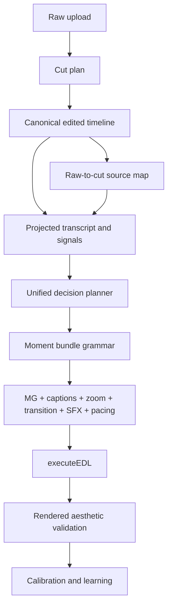
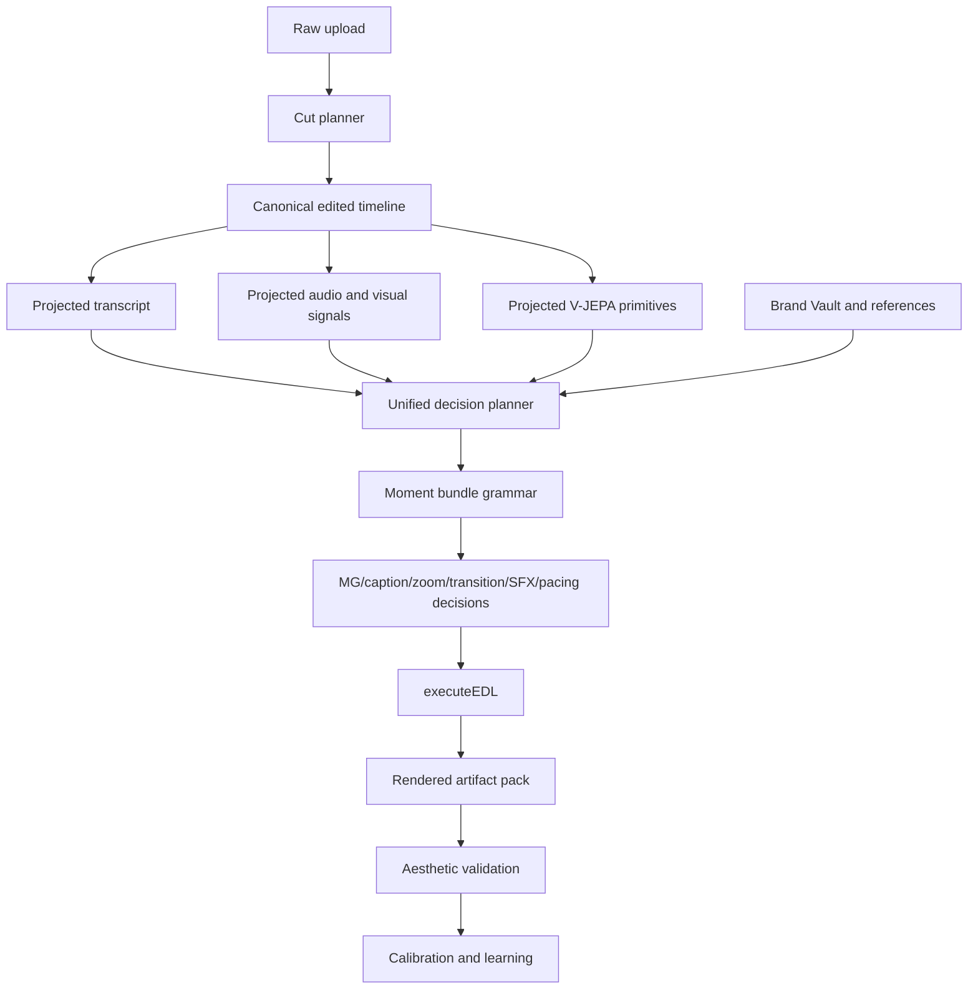

# Editron Northstar Final Plan - 2026-06-14

## Status

This is the canonical remaining plan for Editron upload-to-edit, motion graphics,
captions, zooms, transitions, SFX, V-JEPA, calibration, and live intelligence.

Read this before making Editron changes. If a later implementation disagrees
with this document, update this document in the same commit and explain why.

## Northstar

The system must move from:

`label -> preset -> render`

to:

`content atoms + relations + rhythm + screen context + brand taste + learned references -> form + timing + placement + combo`

Compatibility labels can exist at API/render boundaries, but they must not be
the creative source of truth.

## Non-Negotiable Rules

1. Do not claim Path E and Path D are merged unless code proves one decision
   owner, one source timeline, and one final consumer.
2. Do not add a hidden preset menu where an LLM chooses `keyword-highlight`,
   `stat-counter`, `whip-pan`, or similar labels as the real creative decision.
3. Do not fix visual failures only with caps, blocks, or late cleanup. Guardrails
   are allowed, but root cause fixes must happen at the producer/resolver layer.
4. Do not tune calibration against one creator or one video. Use diverse creator
   references and rendered evidence.
5. Do not let metadata-only receipts be called "live intelligence." Receipts only
   become live intelligence when layout, collision, timing, and renderer decisions
   actually consume them.
6. Do not report MG/caption/zoom/transition quality as good until rendered pixels
   or motion snippets have been inspected.
7. Before structural refactors, verify the current control flow in code and cite:
   producer path, decision owner, data source of truth, and final consumer.

## Current Code Truth

- Upload-to-edit has a working pipeline: upload -> video analysis -> tribe/V-JEPA
  analysis -> director -> EDL executor -> overlays.
- MG has a real composition engine. It can derive content structure, build a
  recipe, score motion/typography/structure dials, and render through Remotion.
- The MG engine is not yet visually deep enough for AutoAE-level output. It
  mostly has text, shapes, containers, rules, particles, masks, patterns, and
  basic data-viz. It lacks enough authored scene atoms.
- Captions currently use a canonical full-track overlay. That is useful as a
  synchronization substrate, but it is not the final northstar. Caption planning
  must become moment-scoped: active groups, line breaks, emphasis, screen region,
  and readability must be resolved per edited moment, not as one blanket style.
- V-JEPA spatial primitives now exist in the current code path: subject bbox,
  text boxes/count/coverage, negative space, motion vector, object count, and
  face count. The remaining issue is reliability and coverage quality.
- Many weights, curves, thresholds, density rules, and visual sizes are still
  explicitly invented or hardcoded. They must be calibrated.
- Old agent/manual template paths still exist. They may be useful as references,
  but upload-to-edit should not use them as the primary creative brain.

## Current Production Blockers

These are not side notes. They must be solved as part of the roadmap before
claiming upload-to-edit quality is production-grade.

1. Decision authority is still brief-led.
   Current project evidence shows the creative brief is still the executable
   producer when both systems exist, while signal-driven decisions are advisory
   or evidence-only. The fix belongs in Phase 2: one planner must own executable
   MG, caption, zoom, transition, SFX, and pacing decisions after the final cut
   timeline exists. Signals and atoms must be the deciding layer, not metadata
   attached after a brief-led choice.

2. Failed-quality runs can still enter normal learning.
   The director worker can skip direct bandit updates on critical failures, but
   `director_completed` can still be consumed by brand-learning and recorded as
   a low reward. The fix belongs before calibration: learning consumers must
   reject `needs_review`, zero-quality, or high-critical-count runs unless the
   run is explicitly marked as a diagnostic sample.

   Important: this must not mean "fail the user's edit run." A bad rendered edit
   should still persist the project, overlays, issue taxonomy, and artifact links,
   then mark the run `needs_review` / degraded. Normal bandit or brand learning
   must not train on it as a successful or ordinary low-reward sample. A separate
   diagnostic-learning lane should learn failure classes such as unreadable
   captions, weak MG relevance, repeated transition form, late SFX, and poor
   screen placement so future resolver/calibration work has evidence.

3. Quality details are not persisted deeply enough.
   Persisting only score, issue count, critical count, and timestamp is not
   enough. The project record or attached artifact pack must retain the actual
   issue taxonomy, affected overlay ids, timestamps, and rendered evidence links
   so failures can be debugged without replaying logs.

4. Quality telemetry names are misleading.
   Per-action quality gate summaries and full-project quality review summaries
   must be separated in logs and persisted fields. "0 critical" at the action
   gate must not look like it contradicts a later full-project review with
   critical issues.

5. Overlay family planning is still uneven.
   Transition decisions, caption decisions, zoom decisions, SFX candidates,
   rejected SFX, placed SFX, media/cutaway decisions, sticker/shape decisions,
   speed/fade/camera-shake decisions, and rendered overlays must be audited
   through one contract: atoms -> overlay job -> physical form -> renderer
   adapter -> rendered evidence. Repetition memory is a constraint after form
   resolution, not the creative source of truth. Weak hints, fallback defaults,
   compatibility names, or rotating through labels must not be treated as any
   overlay family's brain.

## Verified Implementation Status - 2026-06-17

This section records what the current code actually proves, so future sessions do
not re-open solved plumbing or over-claim unfinished behavior.

### Confirmed In Code

- Phase 0 fixture, taxonomy, and artifact-pack scaffolds exist.
- Full-project quality issue details are persisted in bounded sanitized form,
  not only as counts.
- Director, brand-learning, and inline worker learning paths are gated away from
  failed-quality runs.
- V-JEPA spatial primitives are preserved into the Editron analysis path:
  subject bbox, text boxes, text coverage, negative space, motion vector,
  object count, and face count.
- Signal decision audit/licensing exists so signal decisions can be inspected as
  executable candidates, evidence-only facts, rejected candidates, or family
  evidence.
- Caption, zoom, transition, and SFX atomic form resolvers exist as plumbing.

### Still Partial

- Phase 0 artifact truth is not yet design-grade. The harness can build render
  packs and classify failures, but real rendered stills/GIF/audio timing reports
  are not yet a hard gate for upload-to-edit.
- Decision authority is not fully unified until one planner ranks all candidates
  on the canonical edited timeline and owns the final executable bundle.
- Canonical timeline enforcement is not proven everywhere. Raw timeline data
  must remain provenance, not the decision coordinate system.
- Caption, zoom, transition, and SFX planners still need production behavior:
  moment scope, repetition memory, boundary atoms, exact beat alignment, and
  screen-aware placement.
- V-JEPA has preserved fields, but coverage and degraded-mode behavior still need
  health gates before screen-aware placement can be trusted.
- Calibration must remain blocked until rendered evidence is trustworthy.

### Current Next Order

1. Harden Phase 0 artifact packs so they account for MG, captions, zoom,
   transitions, and SFX without pretending audio or camera-motion evidence is the
   same as visual overlay pixels.
2. Run Phase 0 artifact packs against real upload-to-edit projects and persist
   concrete rendered/audio timing issue evidence.
3. Make the unified planner the only executable decision owner.
4. Add the missing signal candidate normalizer: split moment importance from
   execution confidence, project nested signal snapshots into family atoms, and
   mark invented thresholds as calibration-needed.
5. Build production family planners: captions, transitions, zoom/visual motion,
   and SFX. MG continues in the separate MG branch but must plug into the same
   planner contract.
6. Add V-JEPA degraded-mode governance and visual-cutting support.
7. Run reference calibration for weights, curves, density, timing, sizes, and
   thresholds only after the above gates are stable.

## Verified Root Cause Update - 2026-06-18

This update exists to prevent a repeat of the stale diagnosis "Path E only has
eight globals." That was a useful suspicion, but it is not the current root
cause in the live code.

### What Was Verified Twice

Code evidence:

- `lib/editron/agent/director-agent.ts` currently attaches per-moment
  `context.signals`, `atomicMomentBundle`, and `unifiedMomentEvidence` onto Path
  E decisions after the Creative Brief EDL is generated.
- Path D also attaches the same unified moment packet before its decisions enter
  the shared bundle.
- `tests/editron/director-unified-decision-bundle.test.ts` still names the
  current architecture correctly: Path E and Path D remain producers that execute
  through one shared decision bundle. This is downstream convergence, not one
  true decision brain.
- `lib/editron/services/unified-decision-bundle.ts` can promote atom-rich signal
  decisions, but only after confidence floors and family license checks pass.
- `lib/editron/services/signal-executor.ts` still uses `momentWeight` as the
  executable confidence. Complements reduce it further: SFX uses `momentWeight *
  0.8`, caption emphasis uses `momentWeight * 0.7`, and zoom uses `momentWeight
  * 0.6`.
- Family license checks require top-level atoms such as `boundaryFrame`,
  `topicDelta`, `motionVectorX`, `speechPeak`, `beatFrame`, `keyword`, or
  `momentId`. Many signal-executor outputs keep useful evidence inside
  `params.signals` or legacy technique fields instead of normalizing it into
  these family atom fields.

Project evidence:

- Phase 0 fixture for `proj_2Mq5uesPpNOD` reported `video=89`, `caption=1`,
  `transition=5`, `sound=2`, and `motion-graphic=3`.
- Decision authority reported `decisionMode=merged-supplemental`,
  `signalDecisionRole=advisor`, and `signalDecisionsCanAddExecutable=false`.
- The same run had `primaryDecisionCount=67`, `signalDecisionCount=490`,
  `addedSignalDecisionCount=0`, and `evidenceOnlySignalDecisionCount=485`.
- The dominant rejection bucket was `below-signal-confidence-floor`: 475 signal
  decisions. The observed rejected confidence average was about `0.587`, while
  current executable floors sit around `0.68-0.82` by family.
- V-JEPA primitives are not dropped in the persisted segment path: motion vector,
  main subject, text coverage, negative space, object count, and face count show
  field coverage. But face emotion and eye contact were `0`, and the screen-aware
  policy was degraded because overlay hit rate was below the trust bar.
- Quality review knew the result was bad (`overallScore=0` with critical
  issues), which explains why bad edits can ship. It does not explain why signal
  decisions fail to become overlays.

### Actual Root Cause

Signals are fed, but they do not yet own the executable decisions.

The current system behaves like this:

```text
Creative Brief chooses executable decisions
Path E attaches per-moment signals after that choice
Path D emits many signal decisions
Unified bundle accepts Path E as primary
Signal decisions must pass confidence + family atom license
Most signal decisions fail and become evidence-only
executeEDL can use signals for form only after a decision survives
```

That means the problem is not simply "add more signals to Gemini." The problem
is authority and normalization after the final cut:

1. Creative Brief still chooses many executable overlay moments before the
   deterministic signal family planners exist.
2. Signal decisions use moment importance as execution confidence, which is the
   wrong contract. A subtle but certain transition boundary can be important
   enough to execute even if its global moment weight is not huge.
3. Signal executor outputs are not consistently normalized into the top-level
   family atoms required by the license layer.
4. The unified bundle can promote strong signal decisions in tests, but real
   upload-to-edit runs are not producing enough licensed atom-rich candidates.
5. EDL family resolvers can use signals for physical form, but they cannot
   rescue decisions that never become executable.

### Consolidated Phase Status After This Investigation

- Phase 0, rendered truth fixtures: partially done. Manifests and taxonomy exist,
  but rendered stills/clips/audio windows are not yet a hard production gate.
- Phase 1, canonical timeline as law: partially done. The edited timeline exists,
  but all candidates still need to be normalized on that timeline before
  execution ownership is decided.
- Phase 2, one decision owner: not done. Current evidence shows
  `merged-supplemental`, not a true signal-owned planner.
- Phase 2A, signal candidate normalizer: missing. This is now a required
  sub-phase before family planners can become reliable.
- Phase 3, caption planner: not done. The canonical full-track caption overlay
  is useful substrate, but moment-owned caption planning is still missing.
- Phase 4/5, MG scene atoms and semantic spine: owned by the separate MG branch.
  It must plug into the same planner contract, but this plan should not edit MG
  engine WIP from this lane.
- Phase 6, zoom and transition choreography: not done. They need family planners
  that build jobs from atoms, not fallback transition names or samey zoom hints.
- Phase 7, SFX system: partial. Form and provider plumbing exist, but timing,
  rejection telemetry, cache/provider quality, and cross-family sync are not
  production-grade.
- Phase 8, V-JEPA quality and visual cutting: partial. Primitives are preserved,
  but quality/degraded-mode governance and visual-cutting use are incomplete.
- Phase 9, rendered aesthetic gate: not done as a hard blocker.
- Phase 10, calibration: still pending. Do not run full weight/curve calibration
  until the planner and rendered gate are sane.

## MG Port Investigation - 2026-06-18

This section ports the separate MG work back into the canonical Editron plan.
It is based on:

- `docs/agents/sessions/editron/MG-Session-Port-Handoff-2026-06-18.md`
- `docs/agents/sessions/editron/MG-Final-Build-Plan-2026-06-18.md`
- `docs/agents/sessions/editron/MG-Calibration-Readiness-Findings-2026-06-18.md`
- `docs/agents/sessions/editron/MG-Encoding-Law-Phase-Ledger-2026-06-16.md`
- `docs/agents/sessions/editron/Session-2026-06-14-MG-Separate-Branch-Handoff.md`
- Current code in the Director, unified bundle, EDL executor, MG expression
  authority, visual explanation contract, composition planner, composition
  renderer, and focused MG tests.

### Current MG Runtime Truth

The live MG path is not empty and it is not a simple template menu:

```text
Director Path E / Path D
  -> per-moment signals + atomicMomentBundle + unifiedMomentEvidence
  -> unified decision bundle
  -> executeEDL applyGraphic
  -> normalizeMotionGraphicContent
  -> semantic MG ledger gate and candidate selection
  -> buildMotionGraphicSignalSnapshot
  -> utility scorer mg.* dials
  -> resolveMgExpressionAuthority
  -> planComposition
  -> applyMgExpressionAuthorityToRecipe
  -> buildAtomicOverlayPlan / decideAtomicOverlay
  -> persisted motion-graphic overlay
  -> MotionGraphicLayerContent
  -> SafeCompositionRenderer
```

Verified code anchors:

- `director-agent.ts` attaches per-moment `context.signals`,
  `atomicMomentBundle`, and `unifiedMomentEvidence` to Path E decisions around
  the Creative Brief EDL loop. The stale diagnosis "Path E only gets 8 globals"
  is not true for this current main path.
- `director-agent.ts` also attaches the same packet to Path D before the shared
  bundle.
- `unified-decision-bundle.ts` still treats the current architecture as
  `merged-supplemental` unless signal candidates pass confidence and license
  checks.
- `edl-executor.ts` builds MG signal snapshots, normalizes V-JEPA/text/audio
  aliases, resolves semantic MG candidates, calls MG expression authority, then
  persists `contentSignals`, `mgExpressionAuthority`,
  `visualExplanationContract`, semantic candidate metadata, atomic plan, and
  atomic decision.
- `motion-graphic-layer-content.tsx` uses the precomputed recipe when present
  and renders it through `SafeCompositionRenderer`; it does not re-plan live
  overlays unless the overlay lacks a recipe.

So the current root is not "no signals reach MG at all." The root is narrower
and more dangerous:

```text
rich signal and fact bus
  -> narrow MG expression authority
  -> weak stage/layout survival
  -> partial semantic atom families
  -> repeated renderer grammar
  -> rendered quality evidence not yet hard authority
```

### Actual MG Root Causes

1. MG authority consumes too little of the signal/fact surface.
   `mg-expression-authority.ts` computes relevance, screen pressure, and a
   visual explanation contract, but `applyMgExpressionAuthorityToScores` only
   writes three score families today: `mg.typography.font_size`,
   `mg.emphasis.scale_contrast`, and `mg.layout.center_avoidance`. That is too
   narrow to express stage mode, atom-family permission, valence color, proof
   framing, transition-led choreography, density cost, read time, or render
   risk.

2. Full-frame and stage intent can be downgraded by caption coordination.
   `recipeVisualIntentFromContract` can correctly set `preferFullFrame`, but
   `applyVisualIntentToLayout` treats `captionZoneAware` /
   `coordinateWithCaptions` as a reason to fall back to a corner-safe layout.
   The test currently expects a `full-frame-graphic-scene` to resolve to
   `top-right` with `40%` max width. That proves the contract is threaded, but
   also proves stage intent is not authoritative enough.

3. Semantic facts exist but are conservative and incomplete.
   `mg-semantic-fact-extractor.ts`, `mg-semantic-facts.ts`,
   `mg-content-atoms.ts`, and `semantic-mg-candidates.ts` can license numbers,
   bounded stats, comparisons, quotes, identity, concept context, refutation,
   and lists. They still miss many creator-video facts: rhetorical claims,
   setup/payoff, phrase salience, visual object support, social proof, device or
   search scenes, before/after change, story beat, contradiction, and proof
   hierarchy unless the text is very explicit.

4. Renderer vocabulary is richer than what production usually licenses.
   `composition-renderer.tsx` already has stage chrome, semantic concept maps,
   quote proof atoms, refutation proof atoms, stat fields/axes, rhythm ticks,
   full-frame layout, split layout, device frame, stage-aware text treatment, and
   animated scene atoms. The output remains weak because the upstream authority
   does not consistently select or preserve these stage/atom instructions from
   real project evidence.

5. The current MG recipe is still shape-first after structure.
   `composition-planner.ts` derives a structural signature, then dispatches to
   numeric, series, comparison, identity, quotation, brand, process, structured,
   or emphasis composers. That is much better than an LLM choosing a label, but
   the next step is to make the composer receive an explicit fact/wire/stage
   contract so the form comes from evidence, not only from the first projected
   shape.

6. Rendered gates are not final authority.
   Real-project taste gates and render scripts exist, but upload-to-edit still
   needs hard rendered evidence for MG count, stage match, readability,
   repetition, blank/cheap output, caption collision, and timing before learning
   or calibration writes are trusted.

7. Calibration is blocked by structure.
   The code still contains invented thresholds, sizes, weights, and curve ranges
   across MG authority, planner, renderer, and taste gates. Calibration should
   tune those only after the contract produces reliable candidates and rendered
   evidence. Otherwise calibration will learn around broken authority.

### MG Encoding Law

MG form must be generated from evidence-backed visual encodings:

| Fact / relation | Licensed wire | Meaning |
| --- | --- | --- |
| Any defended phrase/value | `literal` | render the phrase/value as glyphs |
| Comparable magnitude | `length` | length/size represents amount |
| Bounded proportion | `sweep` | arc/ring/bar fill represents percent/fraction |
| Ordered series | `slope` | line/sparkline represents trend |
| Ordering or timeline | `position` | placement represents order/time |
| Polarity | `valence` | color/lightness represents positive/negative |
| Negation/refutation | `strike` | strike/cut line represents denial/refutation |
| Directional change | `pair` | connector represents before -> after |
| Salience/hierarchy | `emphasis` | scale/weight represents importance |
| Very large comparable magnitude | `area` | area/mark size represents scale |

These wires are not presets. They are the grammar between facts and pixels.
Renderer components may still have adapter names, but those names must be the
last mile after the wire is licensed.

### MG 0-14 Production Phase Ledger

Do not renumber these phases. Older shorthand sometimes compressed the active
work into 8-9 buckets, but the live MG roadmap is a 0-14 ledger. Phase 8 was
later merged into Phase 14, but it remains listed here so old references still
resolve mechanically.

#### Phase 0: Baseline Artifact Pack

Build a real project MG audit that dumps one record per MG candidate and
persisted MG:

- decision id, frame, source, raw type, reason
- raw `decision.params.signals` keys and values
- normalized `contentSignals` after `buildMotionGraphicSignalSnapshot`
- `atomicMomentBundle` and `unifiedMomentEvidence` summary
- normalized content, structure, semantic atoms, semantic ledger candidates,
  selected semantic candidate, and suppressed candidate reasons
- visual explanation contract input and output
- MG expression authority output
- `mgScores` before and after authority patches
- recipe id, layout, visual intent, element roles, and stage mode
- atomic overlay plan and decision
- renderer scene atom families expected from content and stage
- rendered artifact link when available

Acceptance:

- A bad project can explain whether MG failed because of missing facts, missing
  signals, authority veto, stage downgrade, renderer output, or quality gate.
- No behavior changes in this phase.
- The report must fail loudly if a source packet has V-JEPA/moment fields but
  the MG snapshot loses them.

Current remaining work:

- Re-render real projects after current code changes, not only probe fixtures.
- Capture stills, clips where available, logs, MG count, gate scores, signal
  packets, recipes, and visible failures.
- Make this the truth input for later phases.

#### Phase 1: Visual Explanation Contract

The Visual Explanation Contract must decide whether a graphic is worth making
and what stage it deserves.

Code-level targets:

- Expand `visual-explanation-contract.ts` obligations beyond current numbers,
  comparison, quote, list, identity, device, and concept evidence:
  claim/proof, setup/payoff, contradiction, before/after, cause/effect,
  social proof, visual object support, screen demo/search, action state, and
  rhetorical hero phrase.
- Replace generic `communicationGain` only with a job vector:
  `explain`, `prove`, `compare`, `emphasize`, `summarize`, `resetAttention`,
  `showProcess`, `showEvidence`, `bridgeTransition`, and `avoidRedundancy`.
- Every high job score must cite content atoms, relations, or moment signals.
- A weak keyword with no relation stays caption evidence, not standalone MG.

Acceptance:

- MG can answer "why this deserves a graphic" from facts and signals.
- The system can skip words that captions already handle, but promote moments
  where graphics add explanation, proof, comparison, or attention reset.

#### Phase 2: Wire Contract Into MG Authority

MG selection must be driven by facts, wires, signals, and the Visual
Explanation Contract. Weak text-card output should be rejectable before render.

Code-level targets:

- Keep `director-agent.ts` per-moment packet attachment, but add a test that Path
  E graphic decisions receive nested visual/audio/speech atoms after the brief is
  generated.
- Extend `edl-executor.ts::buildMotionGraphicSignalSnapshot` and its aliases so
  MG authority receives all relevant stable keys: subject bbox, text boxes,
  text coverage, negative space by side, motion vector, object/face count, face
  presence, eye contact, shot scale, visual complexity, speech energy, speech
  pace, emotion intensity, beat/music energy, cinematic moment, narrative
  pressure, active overlay count, caption redundancy, recent MG form memory, and
  V-JEPA degraded-mode policy.
- Persist a compact `mgSignalAudit` on each MG overlay: present keys, missing
  high-value keys, degraded sources, and calibration flags.
- Feed the contract output into `mg-expression-authority.ts` as the source of
  allowed stages, wires, and quality vetoes.
- Expand authority output beyond the current narrow score patches. Required
  fields: `stageMode`, `jobVector`, `licensedWires`,
  `atomFamilyPermissions`, `layoutIntent`, `typographyIntent`, `colorIntent`,
  `motionIntent`, `densityCost`, `readTime`, `captionChoreography`,
  `crossFamilySync`, `renderRisk`, and `calibrationFields`.
- Map those authority fields into `mgScores` only where a curve/dial already
  exists, into recipe `visualIntent` and layout where stage requires it, and
  into atomic overlay plan/decision where timing, motion, and style need exact
  execution.

Acceptance:

- Real project MG overlays show a rich per-moment packet, not only personality
  globals.
- Missing V-JEPA/word-timing/audio data is visible as degraded evidence, not
  silent default zeros.
- Weak keyword/text-card MGs become caption evidence or rejected candidates
  unless they add visual explanation value.

#### Phase 2A: Signal Candidate Normalizer

This is shared Editron work required before MG, captions, zoom, transitions, and
SFX can all behave consistently.

Targets:

- Split moment importance from execution confidence.
- Normalize candidate family, job role, timing anchor, evidence strength,
  completeness, risk, source, calibration status, and physical-form readiness.
- Project nested signal snapshots into top-level family atoms without losing the
  original source packet.
- Treat LLM/brief labels as semantic hints, not executable renderer labels.

Acceptance:

- Signal decisions can be promoted or rejected for clear reasons.
- `unified-planner` is used only when one planner truly ranks all candidates.

#### Phase 3: Stage-Aware Layout

Stage mode is not a suggestion. If the contract chooses full-frame, split,
device, or transition-led, the recipe and renderer must honor it or record a
downgrade reason.

Code-level targets:

- In `mg-expression-authority.ts`, split `captionZoneAware` from
  `captionForcesCorner`. Caption coordination means choreography and reserved
  caption space; it must not automatically turn full-frame into top-right.
- Change `applyVisualIntentToLayout` so:
  - `full-frame-graphic-scene` resolves to center/full-frame layout unless
    screen risk explicitly downgrades it.
  - `split-footage-graphic` keeps split layout unless clip-screen risk blocks it.
  - `device-or-screen-scene` keeps device frame unless device evidence is weak.
  - `mg-led-transition` keeps full-width transition lane.
  - any downgrade persists `stageDowngradeReason`.
- Update tests that currently expect `full-frame-graphic-scene -> top-right` so
  they assert the new invariant.

Acceptance:

- Full-frame MGs can exist above footage/audio when that is the right visual job.
- Caption safety coordinates with stage; it does not erase stage.

Stage modes to support:

- compact overlay
- full-frame graphic scene
- split footage/graphic scene
- device or screen scene
- interstitial graphic scene
- MG-led transition scene

This is the big "stop making corner cards" phase.

#### Phase 4: Scene Atom Library

Renderer work must follow the encoding law, not a template library menu.

Add or harden scene atom families:

- scalar hero with magnitude/valence/strike wires
- bounded proportion ring/bar/arc from `sweep`
- comparison rail/split from `pair`
- process track from `position`
- quote/proof frame from `quote-proof`
- contradiction/refutation cut from `strike`
- device/search/browser shell from device evidence
- social proof counter cluster from count + source
- word/phrase kinetic cluster from salience + speech timing
- transition-led MG bridge from boundary atoms

Acceptance:

- Forms are generated by licensed wires and physical parameters.
- Repeated chrome without fact support fails the taste gate.

#### Phase 5: Generative Assembler

The composer layer must receive fact/wire/stage contracts, not merely projected
shape labels.

Targets:

- Convert remaining shape-first composers into fact/wire candidate generation.
- Keep `composition-planner.ts` structural signature, but make `compose*`
  functions consume licensed wires and stage constraints.
- Preserve current numeric/data-series work, where candidate enumeration,
  gating, scoring, and selection already exist.
- Remove or quarantine any renderer-key-as-decision behavior.

Acceptance:

- The system can explain the form from evidence before it names a renderer
  component.
- Explicit `kind` or `graphicType` cannot override content evidence.

#### Phase 6: Multi-Overlay Choreography Wiring

MGs should land as part of a moment bundle:

```text
caption emphasis + MG + zoom + transition + SFX + pacing
```

Targets:

- Thread signal curves, atomic plan, and atomic decision into render reliably.
- Coordinate MG with captions, zoom, transition, SFX, and pacing anchors.
- Preserve exact timing anchors: phrase start/end, beat, pause, boundary, or
  source visual event.
- Prevent same-moment overlay spam by assigning one moment owner and dependents.

Acceptance:

- The system can make a slow push, keyword snap, full-frame proof MG, SFX hit,
  and transition land on the same emotional beat without one family spamming.

#### Phase 7: Rendered Aesthetic Gate

Make rendered evidence a hard review gate before learning/calibration.

Checks:

- too few MGs for high-opportunity videos
- too many MGs or overlay spam
- repeated same recipe/stage/chrome
- stage mismatch
- unreadable text
- text outside safe box
- face/caption collision
- weak tiny stat
- blank or near-blank render
- low contrast
- motion landing late/early
- unsupported data-viz
- caption duplicate with no visual gain

Acceptance:

- A project with `overallScore=0` cannot silently look "successful."
- Quality issue details include affected overlay id, frame range, reason, and
  rendered artifact link.

#### Phase 8: Calibration Placeholder, Merged Into Phase 14

Historical phase. Do not start broad calibration here. Keep this as an alias for
older handoffs, but execute calibration under Phase 14 after structure, rendered
gates, and holdout evaluation are ready.

#### Phase 9: Semantic Fact Extractor And Candidate Ledger

Add deterministic fact extractors and content-structure roles for:

- rhetorical claim
- proof/evidence
- setup/payoff
- cause/effect
- before/after
- contradiction/refutation
- quote/source
- process/list
- social proof/counts
- device/screen/search
- visual object support
- phrase salience and keyword grouping

Rules:

- No LLM production fact authority.
- Every fact has source span or visual source evidence.
- Unknown or weak atoms render conservatively as readable text/caption evidence.

Acceptance:

- Talking-head videos produce more than numeric/keyword boxes when the speech
  contains claims, proof, contradiction, process, or narrative turns.
- Rich MGs do not appear from unsupported vibes.

#### Phase 10: Real-Project Taste Gate

Run the phase-0 pack and rendered gate on real projects continuously while Phase
9-13 work lands.

Targets:

- Dump project MG candidates, selected overlays, recipes, atomic plans, atomic
  decisions, captions, and rendered stills/clips.
- Fail projects with sparse MG count, stale stage, repeated shells, weak stat
  choices, bad placement, unreadable text, or caption/MG duplication.
- Keep this gate project-generic. No Hank/Iman/Vlogbrothers-specific exceptions.

Acceptance:

- We can say exactly why a real project's MGs looked bad without reading huge
  logs manually.
- Good-looking probes are not enough; real upload-to-edit projects must pass.

#### Phase 11: Kill Remaining Fallback / Template Authority

Finish removing template/composer fallback power, legacy `graphicType`
selection, renderer-key-as-decision behavior, and explicit preset authority.

Targets:

- `graphicType`, `kind`, recipe id, renderer atom name, particle name, and
  legacy template id must be compatibility metadata only.
- Fallbacks may render conservative text when evidence is weak, but they cannot
  be the creative authority.
- Template registries or composer defaults must not silently win over
  fact/wire/stage contracts.
- Add invariant tests around this rule.

Acceptance:

- No code path can create a rich MG only because a label said
  `keyword-highlight`, `stat-counter`, `quote-card`, or a renderer key.

#### Phase 12: Atom Expansion After Facts

This is the broad atom-family expansion phase. It must happen after Phase 9
facts exist, not before.

Priority atom families:

- number hero
- valence color
- per-word emphasis
- comparison
- process/sequence
- speaker identity
- proof/refutation
- quote/proof
- tiny-rate contextualization
- device/search/social proof where evidence exists

Acceptance:

- Each atom family has evidence gates, rendered before/after proof, and invariant
  tests.
- Atom families are parametric and evidence licensed, not a menu of templates.

#### Phase 13: Choreography Proof And Timeline Memory

Prove MG + captions + zoom + transition + SFX coordinate on one edited timeline.

Targets:

- Add recent MG memory to candidate scoring: stage, wire, atom family, placement,
  motion pattern, and density cost.
- Let MG suppress/reshape caption emphasis when it owns the same phrase.
- Let transitions/zooms/SFX sync to MG landing when the moment bundle chooses
  graphic-led emphasis.
- Score repetition and collision as first-class failures.
- Produce rendered proof windows showing the whole moment bundle, not isolated
  MG stills only.

Acceptance:

- A moment bundle can land as layered timing, not separate overlay spam.

#### Phase 14: Calibration And Holdout Evaluation

Calibration should tune:

- authority weights
- Visual Explanation Contract thresholds
- stage-mode thresholds
- wire-selection weights
- typography sizes
- line-height and wrapping limits
- density budgets
- animation durations and curves
- render-risk thresholds
- taste-gate severity

Requirements:

- human labels
- render-in-loop scorecard
- writable curve store
- CMA-ES or equivalent offline weight tuning
- at least 50 diverse cases before trusting broad trends
- holdout split
- VLM gate must fail loud when no API key or no rendered artifact exists
- no tuning to one Hank Green / Vlogbrothers / Iman clip
- no bandit/brand learning writes from failed-quality projects unless diagnostic

Acceptance:

- Calibration changes numbers and curves, not architecture.
- The holdout set improves or the tuning run is rejected.

### CEO Review Of The MG Plan

Options reviewed:

1. Patch current dial thresholds.
   - Fastest, but it treats symptoms. It would make some MGs larger or more
     frequent without proving they are visually justified.
   - Rejected.

2. Rewrite the MG engine.
   - Tempting, but wasteful. The renderer, content structure, wires, VEC,
     planner, tests, and render scripts already contain useful production
     pieces.
   - Rejected.

3. Strangler contract above the current MG engine.
   - Keep the existing renderer and composers.
   - Add a hard fact/wire/stage authority layer, prove it with audits and
     rendered evidence, then expand atom families.
   - Recommended.

CEO verdict:

- Do not pivot back to "LLM chooses better graphic labels."
- Do not calibrate first.
- Do not claim AutoAE-level quality from existing pieces yet.
- The near-term win is to make the existing MG stack honest and executable:
  every visible MG must cite a fact, a wire, a stage, a physical form, and a
  rendered-quality result.

Production risk:

- The branch is currently dirty and behind origin. Do not land MG runtime edits
  until unrelated Brand Vault and local MG WIP are separated or explicitly
  accepted.
- Existing tests prove unit behavior, not live-project aesthetics. The next
  implementation must start with MG-0 audit truth before broad form changes.

### Corrected Implementation Order

1. Keep Phase 0 read-only truth packs active on every serious fixture project.
2. Build Phase 2A signal candidate normalization before changing family output:
   candidate family, job role, timing anchor, evidence strength, completeness,
   risk, normalized atoms, and calibration status.
3. Change decision authority so `unified-planner` is used only when one planner
   has ranked all candidates, not when Path E stayed primary and signals merely
   decorated or validated it.
4. Convert Creative Brief output into semantic facts and narrative intent:
   claim, proof, contrast, quote, topic shift, emotional beat, and optional
   family hint. Those facts can influence candidates but cannot directly force a
   renderer label.
5. Implement family planners in this order: caption/readability, transition
   boundary, zoom/camera motion, SFX. MG now follows the MG Port plan above:
   audit truth, evidence normalization, VEC authority, stage survival, authority
   output expansion, atom-family expansion, rendered gate, choreography, then
   calibration.
6. Make rendered quality evidence a hard review gate before learning or broad
   calibration.
7. Run calibration only after real fixtures prove candidate selection, timing,
   placement, and rendered output are stable.

## Correct Architecture



The canonical edited timeline is law. Raw timeline data is provenance. Decisions
for MG, captions, zooms, transitions, SFX, and pacing must be made on the final
edited timeline using projected raw evidence.

## Overlay Planner Contract

This is the required architecture for every overlay family. It exists to prevent
the system from hiding presets behind nicer words.

```text
projected evidence
  -> primitive atoms
  -> relations and moment windows
  -> overlay job
  -> physical form
  -> renderer adapter
  -> rendered quality evidence
  -> calibration update
```

### What Each Layer Owns

1. Primitive atoms
   - The smallest facts the system can defend.
   - Examples: word start/end, speech pause, beat frame, subject bbox, text box,
     negative space, motion vector, shot scale, topic delta, emotion delta,
     visual clutter, source clip boundary, brand color contrast, provider asset
     quality.
   - Atoms do not choose a style. They only say what is true.

2. Relations and moment windows
   - Relations connect atoms into meaning.
   - Examples: sentence continues across cut, new thought begins, motion carries
     left-to-right, subject jumps position, beat lands 4 frames after boundary,
     on-screen text occupies lower third, phrase is a claim, number supports a
     proof, silence creates room for SFX.
   - Moment windows define where an overlay can live on the edited timeline.

3. Overlay job
   - The job is the purpose of the overlay, not its visual preset.
   - A job can be multi-axis. For example, a transition can be
     `{continuity: high, emphasis: medium, jumpHide: low, attentionReset: low}`.
   - Jobs must be explainable from atoms and relations. If the job cannot cite
     evidence, it is not executable.

4. Physical form
   - Physical form is the concrete render plan.
   - It includes timing, position, size, curve, intensity, direction, focal
     anchor, opacity, blur, scale, pan, stroke/fill, typography, volume, fade,
     layer, safe-zone, and collision constraints.
   - Physical form can be continuous, not a menu. Example: transition duration
     can be 7 frames from beat distance and motion strength, not "pick quick".

5. Renderer adapter
   - The renderer converts physical form into Remotion/CSS/keyframes/SVG/Lottie
     or editor overlay fields.
   - Compatibility labels such as `whip-pan`, `soft-cut`, `impact`, or
     `word-by-word` may exist only here as adapter shells. They are not the
     source of creative choice.

6. Rendered quality evidence
   - The system must render and inspect snippets/stills/audio windows.
   - Quality checks must report concrete failures: unreadable, mistimed, blank,
     face-covered, repeated form, visually cheap, too loud, wrong moment, or bad
     crop.

7. Calibration
   - Every invented threshold, curve, size, duration, density limit, and score
     weight must be marked `invented-needs-calibration` until tuned against
     diverse rendered references.

### Universal Overlay Planner Rules

- A label without atoms is evidence-only.
- A job without evidence is evidence-only.
- Physical form without a renderer contract is invalid.
- Renderer labels cannot overrule atoms.
- Repetition memory can restrain, vary, suppress, or soften a resolved physical
  form. It cannot choose from a style menu.
- Guardrails are not root fixes. If a quality gate repeatedly blocks an overlay,
  the planner or atom extractor is wrong.
- Brand taste modifies physical form and thresholds; it does not invent facts.
- LLM/Gemini can propose semantic facts and narrative intent, but deterministic
  planners must validate timing, placement, density, screen safety, and render
  budgets.

## Deep Overlay Planner Contract

This section is the implementation contract. It is deliberately stricter than
the shorthand family specs below. The shorthand specs name useful atoms and
jobs; this contract defines how an overlay becomes executable without hiding a
preset menu behind nicer words.

Every overlay family must produce this shape before it reaches a renderer:

```text
OverlayPlannerDecision
  family
  momentWindow
  inputAtoms
  relations
  jobVector
  executionLicense
  physicalForm
  rendererAdapter
  crossFamily
  evidence
  calibration
```

Required fields:

- `family`: caption, text, MG, zoom, transition, SFX, pacing, speed, fade,
  camera-shake, media, image, video, avatar, logo, shape, sticker, Lottie, or
  HTML scene.
- `momentWindow`: edited-timeline start/end, raw source map, confidence, and
  whether the window touches a cut boundary.
- `inputAtoms`: primitive facts with source, frame/time, value, confidence, and
  freshness. If an atom came from fallback or inference, mark it.
- `relations`: the meaning built from atoms, such as sentence-continuation,
  topic-turn, object-supports-claim, beat-near-keyword, subject-jump, empty
  region, or caption-collides-with-face.
- `jobVector`: continuous purpose scores, not a single menu label. A transition
  can be 0.8 continuity and 0.4 emphasis at the same time. A caption can be
  0.9 readability and 0.3 punch.
- `executionLicense`: executable, evidence-only, or rejected, with reason. A
  label-only decision is evidence-only.
- `physicalForm`: timing, geometry, motion, appearance, audio, layer, safety,
  and density parameters. These are the real creative output.
- `rendererAdapter`: a thin mapping from physical form to Remotion/editor fields.
  Adapter labels are allowed only here.
- `crossFamily`: suppresses, dependsOn, syncTargets, densityCost, collisionCost,
  and shared anchors with other overlay families.
- `evidence`: selected reasons, rejected alternatives, risk flags, degraded
  signals, and quality expectations.
- `calibration`: every invented threshold, curve, size, duration, score weight,
  or default value touched by this decision.

### Planner Runtime Algorithm

Every family planner must run the same deterministic loop:

1. Build an evidence packet on the canonical edited timeline.
   - Use raw timeline data only through the raw-to-cut source map.
   - Include transcript, V-JEPA, Wav2Vec, Essentia/music, brand, quality, and
     recent overlay memory.
2. Normalize primitive atoms.
   - Convert speech, visual, audio, structural, brand, and asset facts into a
     common atom format with confidence.
   - Do not let a renderer label become an atom.
3. Build relations.
   - Relations answer "what is connected to what?" Examples: word belongs to
     claim, number supports proof, cut continues sentence, motion carries
     left-to-right, screen text blocks lower third.
4. Build candidate windows.
   - Candidate windows are not every cut or every word. They are spans where
     atoms and relations show an overlay could help.
5. Resolve a job vector.
   - The job vector is a weighted purpose profile. It can have multiple active
     dimensions. The family planner must cite the atoms that created each high
     score.
6. Check execution license.
   - Minimum evidence must exist for that family. Otherwise the decision stays
     evidence-only even if the brief, LLM, or legacy graph suggested it.
7. Resolve physical form.
   - Convert job vector plus screen context plus brand plus memory into concrete
     timing, size, position, curves, motion, appearance, audio, and safety.
8. Run cross-family orchestration.
   - The moment bundle chooses a combo, not independent overlay spam. Captions,
     MG, zoom, transition, SFX, pacing, and media can suppress or reshape each
     other.
9. Emit renderer adapter.
   - The adapter receives physical form. It may choose the closest renderer
     component or compatibility name, but it must persist the physical form
     separately.
10. Persist the audit.
    - Store selected and rejected candidates, reasons, atoms, relations, job
      vector, physical form, degraded signals, and calibration flags.
11. Render evidence.
    - Capture stills/snippets/audio windows for quality checks.
12. Feed calibration only after rendered evidence passes.
    - No bandit or brand learning from degraded or failed-quality runs unless
      explicitly marked diagnostic.

### Minimum Executable Evidence

These are not quality goals. They are the minimum bar before an overlay can be
created.

| Family | Minimum executable evidence |
| --- | --- |
| Transition | Boundary frame, raw-to-cut confidence, and at least two of speech pause/continuation, topic delta, beat proximity, motion vector, subject jump, visual continuity, audio tail, or brightness/color delta. |
| Zoom / camera motion | Moment window, focal anchor source, crop safety, and at least one attention atom: speech peak, word importance, visual salience, subject bbox, face/eye contact, object detail, beat, or emotion spike. |
| Caption / text | Text payload, word/phrase timing, readable duration, safe region or collision policy, contrast plan, and grouping rule. |
| MG | Semantic structure, relation, or visual explanation contract; moment relevance; screen region; brand/render capability; and density/collision budget. |
| SFX | Sync anchor, role, mix safety, speech/music conflict check, density memory, and either asset quality evidence or an explicit silence decision. |
| Pacing / speed | Span start/end, word-boundary or motion-boundary safety, source-map confidence, and a reason atom such as overheld shot, flatness, action peak, silence, or beat section. |
| Fade / color / filter | Span, emotional or section relation, brightness/color continuity evidence, brand/world intent, and overuse guard. |
| Camera-shake | Exact impact anchor, visual/speech/beat reason, face/text safety, restraint score, and recent shake memory. |
| Media / image / video / cutaway | Asset identity, semantic role, source confidence, relevance relation, placement/crop safety, and duration/readability budget. |
| Avatar / logo | Asset identity, role, brand or speaker relation, clear-space/contrast safety, and repeat budget. Avatar must not masquerade as logo internally. |
| Shape / sticker / Lottie / HTML scene | Target atom or region, semantic role, asset capability, screen safety, density budget, and animation timing plan. |

### Job Vector Dimensions By Family

A job vector is a set of purpose scores. It is not a menu. A family planner may
add more dimensions, but these are the minimum.

Transition:

- `continuity`: make the edit invisible.
- `turn`: mark a new thought or section.
- `impact`: make the boundary hit harder.
- `motionTransfer`: carry direction or energy across the cut.
- `jumpHide`: conceal subject, angle, or composition discontinuity.
- `attentionReset`: clear fatigue after a dense moment.
- `contrastReveal`: separate before/after or opposing ideas.
- `audioBridge`: let speech, ambience, or music lead/trail picture.
- `silence`: choose a clean hard cut when motion is already enough.

Zoom / camera motion:

- `attentionPull`: move the eye to the important subject or phrase.
- `proofReveal`: reveal object, metric, screen detail, or evidence.
- `pressureBuild`: raise tension before a claim.
- `release`: pull back after intensity.
- `subjectFollow`: keep the subject legible during motion.
- `premiumLife`: add tiny non-distracting motion to static footage.
- `framingCorrection`: improve off-center or dead-space framing.
- `motionAvoidance`: choose stillness because footage already moves.

Caption / text:

- `readability`: make speech legible.
- `speechSync`: match timing and active word.
- `emphasis`: show the key word or phrase.
- `explanation`: clarify what is happening or what is implied.
- `comedyTiming`: land text around a joke, pause, or reaction.
- `styleExpression`: express brand/content energy without hurting reading.
- `accessibility`: override fancy styling when speech is hard to follow.
- `screenRespect`: avoid face, mouth, MG, objects, and existing text.

SFX:

- `punctuate`: mark a keyword, cut, MG landing, or motion peak.
- `glue`: make a transition feel joined.
- `build`: increase tension into a beat.
- `release`: signal resolution or relief.
- `texture`: add environment or tactile detail.
- `comedy`: support a joke without overpowering speech.
- `silence`: intentionally do nothing when asset quality or mix safety fails.

Pacing / speed / fade / shake:

- `compression`: shorten weak or repetitive time.
- `savor`: slow or hold a meaningful visual moment.
- `reset`: clear section or attention state.
- `impact`: exaggerate a beat with shake/speed/fade.
- `continuity`: preserve speech and motion sense.
- `de-noise`: remove filler, dead air, awkward pause, or flatness.

Media / image / avatar / logo / shape / sticker / Lottie / HTML:

- `evidenceDisplay`: show proof, object, source, or reference.
- `identity`: introduce person, brand, product, place, or role.
- `explanation`: visually explain a process or relation.
- `engagement`: add humor, reaction, or cultural context.
- `brandRecall`: reinforce brand without clutter.
- `screenSubstitution`: temporarily replace/cover footage when footage is weak.
- `supportOnly`: stay secondary because the main video already carries meaning.

MG:

- `explain`: make abstract content visible.
- `emphasize`: make a claim/number/contrast/quote land.
- `structure`: show list, sequence, hierarchy, relation, or system.
- `compare`: show before/after, rank, delta, ratio, or alternative.
- `prove`: connect evidence to claim.
- `brandExpression`: express taste and craft without stealing focus.
- `sceneTakeover`: temporarily become the main layer when the video itself is
  not the best explanation.

### Physical Form Dimensions

All families must resolve physical form through explicit dimensions. If a family
does not use one dimension, it must say `not-applicable`, not silently omit it.

Timing:

- start frame, end frame, sync frame, pre-roll, attack, hold, release, tail,
  lead/lag from speech, beat distance, cut-boundary distance.

Geometry:

- anchor, x/y, width/height, safe-zone, crop box, focal point, transform origin,
  clear space, protected regions, collision boxes.

Motion:

- direction vector, speed, acceleration, easing, scale, pan, rotation, blur,
  smear, shake amplitude, anticipation, overshoot, settle.

Appearance:

- color, contrast, opacity, stroke, shadow, typography, size, line height,
  casing, surface, border, texture, image treatment, brand deviation.

Audio:

- sync anchor, start offset, volume, loudness target, ducking, fade, tail,
  stereo/pan when available, music/speech conflict, silence permission.

Layering:

- z-order, takeover/secondary role, caption-vs-MG priority, under/over video,
  background dimming, mask behavior, transition overlap.

Safety:

- face/mouth avoidance, on-screen-text avoidance, crop limits, flashing risk,
  blank-frame risk, title-safe/action-safe, screen-direction continuity.

Density and memory:

- recent family count, repeated form, repeated direction, repeated focal region,
  cumulative edit density, per-moment overlay budget, global restraint.

### Family Deep Contracts

#### Transitions

Input atoms:

- boundary, source clip A/B ids, A ending energy, B starting energy, speech pause,
  sentence continuity, topic delta, semantic relation, beat phase, motion vector
  before/after, subject bbox before/after, shot scale before/after, text/clutter
  delta, brightness/color delta, ambience/music continuity.

Relations:

- continuation, contrast, section break, match candidate, jump risk, eye-trace
  jump, screen-direction carry, audio lead/trail, cut-on-action, pause-supported
  transition, speech-protected boundary.

Physical form:

- boundary frame, duration, opacity curve, motion direction, translation, scale,
  blur, smear, exposure, mask edge, edge softness, audio crossfade, SFX role,
  zoom bridge, landing frame.

Reject or degrade when:

- transition happens mid-word without an audio reason, repeated form is too
  recent, visual pressure is too high for motion blur, speech continuity needs a
  plain cut, V-JEPA coverage is degraded and no safe proxy exists.

Renderer adapter:

- Only after the form is resolved can it map to a renderer shell such as
  dissolve, whip, soft cut, wipe, match cut, jump cut, J-cut, or L-cut.

#### Zoom And Camera Motion

Input atoms:

- subject bbox, face/eye confidence, object/text boxes, negative space,
  shot scale, current camera motion, motion vector, speech energy, word
  importance, emotion, beat, clip length, recent zoom memory, brand restraint.

Relations:

- subject supports current claim, word peak aligns with face, object is evidence,
  frame is static, camera already moving, negative space is usable, cut is near,
  focal region repeats too soon.

Physical form:

- focal x/y, transform origin, scale from/to, pan x/y, crop safety, attack,
  hold, release, easing, micro-drift, stabilization restraint, subject lock,
  face/text protection.

Reject or degrade when:

- crop would cut face/text, motion-on-motion would feel unstable, same focal
  zone repeats, no defensible attention atom exists, or subject confidence is
  too low and no safe center/negative-space fallback exists.

Renderer adapter:

- The renderer may emit keyframes and compatibility names like punch, push, or
  pull, but those names must be derived from the continuous form.

#### Captions And Text

Input atoms:

- word timings, confidence, breath groups, sentence/phrase boundaries, speaker
  changes, speech rate, emphasis words, claims/numbers/names, pauses, cut
  boundaries, face/mouth boxes, on-screen text, negative space, brand type rules.

Relations:

- phrase belongs together, emphasized word lands at frame, caption crosses cut,
  face/mouth conflict, screen text conflict, joke pause, accessibility need,
  brand style fit, active row overflow.

Physical form:

- segment window, active word windows, group size, row breaks, max words/chars,
  font, size, weight, line height, casing, highlight geometry, color, surface,
  padding, anchor, entrance/exit, active animation, min/max duration.

Reject or degrade when:

- reading speed is unsafe, contrast fails, row wrapping fails, caption fights MG
  or face, active word would lag speech, or fancy style cannot fit the current
  moment. Degrade to readable form, not to no caption unless captions are truly
  optional for the project.

Renderer adapter:

- Word-by-word, phrase, karaoke, subtitle, Instagram, or Hormozi style names are
  adapter outputs. The real decision is grouping, timing, typography, surface,
  emphasis, and screen placement.

#### SFX

Input atoms:

- transition landing, MG landing, zoom punch, beat, keyword, motion peak, silence
  pocket, music/speech loudness, emotion spike, action cue, recent SFX memory,
  provider asset candidates and rejected candidate evidence.

Relations:

- SFX syncs to visual beat, SFX glues transition, SFX punctuates keyword, SFX
  would mask speech, asset tail overlaps next speech, provider result is wrong
  texture, silence is better than bad sound.

Physical form:

- sync frame, start offset, trim, duration, attack, tail, fade, volume, ducking,
  texture, brightness, low-end weight, provider query terms, avoid terms,
  quality floor, fallback policy.

Reject or degrade when:

- no asset clears quality, timing drift exceeds tolerance, speech/music conflict
  is too high, recent SFX density is high, or the only available match is a
  generic/cheesy sound.

Renderer adapter:

- Impact, whoosh, tick, riser, shimmer, ambience, or foley are provider/search
  tokens only. The planner decides role, texture, mix, and timing first.

#### Pacing, Speed, Fade, And Camera Shake

Input atoms:

- clip length, silence, speech rate, filler, topic shift, action start/end, beat
  section, visual motion, shot quality, flatness, overheld/underheld evidence,
  word-boundary safety, source-map confidence, recent rhythm.

Relations:

- shot is overheld, thought has ended, action peak deserves hold, beat section
  changes, speed change would damage speech, shake would cover face/text, fade
  would imply a section reset.

Physical form:

- cut/split frame, speed curve, ramp handles, hold duration, fade color/opacity,
  shake amplitude/frequency/decay, audio compensation, word/motion safety.

Reject or degrade when:

- source map is weak, speech would be damaged, visual action would become
  unreadable, or a guardrail would repeatedly block the same behavior. Repeated
  blocks mean the cut/pacing planner is wrong, not that late cleanup is good.

Renderer adapter:

- Speed, fade, and shake renderer fields are physical outputs. Technique labels
  are explanatory metadata only.

#### Media, Image, Video, Avatar, Logo

Input atoms:

- asset source, identity, role, relevance relation, transcript/entity link,
  brand ownership, speaker/product/person/place link, crop box, alpha/mask
  support, resolution, safe region, duration need.

Relations:

- asset proves claim, introduces identity, compares against footage, replaces
  weak footage, supports humor, reinforces brand, or would distract from face.

Physical form:

- placement, size, crop, mask, reveal timing, hold, exit, treatment, shadow,
  frame/device shell if needed, clear space, z-order, caption/MG collision.

Reject or degrade when:

- asset source is untrusted, identity is weak, crop/resolution fails, logo clear
  space fails, avatar is being treated as a logo, or media is decoration without
  a semantic role.

Renderer adapter:

- Image/video/avatar/logo renderer names are asset-role adapters, not creative
  source of truth.

#### Shape, Sticker, Lottie, HTML Scene

Input atoms:

- target region, semantic role, asset capability, animation capability, visual
  density, brand fit, object/face/text collision, relevance relation, timing
  anchor, interaction with captions/MG.

Relations:

- shape points to evidence, sticker adds reaction/humor, Lottie illustrates a
  process, HTML scene temporarily replaces footage, decorative element would
  clutter the moment.

Physical form:

- x/y/size, anchor, path, stroke/fill, icon/sticker asset, animation progress,
  entrance/exit, loop count, opacity, blend mode, z-order, collision behavior.

Reject or degrade when:

- no target atom exists, asset capability is unknown, animation loops randomly,
  sticker is irrelevant, or it competes with primary speech/face/MG.

Renderer adapter:

- Shape/sticker/Lottie/HTML component names are implementation shells. The
  planner owns role, placement, timing, and animation parameters.

#### Motion Graphics

Input atoms:

- semantic facts, numeric values, units, comparisons, ranks, trends, quotes,
  claims, evidence, relations, brand profile, screen context, visual support
  need, video-as-background suitability, recent MG forms.

Relations:

- number supports claim, quote belongs to speaker, comparison has sides, process
  has steps, contradiction exists, hierarchy exists, topic needs visual
  explanation, video footage is not enough, MG should become upper-layer scene.

Physical form:

- scene/takeover versus overlay, layout region, hierarchy, grouping, typography,
  color/material, motion choreography, entrance/hold/exit, relation lines,
  counters, charts, device/search/social proof surfaces, collision plan.

Reject or degrade when:

- no visual explanation contract exists, semantic structure is weak, timing does
  not match the moment, screen context is unsafe, or rendered proof fails.

Renderer adapter:

- Renderer recipes/components are allowed only as executable shells for resolved
  structure. MG must not be selected from `graphicType`.

### Cross-Family Moment Bundle Orchestration

Overlay families are not independent. The moment bundle owns the combo:

```text
moment = speech meaning + emotional intensity + visual state + viewer eye path
       + rhythm + brand taste + recent overlay memory

moment -> caption job + MG job + zoom job + transition job + SFX job
       -> one density/collision/timing decision
```

Rules:

- If caption density is high, MG must shrink, move, delay, or suppress.
- If MG becomes the main explanatory layer, captions become minimal or relocate.
- If a transition owns a whoosh/impact SFX, standalone SFX at the same frame
  must merge with it or be rejected.
- If zoom bridges into/out of a transition, transition motion must reduce or
  align with that zoom.
- If V-JEPA screen context is degraded, screen-aware placement must mark
  degraded and use conservative safe regions.
- If the same physical form repeats too often, the planner must first ask
  whether the overlay is needed. Variation is second. Suppression is allowed.
- If rendered evidence fails, calibration must not learn the failure as taste.

## Family Planner Specs

These specs are intentionally deeper than "caption planner" or "transition
planner." Each family must expose atoms, jobs, physical form, renderer adapter,
quality evidence, and calibration fields.

### Transition Planner

Transition answers: "what changed at this cut boundary, and how should the
viewer feel crossing it?"

Boundary atoms:

- clip A ending energy, clip B starting energy
- clip A ending motion vector, clip B starting motion vector
- subject bbox before/after, subject position jump, subject size jump
- shot scale before/after, camera motion before/after
- speech pause length, sentence continues, speaker changes, new thought starts
- topic shift strength, semantic contrast, claim/evidence relation
- beat proximity, beat phase, music hit, silence pocket, audio tail
- visual continuity, color/brightness delta, clutter/text-on-screen delta
- emotional jump, tension release, hook/setup/payoff relation
- boundary confidence, raw-to-cut mapping confidence, V-JEPA coverage quality

Jobs:

- invisible continuity: let the edit disappear
- thought turn: mark a new idea without over-styling
- impact landing: make a claim/beat hit harder
- motion carry-through: preserve directional energy across the boundary
- jump hide: cover a visual discontinuity or awkward subject jump
- attention reset: clear visual fatigue after a dense moment
- contrast reveal: make before/after or opposing ideas feel separate
- section reset: signal chapter/scene change
- audio bridge: let speech/music lead or trail the picture

Physical form:

- exact boundary frame, pre-roll frames, post-roll frames
- duration frames, anticipation frames, landing frames, hold/settle frames
- opacity curve, easing, exposure curve
- motion direction vector, x/y translation, scale curve
- blur amount, smear amount, mask/wipe edge, edge softness
- color/tint/exposure guardrails from clip brightness and brand
- SFX eligibility, SFX role, SFX sync frame, silence permission
- zoom bridge in/out, camera motion compatibility
- repetition memory: recent physical forms, recent direction, recent intensity

Renderer adapter:

- Maps physical form to transition overlay fields and Remotion renderer params.
- `whip-pan`, `dissolve`, `soft-cut`, `dip-to-black`, etc. are adapter labels
  only after direction, duration, blur, opacity, scale, and landing are resolved.

Quality evidence:

- boundary snippet before/after, blank-frame detection, speech-over-transition,
  repeated form report, missing/late SFX report, visual harshness on busy frames.

Calibration:

- boundary strength thresholds, duration curves, blur/smear curves, SFX
  eligibility, repetition sensitivity, speech-pause tolerance.

### Zoom And Camera-Motion Planner

Zoom answers: "where should the viewer's eye go, and how should attention move
through this moment?"

Atoms:

- main subject bbox, face bbox, eye-contact confidence, object/text boxes
- negative-space map, protected regions, screen clutter, text coverage
- shot scale, subject size, subject side, subject movement
- existing camera motion, motion vector, stabilization confidence
- speech energy, word importance, phrase importance, emotion intensity
- beat phase, music pulse, pause/release, hook/claim/proof relation
- recent zoom history, recent focal anchors, recent scale deltas
- clip duration, moment window, cut boundary proximity
- brand motion energy, brand restraint, platform format

Jobs:

- attention pull: bring the viewer into a claim or emotional beat
- proof reveal: guide eye to an object, metric, face, or screen detail
- pressure build: slowly increase intensity before a key phrase
- release/reset: pull back after intensity or dense graphics
- follow subject: keep the subject/object legible during motion
- premium drift: add subtle life to static footage without calling attention
- correction: compensate for off-center framing or unused negative space
- avoid motion: explicitly choose stillness when footage already moves enough

Physical form:

- start frame, attack frames, hold frames, release frames, end frame
- scale from/to, scale delta, max crop, crop safety margin
- focal x/y, transform origin, pan x/y, subject lock strength
- curve/easing, micro-drift amount, stabilization restraint
- face/eye/object protection, text-safe zone
- intensity, visual pressure, density interaction with MG/captions
- repetition memory: last focal zone, last direction, last scale, last timing

Renderer adapter:

- Emits keyframes for scale/pan/transform-origin. Labels such as `punch-in`,
  `slow-push`, or `pull-back` are compatibility names only.

Quality evidence:

- crop/face safety, subject drift, repeated zoom report, visual nausea risk,
  focus misses, motion-on-motion conflict.

Calibration:

- scale delta curves, focal strength thresholds, attack/hold/release curves,
  busy-frame restraint, repetition-memory decay.

### Caption And Text Planner

Captions answer: "what speech/text must be readable now, and what should be
emphasized without fighting the video?"

Atoms:

- word timings, word confidence, phrase boundaries, punctuation, sentence role
- speech rate, pauses, breath groups, speaker changes
- emphasis words, claims, names, numbers, contrast words, joke beats
- cut boundaries, moment windows, clip changes, audio lead/trail
- face bbox, mouth region, on-screen text boxes, negative space, screen clutter
- brand typography, brand contrast, casing preference, caption density tolerance
- platform aspect ratio, safe zones, subtitles-on/off assumption

Jobs:

- subtitle clarity: make speech readable with minimum styling
- emphasis punch: highlight one word/phrase at the emotional beat
- phrase build: reveal a phrase in chunks as it is spoken
- explanatory subtitle: describe what is happening when speech is absent/unclear
- comedic timing: hold or snap text around a joke/reaction
- premium clean: stay elegant and low-distraction for luxury/serious footage
- high-energy social: large rhythmic groups when the video needs that style
- accessibility safety: prioritize legibility over aesthetics

Physical form:

- moment segment start/end, active word/phrase windows
- group size, line breaks, max words per row, max chars per row
- font family, font size, weight, letter spacing, line height
- casing, emphasis scale, highlight shape, highlight color, shadow/stroke
- background/surface, opacity, border radius, padding
- x/y/width/height, anchor region, collision avoidance
- entrance/exit motion, active word animation, hold policy
- reading speed limits, min/max duration, cut-boundary split policy

Renderer adapter:

- Can render as caption overlay, text overlay, karaoke groups, word boxes, or
  subtitles, but only after grouping/position/style/animation are resolved.

Quality evidence:

- readability WPM, contrast, overflow, face/mouth collision, cut-spanning
  caption, active-word lag, repeated style mismatch, screenshot proof.

Calibration:

- font size curves, group duration, words per row, contrast thresholds, emphasis
  scale, safe-zone preference, style-to-brand mapping.

### SFX Planner

SFX answers: "does this moment need sound support, and can we get a good asset
that lands exactly?"

Atoms:

- beat frame, beat strength, music loudness, dialogue loudness, silence pocket
- transition landing frame, MG landing frame, zoom attack/landing frame
- phrase impact, joke beat, emotional spike, action/motion peak
- SFX role request, asset candidate quality, provider confidence
- scene density, recent SFX history, brand sound taste, platform loudness norms

Jobs:

- impact hit, soft accent, whoosh, riser, downer, UI tick, sparkle, glitch,
  comedic tap, transition glue, ambience bed, silence

Physical form:

- exact sync frame, asset start offset, duration, trim, fade in/out
- volume, ducking amount, dialogue protection, music conflict score
- stereo/pan if available, tail length, release curve
- provider query terms, rejected candidates, fallback policy, silence permission
- density window and repetition memory

Renderer adapter:

- Emits sound overlays and timing/volume metadata. Provider names and sound
  category labels are not the creative decision.

Quality evidence:

- timing drift from visual/beat anchor, orphan SFX, overmixing, missing asset,
  repeated asset, bad provider match.

Calibration:

- timing tolerance, volume curves, ducking, query expansion, provider rejection,
  max density by content type.

### Pacing, Speed, Slow-Motion, Fade, And Camera-Shake Planner

These answer: "how should time itself feel?"

Atoms:

- clip length, flatness, topic shift, pause length, speech rate, filler density
- motion intensity, action start/end, visual salience, shot quality
- beat section, music intensity, silence, emotional tension/release
- cut-boundary availability, word-boundary safety, source-map confidence
- recent pacing rhythm, average clip length, platform tempo

Jobs:

- compress low-value time, linger on important emotion, emphasize action,
  smooth tempo, create tension, release tension, hide awkwardness, reset section,
  add tactile impact, explicitly stay clean.

Physical form:

- cut/split frame, speed multiplier, ramp start/end, ramp curve
- slow-motion window, hold frames, fade duration, fade curve, exposure/tint
- shake amplitude, frequency, decay, axis, anchor, max discomfort
- audio treatment, word-boundary lock, motion-boundary lock

Renderer adapter:

- Emits speed-change, fade, slow-motion, camera-shake, or clean-cut decisions
  from continuous timing parameters.

Quality evidence:

- clip-too-long, mid-word cut, motion cut mismatch, over-shake, bad fade,
  pacing monotony, tempo spikes.

Calibration:

- pacing tolerance, flatness thresholds, speed curves, fade curves, shake
  amplitude, visual-cut thresholds for low/no-speech videos.

### Media, Image, Video, Avatar, And Logo Planner

Media answers: "should external or existing visual material appear, and what
role should it play?"

Atoms:

- asset type, source confidence, relevance score, semantic role
- image/video dimensions, aspect ratio, transparent/opaque, dominant colors
- object/face/text boxes inside asset, crop-safe region, brand/logo identity
- screen negative space, existing subject bbox, current caption/MG occupancy
- proof need, product mention, person mention, website/app reference
- copyright/source status, quality/resolution, visual match to footage

Jobs:

- proof insert, B-roll support, cutaway, product reveal, identity/avatar cue,
  logo/brand stamp, screenshot reference, before/after evidence, visual
  explanation, background layer, reject/no-media.

Physical form:

- start/end, layer, region, x/y/width/height, crop, fit mode, mask
- entry/exit motion, parallax/drift, shadow/stroke, background treatment
- safe-zone, face/text avoidance, caption/MG interaction
- color harmonization, contrast, opacity, brand protection

Renderer adapter:

- Emits image/video/avatar/logo overlays from placement/crop/motion fields.
  `avatar`, `logo`, or `screenshot` are roles, not renderer presets.

Quality evidence:

- bad crop, low resolution, face/logo cut off, irrelevant media, collision,
  off-brand color, too long/too short.

Calibration:

- relevance threshold, crop safety, size curves, duration curves, brand
  harmonization, proof-vs-distraction tradeoff.

### Shape, Sticker, Lottie, And HTML Scene Planner

Decorative/structured visual overlays answer: "what visual aid helps attention
or explanation without becoming cheap clutter?"

Atoms:

- target word/object/region, semantic role, emphasis strength
- relation type: arrow, bracket, container, underline, badge, pointer, frame
- humor intent, reaction moment, platform style, brand geometry
- screen density, protected regions, motion energy, current overlay stack
- Lottie/HTML asset capabilities, loop length, alpha, color editability

Jobs:

- point attention, frame content, connect two ideas, show process, add humor,
  add social-native reaction, create badge/status, decorative accent, reject.

Physical form:

- geometry, path, anchor, size, rotation, stroke, fill, opacity
- color from brand/color theory, corner radius, shadow, blur
- entrance/exit curve, loop count, motion path, timing with speech/beat
- layer priority, collision avoidance, max density, asset trim

Renderer adapter:

- Emits shape/sticker/Lottie/HTML overlays from physical fields. Asset/template
  ids are implementation details after the planner resolves role and form.

Quality evidence:

- clutter, cheap/stale sticker, bad loop, wrong target, off-brand shape, text
  collision, motion distraction.

Calibration:

- density thresholds, emphasis-to-size curves, geometry preference, humor
  tolerance, loop duration, brand color constraints.

### MG Planner

MG is handled in its dedicated branch, but it must obey the same contract.

Atoms:

- content structure, semantic relations, numbers, quotes, lists, comparisons,
  trends, proof/evidence, brand taste, moment energy, screen context.

Jobs:

- explain structure, make proof visible, dramatize contrast, show process,
  support identity, reveal data, create premium pause, reject/no-MG.

Physical form:

- composition layout, hierarchy, size, region, typography, color, shape system,
  motion phases, depth, masks, particles, timing with captions/zoom/SFX.

Renderer adapter:

- Remotion scene atoms and primitive renderers. Recipe labels are compatibility
  shells, not the decision source.

Quality evidence:

- rendered snippet, readability, relevance, aesthetic quality, timing, repeated
  form, face/screen collision, premium-vs-cheap classification.

Calibration:

- relevance thresholds, size/layout curves, motion intensity, color/contrast,
  scene atom selection, density and timing.

## Phase 0 - Project Fixtures And Rendered Truth

Goal: stop arguing from metadata and inspect actual output.

Deliverables:

- Freeze 3-5 real project fixtures with cuts, transcript, overlays, decision log,
  V-JEPA coverage, MG recipes, caption presentation, zoom forms, transition forms,
  and SFX forms.
- Add a repeatable rendered snippet harness for MG/captions/zoom/transitions/SFX.
- Generate stills and short motion snippets around every overlay.
- Store reports with actual failure classes: unreadable, ugly, wrong moment,
  bad placement, repeated form, bad timing, too much density, missing MG,
  weak transition, weak SFX, caption mismatch.

Acceptance:

- A project cannot be called "good" from receipts alone.
- Every later phase can be judged against rendered evidence.

## Phase 1 - Canonical Timeline As Law

Goal: every decision is made on the final edited timeline, not raw footage after
the fact.

Deliverables:

- Verify all decisions consume `EditedTimelineContext` or equivalent final-cut
  context.
- Project transcript, V-JEPA, Wav2Vec, Essentia, moment weights, and brand context
  onto the canonical cut timeline before overlay decisions.
- Keep raw timestamp mapping only as evidence/provenance.
- Remove or gate any path that makes precision overlay decisions before the final
  cut is known.

Acceptance:

- An MG/caption/zoom/SFX cannot be born inside footage that was removed.
- No late "snap from removed footage" patch is treated as the main solution.

## Phase 2 - One Decision Owner

Goal: replace "Path E primary plus Path D supplement/fallback" with one actual
decision planner.

Deliverables:

- LLM/Gemini may propose semantic facts, narrative intent, and candidate meaning.
- Signal/atom system validates facts and resolves form/timing/placement.
- Utility/Path-D style scoring becomes evidence and validation, not a second editor.
- `executeEDL` receives one decision bundle with clear authority metadata.

Acceptance:

- No duplicate primary producer creates captions/MGs/zooms/transitions/SFX behind
  the unified planner.
- "Merged" can only be claimed after producer, owner, timeline, and consumer are
  verified in code.

## Phase 3 - Moment-Scoped Caption Planner

Goal: captions read as authored moment decisions, not one blanket full-video
style.

Deliverables:

- Keep canonical transcript timing as the synchronization substrate, but resolve
  visible caption groups by moment windows on the edited timeline.
- Replace broad style buckets with a caption planner using:
  speech rate, energy, topic style, creator format, face position, text-on-screen,
  visual busyness, brand, contrast, and screen safe zones.
- Resolve per-moment caption jobs: subtitle clarity, emphasis punch, phrase
  build, explanatory subtitle, comedic timing, premium clean, high-energy social,
  or accessibility safety.
- Resolve physical caption form per moment: active word windows, group size, line
  breaks, font, casing, highlight behavior, surface/background, region, duration,
  entrance/exit motion, cut-boundary split policy, and protected-region avoidance.
- Add rendered caption tests for readability, collision, font fit, and style match.

Acceptance:

- Caption style is not judged by enum name. It is judged by rendered fit on the
  actual moment.
- Captions are not forced to one overlay per cut or one full-video blanket. The
  planner chooses moment segments from speech/readability/screen atoms.

## Phase 4 - MG Scene Atom Library

Goal: reach AutoAE-level visual depth without turning the brain into templates.

Deliverables:

Build Remotion JSX atom families with slots, constraints, and signal dials:

- kinetic text blocks: word, phrase, line, stacked box, typewriter, glitch
- number hero: count, rate, fraction, percent, comparison, proof metric
- process/flowchart stack: steps, arrows, progress, branching, checklists
- search scene: Google/YouTube/search-bar typing and result reveal
- browser/device mockup: phone, browser window, dashboard, app screenshot frame
- social proof: followers, subscribers, views, comments, review cards
- comparison scene: before/after, vs, pros/cons, tradeoff, transformation
- quote/proof scene: quote, author, claim, evidence, objection/refutation
- timeline/sequence: milestone, chronology, roadmap, cause-effect chain
- object/cutout hero: hook/object/asset-assisted composition when media exists
- 3D/perspective panels: tilt, depth, parallax, shadow, light, camera move

These are not standalone export templates. They are visual atom families.

Acceptance:

- The LLM never chooses "template 14." Content atoms license an affordance, and
  signals/brand/screen context resolve the exact form.
- AutoAE-like flowchart/process output is possible from process/list atoms.

## Phase 5 - MG Semantic Spine And Relevance

Goal: choose the right moments and the right MG form.

Deliverables:

- Expand semantic atoms for process, list, hook, mistake, objection, proof,
  claim, evidence, quote, comparison, before/after, social metric, search query,
  screen/device, brand object, and causal chain.
- Strengthen MG expression authority:
  relevance, size, placement, duration, redundancy, screen pressure, and moment
  strength must be resolved from atoms/signals.
- Fix placement mismatch between preferred region and rendered recipe layout.
- Prevent weak identity/name/filler moments from becoming standalone MGs.

Acceptance:

- MG selection is signal-driven and content-driven.
- The output is not mostly keyword boxes or generic text cards.

## Phase 6 - Zoom And Transition Choreography

Goal: zooms and transitions feel authored, not repeated.

Deliverables:

- Add timeline memory: recent zoom type, recent transition type, recent intensity,
  recent screen direction, and recent overlay density.
- Zoom resolver should use subject bbox, shot scale, face/eye attention, motion
  vector, speech intensity, emotional arc, beat phase, and topic shift.
- Transition resolver should use cut-boundary atoms:
  topic delta, speech pause, visual continuity, motion direction, beat strength,
  scene relation, and semantic relationship.
- Transition form must be resolved from atoms and signals, not selected from a
  preset/menu. Compatibility names such as `whip`, `push`, `fade`, or
  `soft-cut` are allowed only as renderer adapter labels after physical form
  exists.
- For every candidate boundary, build and persist transition reasoning:
  boundary atoms, motion atoms, speech atoms, rhythm atoms, screen atoms, brand
  constraints, transition job, resolved physical form, evidence, rejected
  alternatives, timing source, and calibration status.
- Transition jobs describe purpose, not style labels: invisible continuity,
  impact/turn emphasis, motion carry-through, attention reset, jump-hide,
  semantic contrast, or beat landing.
- Physical form resolves concrete render parameters: duration, opacity curve,
  motion direction, scale curve, blur, smear, mask/wipe edge, anticipation
  frames, landing frames, settle/hold frames, SFX eligibility, and whether zoom
  should bridge into or out of the boundary.
- Repetition memory can modify or suppress a resolved form when recent output is
  too similar, but it must not choose the transition from a menu. It may adjust
  intensity, duration, curve, direction, or expressive-vs-invisible restraint.
- Render and inspect transition snippets, not just unit-test params.

Acceptance:

- Repeated same-feeling zooms are treated as a failure.
- Non-hard-cut transitions are content-boundary decisions, not budget
  decorations, fallback defaults, or label rotation.
- A transition overlay is explainable from boundary/motion/speech/rhythm/screen
  atoms plus brand taste. If that evidence is weak, the planner should prefer a
  clean editorial cut.

Current execution slice:

- Deepen transition planner into full boundary job plus physical-form inputs:
  topic/speech/beat/motion/screen/brand atoms, purpose job vector, duration,
  opacity, motion, blur/smear, landing/settle, SFX eligibility, zoom bridge, and
  rejection reasons.
- Deepen zoom planner with subject position, shot scale, visual motion, speech
  and emotion peaks, crop safety, recent focal-zone memory, recent scale-memory,
  and motion-on-motion restraint.
- Deepen caption planner into moment grouping, readability, style intent, active
  word/phrase windows, line wrapping, safe regions, contrast, and cut-boundary
  split policy. Global style may exist, but moment readability wins.
- Deepen SFX planner with exact sync windows, transition/MG/zoom/caption anchors,
  silence pockets, speech/music conflict checks, provider quality, cache/reuse
  policy, and explicit skip reasons when no good asset fits.
- Add cross-overlay timeline memory so captions, zoom, transitions, SFX, and MG
  coordinate on the same beat instead of repeating, colliding, or competing.

## Phase 7 - SFX System

Goal: SFX has MG-like intent infrastructure while still using external providers.

Deliverables:

- Keep external SFX providers as primary.
- Add deterministic SFX roles: impact, whoosh, riser, button, sparkle, glitch,
  transition-tail, soft-hit, negative-space, emphasis-tick.
- Add provider abstraction, Cloudflare/R2 cache, quality tiers, rejection telemetry,
  silence/overmixing guardrails, and timing alignment to frames/beats.
- Persist `sfxForm`, role, volume, timing, source provider, and rejection reason.

Acceptance:

- Bad provider results are observable and rejected.
- SFX is timed with MG/zoom/transition/caption rhythm, not sprinkled randomly.

## Phase 8 - V-JEPA Quality And Visual Cutting

Goal: visual understanding affects cuts and overlays.

Deliverables:

- Improve V-JEPA coverage and gap handling.
- Validate subject bbox, text boxes, negative space, motion vectors, face/object
  counts, face emotion, and eye-contact quality.
- Add degraded-mode flags when primitives are missing or unreliable.
- Use visual understanding for cut sequencing, especially no-sound or weak-sound
  videos: visual salience, action continuity, shot quality, screen content,
  silent-moment protection, and visual cut boundaries.

Acceptance:

- Visual primitives are not just metadata. They affect cut choice, overlay placement,
  zoom focal points, transition choices, and caption safe zones.

## Phase 9 - Rendered Aesthetic Gate

Goal: decide quality from actual rendered output.

Deliverables:

- Render before/after frames and short clips around each overlay.
- Score legibility, contrast, face overlap, caption overlap, text overflow, blank
  output, timing landing, animation quality, visual density, and repeated forms.
- Add human/founder review hooks for subjective taste where automation is weak.
- Prevent normal calibration/learning writes from failed render-quality runs,
  while still preserving the run as `needs_review` evidence for a separate
  diagnostic failure-learning lane.

Acceptance:

- Quality review cannot say "pass" when rendered output is visibly bad.
- A bad rendered run is not thrown away: it is saved as reviewable evidence with
  issue taxonomy and artifacts, then excluded from normal success learning.
- Aesthetic failures produce actionable resolver or atom-library TODOs.

## Phase 10 - Calibration

Goal: tune weights, curves, sizes, relevance, timing, density, and placement from
reference evidence.

Deliverables:

- Run calibration across diverse creators and formats:
  hooks/claims, talking-head education, vlog/creator, documentary, product/luxury,
  screen-record/tutorial, podcast/interview, music/beat-driven.
- Calibrate:
  moment weights, MG relevance thresholds, MG size/layout curves, caption style
  curves, zoom intensity/focal curves, transition boundary rules, SFX timing/volume,
  V-JEPA confidence defaults, and density policies.
- Use seeded deterministic offline tuning for curve parameters.
- Keep calibration reports separate from live bandit writes until verified.

Acceptance:

- Weights and curves stop being mostly invented values.
- The system learns robust editing taste, not one creator cosplay.

## Phase 11 - Live Intelligence

Goal: receipts and atoms drive live editor behavior.

Deliverables:

- Receipts power collision checks, face avoidance, text legibility checks, caption
  density, overlay stacking, zoom/transition restraint, and smart placement.
- Editor `changeOverlay` and bulk `setOverlays` paths keep receipts fresh in memory.
- Live UI exposes meaningful debug info: why this overlay exists, why this spot,
  why this size, why this motion, why this sound.

Acceptance:

- Metadata is not stale during unsaved editor sessions.
- Live intelligence consumes the same atomic truth as render/export.

## Phase 12 - Brand And Reference Learning

Goal: brand taste shapes the edit without becoming a preset pack.

Deliverables:

- Feed Brand Vault taste into MG/caption/zoom/transition/SFX resolvers:
  typography, color, restraint, density, motion taste, tone, visual references.
- Learn per-brand overrides only after rendered quality is verified.
- Store accepted/rejected overlay decisions as taste evidence.

Acceptance:

- Brand changes influence visual language coherently.
- Learning never overwrites ground-truth atoms or hides bad runs.

## Execution Order

1. Rendered truth fixtures.
2. Caption aesthetic resolver.
3. MG scene atom library, starting with process/flowchart and number hero.
4. MG semantic spine/relevance/placement fixes.
5. Zoom and transition choreography.
6. SFX provider/form system.
7. V-JEPA quality plus visual cutting.
8. Rendered aesthetic gate.
9. Full calibration.
10. Live intelligence.
11. Brand/reference learning.

## First Implementation Slice

Start with a small, shippable slice:

1. Render current project MG/caption snippets and write a failure report.
2. Implement one AutoAE-grade scene atom family: process/flowchart stack.
3. Add process/list atoms to MG semantic extraction.
4. Route process/list MG decisions to the new atom family via structure and signals.
5. Render before/after snippets and compare.

This proves the core idea without pretending the whole MG domain is finished.

## Verification Protocol

For every phase:

- Read the current code path first.
- Change at most five files per implementation phase.
- Add focused regression tests for the exact bug or behavior.
- Run focused tests.
- Run typecheck/lint when practical; if repo baseline is red, report touched-file
  filtering separately from baseline failures.
- Render actual snippets for visual work.
- Do not push or call a phase complete without evidence.

## Open Calibration Flags

The following are explicitly invented or calibration targets and must not be
treated as permanent truth:

- MG expression authority weights and thresholds.
- MG font size, layout width, duration, screen pressure, and relevance curves.
- Caption style thresholds, geometry, word grouping, highlight intensity.
- Zoom intensity, focal point, attack/hold/release, and repetition policies.
- Transition duration, boundary thresholds, physical-form curves, expressive
  restraint, repetition memory, and SFX eligibility.
- SFX volume, timing, role matching, and provider rejection thresholds.
- Moment-weight blend and V-JEPA/Wav2Vec/Gemini contribution weights.
- V-JEPA fallback defaults and degraded-mode thresholds.
- Overlay density policies across MG/captions/zoom/transitions/SFX.

## Definition Of Done

Editron upload-to-edit is not "done" until:

- a user upload produces a coherent final cut,
- captions look intentional for that video,
- MGs are relevant, varied, readable, and visually rich,
- zooms and transitions feel choreographed,
- SFX is useful and not spammy,
- V-JEPA changes placement/form/cutting decisions,
- calibration has tuned the core weights/curves from references,
- rendered aesthetic checks catch bad output before learning/persistence,
- and the architecture has one verified decision owner over the final timeline.

## CEO Review Details

| Review | Trigger | Why | Runs | Status | Findings |
|--------|---------|-----|------|--------|----------|
| CEO Review | `/plan-ceo-review` | Scope and strategy | 1 | ISSUES_OPEN | Option B approved: strangler production plan. 9 required amendments before coding. |
| Codex Review | `/codex review` | Independent second opinion | 0 | NOT_RUN | Not requested in this pass. |
| Eng Review | `/plan-eng-review` | Architecture and tests | 0 | REQUIRED_NEXT | Needed before implementation of the first code slice. |
| Design Review | `/plan-design-review` | UI and rendered aesthetic gaps | 0 | RECOMMENDED_LATER | Needed once rendered snippets exist. |
| DX Review | `/plan-devex-review` | Developer experience gaps | 0 | NOT_RUN | Not required for this plan pass. |

- **UNRESOLVED:** 0 user decisions. The user selected option B, the strangler production plan.
- **VERDICT:** CEO direction is approved with required amendments. Do not implement code until the first Phase 0 fixture/render pack is produced and the eng review is run.

### CEO Review Summary

Option B is the correct business and engineering path. It keeps the useful
systems already built, but creates one production decision owner around the
canonical edited timeline. A full rewrite would waste working infrastructure.
Tiny patches would keep producing the same visible failures: generic MGs,
same-feeling zooms, caption style mismatch, weak transitions, spammy SFX, and
metadata that does not affect rendered output.

The plan is strong because it starts with rendered evidence, demands a canonical
timeline, demotes LLMs to semantic facts, keeps calibration after render-quality
proof, and names invented weights/curves as calibration targets.

The plan is not implementation-ready until the amendments below are handled.

### Required Amendments

1. Phase 0 must freeze a baseline artifact pack before any resolver work.
   Include project ids, source assets, kept cuts, transcript, decision bundle,
   overlays, MG recipes, caption presentation, zoom/transition/SFX forms,
   V-JEPA coverage, rendered stills, short clips, and a failure taxonomy.

2. The first MG atom family must be selected from rendered failure evidence.
   Process/flowchart is a strong candidate, but not a law. If the failing
   projects mostly need number hero, proof cards, or concept/contrast layouts,
   build that first.

3. The one-decision-owner claim must be verified in code before using the word
   "merged." The verification must cite producer path, decision owner,
   canonical timeline source, authority metadata, and final consumer.

4. Old Director, utility, reactive, template, and fallback paths must be marked
   as facts, validators, adapters, or disabled fallbacks. They must not create a
   second primary caption/MG/zoom/transition/SFX brain after the unified planner.

5. Every resolver change must update the signal/weights/curves source of truth
   or explicitly mark the value as invented and awaiting calibration.

6. Rendered aesthetic validation must produce human-inspectable artifacts, not
   just numeric scores. Each report needs before/after stills or short clips.

7. V-JEPA quality must be judged by coverage and primitive reliability. If face,
   eye contact, subject bbox, negative space, text boxes, or motion vectors are
   missing or low confidence, the system must mark degraded mode and avoid fake
   certainty.

8. New scene atom families and resolver behavior need feature flags or a clean
   rollback path until rendered checks pass on multiple project fixtures.

9. Calibration stays blocked until reference measurement is real and rendered
   aesthetic evidence exists. No bandit or brand-learning writes from bad runs.

### What Already Exists

- Upload-to-edit can produce a cut, overlays, and an executable EDL.
- MG has a composition spine with structure, recipes, typography, color,
  layout, motion, and Remotion rendering.
- Captions have a canonical track; the problem is aesthetic resolving and fit.
- Zoom, transition, and SFX form infrastructure exists, but still needs better
  choreography, persistence, and rendered validation.
- V-JEPA primitives are present in the current plan, but must prove coverage and
  quality on real projects.
- Atomic receipts exist, but are only live intelligence when live decisions read
  them.

### NOT In Scope

- A full rewrite of Editron. The correct move is strangler unification.
- A template marketplace clone. AutoAE is a quality reference, not the runtime
  architecture.
- Copying one creator's style. Calibration must learn across formats.
- Building a local SFX database as the primary source. External providers plus
  cache, quality telemetry, and rejection policy are the plan.
- Calling calibration before rendered quality gates exist.

### Architecture Review



Architecture verdict: good direction, but the first code phase must prove that
there is one owner over the final timeline. Shared downstream helpers are not
enough.

### Data Flow And Shadow Paths

```text
raw upload
  -> cut plan
  -> canonical edited timeline
  -> projected transcript/signals/V-JEPA/brand
  -> unified decision planner
  -> moment bundle grammar
  -> executeEDL
  -> rendered validation
  -> calibration only if validation passes

nil input: fail loud at fixture/project load, no learning writes
empty input: produce no overlay decision and record no-op reason
error input: retry bounded external calls, then mark degraded mode
stale input: reject if decision bundle timeline hash does not match cut timeline
```

### Error And Rescue Registry

| Codepath | What can go wrong | Rescue action | User impact |
|----------|-------------------|---------------|-------------|
| Project fixture loader | Project missing or Mongo query fails | Fail loud with project id and query context | Test run stops instead of lying |
| Cut planner | Gemini/audio/transcript unavailable | Mark degraded or fail based on policy | User sees blocked/degraded status |
| Timeline projection | Raw-to-cut map invalid | Reject precision decisions | Prevents overlays born in removed footage |
| V-JEPA analysis | Coverage gaps or weak primitives | Mark degraded and use safe proxy only | Fewer screen-aware decisions, not fake ones |
| Unified planner | LLM facts malformed | Drop facts, keep deterministic signals | No menu-label hallucination becomes truth |
| MG resolver | Missing semantic atoms | Conservative readable output plus failure reason | Avoids ugly invented form |
| Caption resolver | Style cannot fit screen | Fall back to legible safe style | Captions stay readable |
| SFX provider | Bad search result or timeout | Retry/fallback/cache/reject with telemetry | Avoids random or missing SFX |
| Render harness | Remotion render fails | Fail artifact pack and block calibration | Bad pixels cannot train learning |
| Calibration runner | Reference signal invalid | Dry-run report only, no writes | No corrupted weights |

Critical gaps before coding: fixture loader contract, timeline hash check,
render-artifact failure policy, V-JEPA degraded-mode policy.

### Failure Modes Registry

| Codepath | Failure mode | Rescued? | Test? | User sees? | Logged? |
|----------|--------------|----------|-------|------------|---------|
| Unified planner | Second producer creates duplicate overlays | Planned | Needed | No spam overlays | Must log suppressed producer |
| MG resolver | Generic keyword box dominates output | Planned | Needed | Better relevance or no MG | Must log semantic insufficiency |
| Caption resolver | Global style mismatches video | Planned | Needed | Safe readable caption style | Must log style reason |
| Zoom resolver | Same motion repeated | Planned | Needed | Varied choreography | Must log timeline memory |
| Transition resolver | Hard-cut/default dominates | Planned | Needed | Boundary-driven transitions | Must log boundary atoms |
| SFX resolver | Too many SFX | Planned | Needed | Density-respected SFX | Must log density policy |
| V-JEPA pipeline | Coverage weak but trusted | Planned | Needed | Degraded-mode behavior | Must log coverage score |

### Security And Privacy Review

No new public API is approved by this plan alone. The first implementation slice
must not add external data exfiltration. Rendered fixture artifacts may contain
user video frames, transcripts, brand data, or creator references, so artifact
storage must stay local/private unless explicitly exported. Any future provider
calls for SFX, V-JEPA, Gemini, or reference analysis must log ids and status, not
raw private content unless needed for debugging.

### Performance And Cost Review

Rendered snippets and visual analysis are expensive. Phase 0 must render short
windows around overlays, not full videos by default. Cache V-JEPA/provider
results by asset hash and model version. Keep calibration dry-run first, seeded,
and batchable. The p99 risk is long videos with many overlays and external calls.

### Observability Review

Every decision bundle needs:

- timeline hash and project id,
- source producer and authority,
- semantic atoms and missing-atom reasons,
- signal snapshot and calibration version,
- V-JEPA coverage/degraded flags,
- resolver output and compatibility projection,
- rendered artifact paths,
- aesthetic failure classes.

Without this, failures will keep looking subjective.

### Deployment And Rollback Review

Ship the strangler in feature-flagged slices:

1. Phase 0 fixture/render report is read-only.
2. New atom family is behind an upload-to-edit resolver flag.
3. Unified decision planner blocks old producers only after fixture tests pass.
4. Calibration writes remain off until render validation passes.

Rollback is flag-off plus revert of the last phase commit. Avoid DB migrations in
the first slice unless absolutely required.

### Design And UX Review

The user-facing bar is rendered output, not internal architecture. The plan must
judge screenshots and clips for:

- caption readability and style fit,
- MG relevance, size, placement, animation landing, and taste,
- zoom/transition rhythm and repetition,
- SFX timing and restraint,
- face/text overlap and screen pressure.

Run a design review after Phase 0 produces artifact packs.

### Dream State Delta

This plan gets Editron from "many promising systems" to "one visible craft
pipeline." It still leaves the 12-month ideal unfinished: a broad visual atom
library, calibrated taste curves, per-brand learning, reliable visual cutting,
and a founder-review loop that can train taste from accepted/rejected outputs.

### Implementation Tasks

- [ ] **T1 (P1, human: ~2h / CC: ~20min)** - Fixtures - freeze 3-5 real project artifact packs before resolver work.
  - Surfaced by: Phase 0 and CEO amendment 1.
  - Files: scripts/tests/docs around Editron fixture dump and render harness.
  - Verify: fixture report includes cuts, overlays, decision bundle, recipes, V-JEPA coverage, and rendered snippets.

- [ ] **T2 (P1, human: ~2h / CC: ~25min)** - Authority - prove one decision owner over the canonical edited timeline.
  - Surfaced by: Phase 1/2 and CEO amendments 3-4.
  - Files: director/unified planner/brief executor/EDL executor tests.
  - Verify: no old producer can create primary MG/caption/zoom/transition/SFX after the unified planner.

- [ ] **T3 (P1, human: ~2h / CC: ~25min)** - Render gate - produce human-inspectable before/after snippets and failure classes.
  - Surfaced by: Phase 9 and CEO amendment 6.
  - Files: render scripts, artifact report, focused tests.
  - Verify: bad MG/caption/zoom/transition/SFX output is visible and classified.

- [ ] **T4 (P1, human: ~2h / CC: ~30min)** - MG atoms - select the first scene atom family from rendered failure evidence.
  - Surfaced by: Phase 4/5 and CEO amendment 2.
  - Files: MG semantic extractor, composition planner, Remotion renderer, tests.
  - Verify: selected atom family renders better than baseline on fixture snippets.

- [ ] **T5 (P2, human: ~1h / CC: ~15min)** - Signal truth - update the source-of-truth file for every weight/curve touched.
  - Surfaced by: CEO amendment 5 and Open Calibration Flags.
  - Files: signal/weights/curves source-of-truth docs/config.
  - Verify: every invented value is marked invented/calibration-needed.

- [ ] **T6 (P2, human: ~1h / CC: ~15min)** - V-JEPA quality - add degraded-mode gates for weak visual primitives.
  - Surfaced by: Phase 8 and CEO amendment 7.
  - Files: V-JEPA coverage audit, moment context projection, resolver inputs.
  - Verify: low coverage prevents fake screen-aware confidence.

- [ ] **T7 (P2, human: ~1h / CC: ~15min)** - Rollout - add feature flags and rollback notes for new resolver behavior.
  - Surfaced by: deployment review and CEO amendment 8.
  - Files: config/feature gates/docs/tests.
  - Verify: old behavior can be restored without code surgery.

- [ ] **T8 (P2, human: ~1h / CC: ~15min)** - Calibration - keep calibration dry-run and blocked until rendered evidence passes.
  - Surfaced by: Phase 10 and CEO amendment 9.
  - Files: calibration runner/docs/tests.
  - Verify: failed render-quality run cannot write normal bandit or brand-learning state, but is persisted as diagnostic failure evidence.

### Completion Summary

| Item | Result |
|------|--------|
| Mode selected | SELECTIVE_EXPANSION via option B, strangler production plan |
| System audit | Dirty tree contains unrelated Brand Vault WIP; plan doc is untracked |
| Architecture | 4 issues found: evidence-first slice, true owner proof, old producer gating, rollback |
| Errors | 4 critical gaps before coding: fixture load, timeline hash, render failure, V-JEPA degraded mode |
| Security | 1 privacy requirement for rendered artifacts and external provider logging |
| Data/UX | 5 visible failure classes must be captured before resolver work |
| Tests | Fixture, authority, render, MG atom, V-JEPA degraded, and calibration-write tests required |
| Performance | Snippet rendering and cache policy required before broad runs |
| Observability | Decision bundle debug payload required |
| Deployment | Feature flags required for new resolver behavior |
| Future | Reversibility 4/5 if strangler slices and flags are respected |
| Design | Design review recommended after Phase 0 artifacts exist |

Next review: run `/plan-eng-review` before the first code implementation slice.

## GSTACK REVIEW REPORT

| Review | Trigger | Why | Runs | Status | Findings |
|--------|---------|-----|------|--------|----------|
| CEO Review | `/plan-ceo-review` | Scope and strategy | 1 | CLEAR_WITH_AMENDMENTS | Option B selected: strangler production plan, with evidence-first gates. |
| Codex Review | `/codex review` | Independent second opinion | 0 | NOT_RUN | Not requested in this pass. |
| Eng Review | `/plan-eng-review` | Architecture and tests | 1 | CLEAR_PHASE_0_ONLY | 7 issues/gaps found; Phase 0 is cleared, later phases require new review after fixtures. |
| Design Review | `/plan-design-review` | UI and rendered aesthetic gaps | 0 | REQUIRED_AFTER_PHASE_0 | Run after rendered artifact packs exist. |
| DX Review | `/plan-devex-review` | Developer experience gaps | 0 | NOT_RUN | Not required before Phase 0. |

- **UNRESOLVED:** 0 user decisions for Phase 0. Scope is reduced to Phase 0 only for the next implementation pass.
- **VERDICT:** CEO + ENG clear the Phase 0 fixture/rendered-truth slice. Do not implement caption/MG/zoom/transition/SFX resolver changes until Phase 0 artifacts prove the failure classes.

### Eng Review Summary

Engineering verdict: the plan is directionally right, but only Phase 0 is
implementation-ready. The full roadmap touches too many modules and too many
creative systems to approve as one pass.

The next pass should build the evidence system, not yet "fix MGs." The goal is
to freeze real project truth, render current output, classify visible failures,
and prove the existing canonical timeline/unified-bundle guards on real
projects.

### Step 0 Scope Challenge

- Existing code already provides useful pieces: `EditedTimelineContext`,
  `planUnifiedDecisionBundleFromCandidates`, `executeEDL`, post-EDL action
  policy, V-JEPA coverage audit, moment-bundle calibration rows, and an MG still
  renderer.
- Minimum complete next change: Phase 0 artifact pack plus rendered snippet
  harness. This is not a shortcut; it is the prerequisite that prevents another
  round of blind resolver edits.
- Complexity trigger: the full 12-phase plan touches far more than 8 files and
  more than 2 services. Approved implementation scope is reduced to Phase 0.
- `TODOS.md` does not exist in this worktree. No TODO file update was made.

### Architecture Review

```text
Existing useful seam:

director-agent
  -> buildEditedTimelineContext(...)
  -> collect creative-brief and signal-driven candidates
  -> planUnifiedDecisionBundleFromCandidates(...)
  -> enforceCanonicalDecisionTimeline(...)
  -> executeEDL(...)
  -> installCanonicalCaptionTrack(...)
  -> gate post-EDL legacy creative actions
  -> persist V-JEPA coverage audit

Phase 0 must not change the editor brain.
Phase 0 observes, renders, classifies, and writes fixture truth.
```

Findings:

1. `[P1] (confidence: 9/10) lib/editron/agent/director-agent.ts:1229` -
   `unifiedDecisionBundle = planUnifiedDecisionBundleFromCandidates(unifiedDecisionCandidates);`
   proves shared bundle planning exists, but it does not by itself prove the
   whole roadmap is one decision brain. The plan must keep the "partial
   convergence until proven" language.

2. `[P1] (confidence: 9/10) lib/editron/services/edited-timeline-context.ts:62` -
   `export function buildEditedTimelineContext(...)` exists and is the right
   source for canonical cut-timeline truth. Phase 0 should record its evidence
   object in every fixture report.

3. `[P1] (confidence: 8/10) tests/editron/decision-timeline-guard.test.ts:65` -
   the current guard catches raw-frame decisions that leak past the edited
   timeline. Phase 0 still needs a real-project regression fixture proving the
   guard catches actual upload-to-edit failures, not only synthetic examples.

4. `[P2] (confidence: 8/10) lib/editron/agent/post-edl-action-policy.ts:69` -
   post-EDL creative action gating exists. Phase 0 should include the skipped
   action reasons in the artifact pack so caption/MG spam is auditable from a
   real run.

### Code Quality Review

Findings:

1. `[P1] (confidence: 9/10) scripts/render-mg-stills.ts:2` - the existing
   renderer renders MG stills only. Phase 0 requires all overlay families:
   MG, captions, zoom, transition, and SFX timing windows. Do not call this
   "rendered truth" until it covers the bundle, not only MG.

2. `[P1] (confidence: 8/10) scripts/render-mg-stills.ts:61` - output goes under
   `.calibration-temp/mg-stills`. Phase 0 needs a stable artifact directory
   structure per project/run so reports are not mixed with calibration scratch.

3. `[P2] (confidence: 8/10) lib/editron/services/vjepa-coverage-audit.ts:117` -
   V-JEPA coverage audit exists and tracks primitive coverage. Phase 0 should
   persist primitive-quality summaries beside rendered artifacts, not only in
   project intelligence metadata.

### Test Review

Coverage diagram for Phase 0:

```text
CODE PATHS                                           TEST STATUS
[+] fixture dump
  ├── [GAP] load project by id from Mongo
  ├── [GAP] include cuts/source clips/raw-to-cut map
  ├── [GAP] include overlays and atomic receipts
  ├── [GAP] include unified bundle summary
  └── [GAP] fail loud on missing project

[+] rendered artifact harness
  ├── [EXISTS] MG stills via scripts/render-mg-stills.ts
  ├── [GAP] caption stills / short clips
  ├── [GAP] zoom motion snippets
  ├── [GAP] transition boundary snippets
  ├── [GAP] SFX timing/audio report
  └── [GAP] stable artifact manifest

[+] validation report
  ├── [EXISTS] MG render validity classifier
  ├── [GAP] caption readability/collision class
  ├── [GAP] repeated zoom/transition class
  ├── [GAP] SFX density/timing class
  └── [GAP] calibration write-block assertion

USER FLOW
[+] Developer runs Phase 0 on project ids
  ├── [GAP] one command creates fixture + artifacts + report
  ├── [GAP] command exits non-zero for missing render outputs
  └── [GAP] report links every overlay to visible evidence
```

Required tests before Phase 0 can be called done:

- Unit: fixture manifest builder handles missing project, no overlays, no MGs,
  and missing unified bundle.
- Unit: artifact classifier marks missing/blank render outputs as failures.
- Integration: real fixture or seeded project dump produces manifest + stills.
- Regression: calibration/bandit writes are blocked when render quality fails.
- Regression: timeline guard evidence is recorded for real project decisions.

### Performance Review

Findings:

1. `[P2] (confidence: 8/10) scripts/render-mg-stills.ts:76` - the current still
   renderer bundles Remotion once then loops overlays. Phase 0 should preserve
   this pattern and avoid one bundle per overlay.

2. `[P2] (confidence: 7/10) Phase 0 plan` - rendering every full video would be
   too slow. Render short windows around overlays and cut boundaries first.

3. `[P2] (confidence: 7/10) Phase 8/10 plan` - V-JEPA, Gemini, provider SFX,
   and calibration calls need cache keys by asset hash, model/provider version,
   and settings before broad runs.

### Failure Modes

| Codepath | Failure mode | Covered now? | Required Phase 0 handling |
|----------|--------------|--------------|---------------------------|
| Fixture dump | Project id missing or Mongo query fails | No | Fail loud with project id |
| Timeline evidence | Source map incomplete | Partly | Record context evidence and guard result |
| Render harness | Overlay render blank/missing | MG only | Classify all overlay families |
| V-JEPA audit | Coverage weak but trusted | Partly | Store degraded flag in artifact pack |
| Calibration | Bad run writes learning state | No | Assert no writes on failed render quality |
| Old producers | Profile action overrides bundle | Unit-tested | Include skipped action reasons in fixture |

Critical gaps for Phase 0: none after scope reduction. Critical gaps for later
phases remain open until Phase 0 artifacts exist.

### Parallelization

Sequential implementation for Phase 0. The first slice should stay in one lane
because fixture manifest shape, render harness output, and validation report
schema must agree.

After Phase 0:

| Step | Modules touched | Depends on |
|------|-----------------|------------|
| Caption aesthetic resolver | caption services, renderer, tests | Phase 0 |
| MG scene atom family | MG engine, Remotion renderer, tests | Phase 0 |
| Zoom/transition choreography | zoom/transition services, EDL tests | Phase 0 |
| SFX contract | SFX provider/cache/form services | Phase 0 |
| V-JEPA quality/visual cutting | V-JEPA audit, timeline projection, cutting | Phase 0 |

These later lanes can split only after the artifact schema is stable.

### Eng Implementation Tasks

- [ ] **E1 (P1, human: ~2h / CC: ~25min)** - Phase 0 - build a real project fixture manifest.
  - Surfaced by: Architecture and Test Review.
  - Files: `scripts/`, `tests/editron/`, fixture/report docs.
  - Verify: fixture includes cuts, raw-to-cut map, overlays, receipts, unified bundle, V-JEPA audit, skipped profile actions.

- [ ] **E2 (P1, human: ~2h / CC: ~30min)** - Phase 0 - expand rendered artifact harness beyond MG stills.
  - Surfaced by: Code Quality and Test Review.
  - Files: render scripts, Remotion harness, artifact report tests.
  - Verify: MG/caption/zoom/transition/SFX windows are represented or explicitly marked unsupported.

- [ ] **E3 (P1, human: ~1h / CC: ~20min)** - Phase 0 - add failure taxonomy and manifest schema tests.
  - Surfaced by: Test Review.
  - Files: validation classifier/tests.
  - Verify: blank/missing/unreadable/repeated/spam/timing failures are machine-readable.

- [ ] **E4 (P1, human: ~1h / CC: ~15min)** - Phase 0 - block normal calibration/learning writes from failed artifact runs.
  - Surfaced by: Failure Modes.
  - Files: calibration runner/tests.
  - Verify: failed render-quality run cannot write normal bandit or brand-learning state, and the failure taxonomy remains available for diagnostic learning.

- [ ] **E5 (P2, human: ~45min / CC: ~10min)** - Phase 0 - cache and cleanup render outputs per project/run.
  - Surfaced by: Performance Review.
  - Files: artifact path utilities/render scripts.
  - Verify: rerunning one project cannot mix stale stills with new reports.

### Completion Summary

| Item | Result |
|------|--------|
| Step 0 | Scope reduced to Phase 0 implementation only |
| Architecture Review | 4 issues/gates found |
| Code Quality Review | 3 issues/gates found |
| Test Review | Diagram produced, 13 gaps identified |
| Performance Review | 3 issues/gates found |
| NOT in scope | Full resolver changes, calibration, live intelligence, broad atom library |
| What already exists | Timeline context, unified bundle, EDL executor, post-EDL policy, V-JEPA audit, MG still renderer |
| TODOS.md updates | 0, no `TODOS.md` exists |
| Failure modes | 0 Phase 0 critical gaps after scope reduction |
| Outside voice | skipped |
| Parallelization | sequential for Phase 0, later lanes after artifact schema |
| Lake Score | complete Phase 0 path chosen over shortcut resolver edits |
