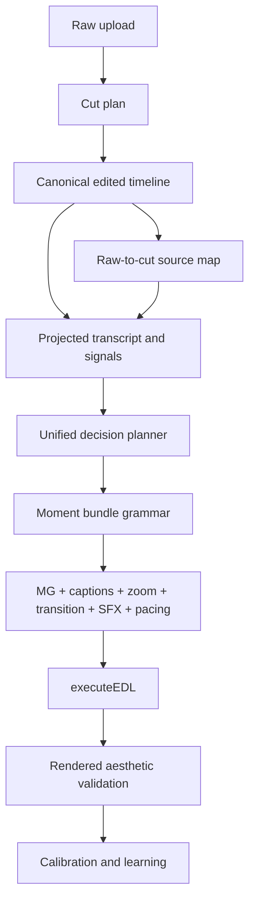
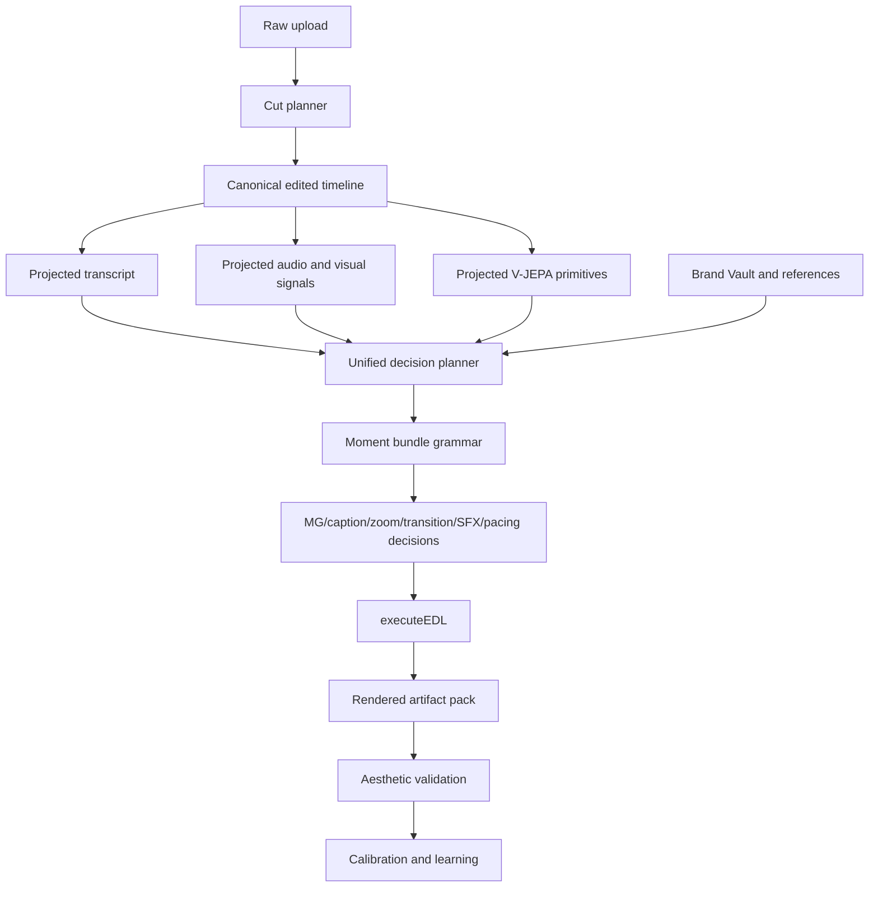

# Editron Northstar Final Plan - 2026-06-14

## Status

This is the canonical remaining plan for Editron upload-to-edit, motion graphics,
captions, zooms, transitions, SFX, V-JEPA, calibration, and live intelligence.

Read this before making Editron changes. If a later implementation disagrees
with this document, update this document in the same commit and explain why.

## Northstar

The system must move from:

`label -> preset -> render`

to:

`content atoms + relations + rhythm + screen context + brand taste + learned references -> form + timing + placement + combo`

Compatibility labels can exist at API/render boundaries, but they must not be
the creative source of truth.

## Non-Negotiable Rules

1. Do not claim Path E and Path D are merged unless code proves one decision
   owner, one source timeline, and one final consumer.
2. Do not add a hidden preset menu where an LLM chooses `keyword-highlight`,
   `stat-counter`, `whip-pan`, or similar labels as the real creative decision.
3. Do not fix visual failures only with caps, blocks, or late cleanup. Guardrails
   are allowed, but root cause fixes must happen at the producer/resolver layer.
4. Do not tune calibration against one creator or one video. Use diverse creator
   references and rendered evidence.
5. Do not let metadata-only receipts be called "live intelligence." Receipts only
   become live intelligence when layout, collision, timing, and renderer decisions
   actually consume them.
6. Do not report MG/caption/zoom/transition quality as good until rendered pixels
   or motion snippets have been inspected.
7. Before structural refactors, verify the current control flow in code and cite:
   producer path, decision owner, data source of truth, and final consumer.

## Current Code Truth

- Upload-to-edit has a working pipeline: upload -> video analysis -> tribe/V-JEPA
  analysis -> director -> EDL executor -> overlays.
- MG has a real composition engine. It can derive content structure, build a
  recipe, score motion/typography/structure dials, and render through Remotion.
- The MG engine is not yet visually deep enough for AutoAE-level output. It
  mostly has text, shapes, containers, rules, particles, masks, patterns, and
  basic data-viz. It lacks enough authored scene atoms.
- Captions are now a canonical full-track overlay. That is acceptable. The weak
  part is style choice and rendered fit, not the existence of one global track.
- V-JEPA spatial primitives now exist in the current code path: subject bbox,
  text boxes/count/coverage, negative space, motion vector, object count, and
  face count. The remaining issue is reliability and coverage quality.
- Many weights, curves, thresholds, density rules, and visual sizes are still
  explicitly invented or hardcoded. They must be calibrated.
- Old agent/manual template paths still exist. They may be useful as references,
  but upload-to-edit should not use them as the primary creative brain.

## Current Production Blockers

These are not side notes. They must be solved as part of the roadmap before
claiming upload-to-edit quality is production-grade.

1. Decision authority is still brief-led.
   Current project evidence shows the creative brief is still the executable
   producer when both systems exist, while signal-driven decisions are advisory
   or evidence-only. The fix belongs in Phase 2: one planner must own executable
   MG, caption, zoom, transition, SFX, and pacing decisions after the final cut
   timeline exists. Signals and atoms must be the deciding layer, not metadata
   attached after a brief-led choice.

2. Failed-quality runs can still enter learning.
   The director worker can skip direct bandit updates on critical failures, but
   `director_completed` can still be consumed by brand-learning and recorded as
   a low reward. The fix belongs before calibration: learning consumers must
   reject `needs_review`, zero-quality, or high-critical-count runs unless the
   run is explicitly marked as a diagnostic sample.

3. Quality details are not persisted deeply enough.
   Persisting only score, issue count, critical count, and timestamp is not
   enough. The project record or attached artifact pack must retain the actual
   issue taxonomy, affected overlay ids, timestamps, and rendered evidence links
   so failures can be debugged without replaying logs.

4. Quality telemetry names are misleading.
   Per-action quality gate summaries and full-project quality review summaries
   must be separated in logs and persisted fields. "0 critical" at the action
   gate must not look like it contradicts a later full-project review with
   critical issues.

5. Transitions and SFX are still shallow.
   Transition decisions, transition overlays, SFX candidates, rejected SFX, and
   placed SFX must be audited together. Transition/SFX output should be governed
   by boundary atoms, rhythm, provider quality, repetition memory, and rendered
   evidence, not by weak hints or default compatibility names.

## Correct Architecture



The canonical edited timeline is law. Raw timeline data is provenance. Decisions
for MG, captions, zooms, transitions, SFX, and pacing must be made on the final
edited timeline using projected raw evidence.

## Phase 0 - Project Fixtures And Rendered Truth

Goal: stop arguing from metadata and inspect actual output.

Deliverables:

- Freeze 3-5 real project fixtures with cuts, transcript, overlays, decision log,
  V-JEPA coverage, MG recipes, caption presentation, zoom forms, transition forms,
  and SFX forms.
- Add a repeatable rendered snippet harness for MG/captions/zoom/transitions/SFX.
- Generate stills and short motion snippets around every overlay.
- Store reports with actual failure classes: unreadable, ugly, wrong moment,
  bad placement, repeated form, bad timing, too much density, missing MG,
  weak transition, weak SFX, caption mismatch.

Acceptance:

- A project cannot be called "good" from receipts alone.
- Every later phase can be judged against rendered evidence.

## Phase 1 - Canonical Timeline As Law

Goal: every decision is made on the final edited timeline, not raw footage after
the fact.

Deliverables:

- Verify all decisions consume `EditedTimelineContext` or equivalent final-cut
  context.
- Project transcript, V-JEPA, Wav2Vec, Essentia, moment weights, and brand context
  onto the canonical cut timeline before overlay decisions.
- Keep raw timestamp mapping only as evidence/provenance.
- Remove or gate any path that makes precision overlay decisions before the final
  cut is known.

Acceptance:

- An MG/caption/zoom/SFX cannot be born inside footage that was removed.
- No late "snap from removed footage" patch is treated as the main solution.

## Phase 2 - One Decision Owner

Goal: replace "Path E primary plus Path D supplement/fallback" with one actual
decision planner.

Deliverables:

- LLM/Gemini may propose semantic facts, narrative intent, and candidate meaning.
- Signal/atom system validates facts and resolves form/timing/placement.
- Utility/Path-D style scoring becomes evidence and validation, not a second editor.
- `executeEDL` receives one decision bundle with clear authority metadata.

Acceptance:

- No duplicate primary producer creates captions/MGs/zooms/transitions/SFX behind
  the unified planner.
- "Merged" can only be claimed after producer, owner, timeline, and consumer are
  verified in code.

## Phase 3 - Caption Aesthetic Resolver

Goal: one global caption track can look good for the video.

Deliverables:

- Keep the canonical caption track.
- Replace broad style buckets with a caption aesthetic resolver using:
  speech rate, energy, topic style, creator format, face position, text-on-screen,
  visual busyness, brand, contrast, and screen safe zones.
- Add moment-level emphasis behavior inside the one track: word/phrase emphasis,
  highlight intensity, line breaks, row grouping, casing, and motion.
- Add rendered caption tests for readability, collision, font fit, and style match.

Acceptance:

- Caption style is not judged by enum name. It is judged by rendered fit on the
  actual video.
- The system does not create one caption overlay per cut unless there is a real
  edit/render reason.

## Phase 4 - MG Scene Atom Library

Goal: reach AutoAE-level visual depth without turning the brain into templates.

Deliverables:

Build Remotion JSX atom families with slots, constraints, and signal dials:

- kinetic text blocks: word, phrase, line, stacked box, typewriter, glitch
- number hero: count, rate, fraction, percent, comparison, proof metric
- process/flowchart stack: steps, arrows, progress, branching, checklists
- search scene: Google/YouTube/search-bar typing and result reveal
- browser/device mockup: phone, browser window, dashboard, app screenshot frame
- social proof: followers, subscribers, views, comments, review cards
- comparison scene: before/after, vs, pros/cons, tradeoff, transformation
- quote/proof scene: quote, author, claim, evidence, objection/refutation
- timeline/sequence: milestone, chronology, roadmap, cause-effect chain
- object/cutout hero: hook/object/asset-assisted composition when media exists
- 3D/perspective panels: tilt, depth, parallax, shadow, light, camera move

These are not standalone export templates. They are visual atom families.

Acceptance:

- The LLM never chooses "template 14." Content atoms license an affordance, and
  signals/brand/screen context resolve the exact form.
- AutoAE-like flowchart/process output is possible from process/list atoms.

## Phase 5 - MG Semantic Spine And Relevance

Goal: choose the right moments and the right MG form.

Deliverables:

- Expand semantic atoms for process, list, hook, mistake, objection, proof,
  claim, evidence, quote, comparison, before/after, social metric, search query,
  screen/device, brand object, and causal chain.
- Strengthen MG expression authority:
  relevance, size, placement, duration, redundancy, screen pressure, and moment
  strength must be resolved from atoms/signals.
- Fix placement mismatch between preferred region and rendered recipe layout.
- Prevent weak identity/name/filler moments from becoming standalone MGs.

Acceptance:

- MG selection is signal-driven and content-driven.
- The output is not mostly keyword boxes or generic text cards.

## Phase 6 - Zoom And Transition Choreography

Goal: zooms and transitions feel authored, not repeated.

Deliverables:

- Add timeline memory: recent zoom type, recent transition type, recent intensity,
  recent screen direction, and recent overlay density.
- Zoom resolver should use subject bbox, shot scale, face/eye attention, motion
  vector, speech intensity, emotional arc, beat phase, and topic shift.
- Transition resolver should use cut-boundary atoms:
  topic delta, speech pause, visual continuity, motion direction, beat strength,
  scene relation, and semantic relationship.
- Render and inspect transition snippets, not just unit-test params.

Acceptance:

- Repeated same-feeling zooms are treated as a failure.
- Non-hard-cut transitions are content-boundary decisions, not budget decorations.

## Phase 7 - SFX System

Goal: SFX has MG-like intent infrastructure while still using external providers.

Deliverables:

- Keep external SFX providers as primary.
- Add deterministic SFX roles: impact, whoosh, riser, button, sparkle, glitch,
  transition-tail, soft-hit, negative-space, emphasis-tick.
- Add provider abstraction, Cloudflare/R2 cache, quality tiers, rejection telemetry,
  silence/overmixing guardrails, and timing alignment to frames/beats.
- Persist `sfxForm`, role, volume, timing, source provider, and rejection reason.

Acceptance:

- Bad provider results are observable and rejected.
- SFX is timed with MG/zoom/transition/caption rhythm, not sprinkled randomly.

## Phase 8 - V-JEPA Quality And Visual Cutting

Goal: visual understanding affects cuts and overlays.

Deliverables:

- Improve V-JEPA coverage and gap handling.
- Validate subject bbox, text boxes, negative space, motion vectors, face/object
  counts, face emotion, and eye-contact quality.
- Add degraded-mode flags when primitives are missing or unreliable.
- Use visual understanding for cut sequencing, especially no-sound or weak-sound
  videos: visual salience, action continuity, shot quality, screen content,
  silent-moment protection, and visual cut boundaries.

Acceptance:

- Visual primitives are not just metadata. They affect cut choice, overlay placement,
  zoom focal points, transition choices, and caption safe zones.

## Phase 9 - Rendered Aesthetic Gate

Goal: decide quality from actual rendered output.

Deliverables:

- Render before/after frames and short clips around each overlay.
- Score legibility, contrast, face overlap, caption overlap, text overflow, blank
  output, timing landing, animation quality, visual density, and repeated forms.
- Add human/founder review hooks for subjective taste where automation is weak.
- Prevent calibration/learning writes from failed render-quality runs.

Acceptance:

- Quality review cannot say "pass" when rendered output is visibly bad.
- Aesthetic failures produce actionable resolver or atom-library TODOs.

## Phase 10 - Calibration

Goal: tune weights, curves, sizes, relevance, timing, density, and placement from
reference evidence.

Deliverables:

- Run calibration across diverse creators and formats:
  hooks/claims, talking-head education, vlog/creator, documentary, product/luxury,
  screen-record/tutorial, podcast/interview, music/beat-driven.
- Calibrate:
  moment weights, MG relevance thresholds, MG size/layout curves, caption style
  curves, zoom intensity/focal curves, transition boundary rules, SFX timing/volume,
  V-JEPA confidence defaults, and density policies.
- Use seeded deterministic offline tuning for curve parameters.
- Keep calibration reports separate from live bandit writes until verified.

Acceptance:

- Weights and curves stop being mostly invented values.
- The system learns robust editing taste, not one creator cosplay.

## Phase 11 - Live Intelligence

Goal: receipts and atoms drive live editor behavior.

Deliverables:

- Receipts power collision checks, face avoidance, text legibility checks, caption
  density, overlay stacking, zoom/transition restraint, and smart placement.
- Editor `changeOverlay` and bulk `setOverlays` paths keep receipts fresh in memory.
- Live UI exposes meaningful debug info: why this overlay exists, why this spot,
  why this size, why this motion, why this sound.

Acceptance:

- Metadata is not stale during unsaved editor sessions.
- Live intelligence consumes the same atomic truth as render/export.

## Phase 12 - Brand And Reference Learning

Goal: brand taste shapes the edit without becoming a preset pack.

Deliverables:

- Feed Brand Vault taste into MG/caption/zoom/transition/SFX resolvers:
  typography, color, restraint, density, motion taste, tone, visual references.
- Learn per-brand overrides only after rendered quality is verified.
- Store accepted/rejected overlay decisions as taste evidence.

Acceptance:

- Brand changes influence visual language coherently.
- Learning never overwrites ground-truth atoms or hides bad runs.

## Execution Order

1. Rendered truth fixtures.
2. Caption aesthetic resolver.
3. MG scene atom library, starting with process/flowchart and number hero.
4. MG semantic spine/relevance/placement fixes.
5. Zoom and transition choreography.
6. SFX provider/form system.
7. V-JEPA quality plus visual cutting.
8. Rendered aesthetic gate.
9. Full calibration.
10. Live intelligence.
11. Brand/reference learning.

## First Implementation Slice

Start with a small, shippable slice:

1. Render current project MG/caption snippets and write a failure report.
2. Implement one AutoAE-grade scene atom family: process/flowchart stack.
3. Add process/list atoms to MG semantic extraction.
4. Route process/list MG decisions to the new atom family via structure and signals.
5. Render before/after snippets and compare.

This proves the core idea without pretending the whole MG domain is finished.

## Verification Protocol

For every phase:

- Read the current code path first.
- Change at most five files per implementation phase.
- Add focused regression tests for the exact bug or behavior.
- Run focused tests.
- Run typecheck/lint when practical; if repo baseline is red, report touched-file
  filtering separately from baseline failures.
- Render actual snippets for visual work.
- Do not push or call a phase complete without evidence.

## Open Calibration Flags

The following are explicitly invented or calibration targets and must not be
treated as permanent truth:

- MG expression authority weights and thresholds.
- MG font size, layout width, duration, screen pressure, and relevance curves.
- Caption style thresholds, geometry, word grouping, highlight intensity.
- Zoom intensity, focal point, attack/hold/release, and repetition policies.
- Transition duration, boundary thresholds, and non-hard-cut rarity rules.
- SFX volume, timing, role matching, and provider rejection thresholds.
- Moment-weight blend and V-JEPA/Wav2Vec/Gemini contribution weights.
- V-JEPA fallback defaults and degraded-mode thresholds.
- Overlay density policies across MG/captions/zoom/transitions/SFX.

## Definition Of Done

Editron upload-to-edit is not "done" until:

- a user upload produces a coherent final cut,
- captions look intentional for that video,
- MGs are relevant, varied, readable, and visually rich,
- zooms and transitions feel choreographed,
- SFX is useful and not spammy,
- V-JEPA changes placement/form/cutting decisions,
- calibration has tuned the core weights/curves from references,
- rendered aesthetic checks catch bad output before learning/persistence,
- and the architecture has one verified decision owner over the final timeline.

## CEO Review Details

| Review | Trigger | Why | Runs | Status | Findings |
|--------|---------|-----|------|--------|----------|
| CEO Review | `/plan-ceo-review` | Scope and strategy | 1 | ISSUES_OPEN | Option B approved: strangler production plan. 9 required amendments before coding. |
| Codex Review | `/codex review` | Independent second opinion | 0 | NOT_RUN | Not requested in this pass. |
| Eng Review | `/plan-eng-review` | Architecture and tests | 0 | REQUIRED_NEXT | Needed before implementation of the first code slice. |
| Design Review | `/plan-design-review` | UI and rendered aesthetic gaps | 0 | RECOMMENDED_LATER | Needed once rendered snippets exist. |
| DX Review | `/plan-devex-review` | Developer experience gaps | 0 | NOT_RUN | Not required for this plan pass. |

- **UNRESOLVED:** 0 user decisions. The user selected option B, the strangler production plan.
- **VERDICT:** CEO direction is approved with required amendments. Do not implement code until the first Phase 0 fixture/render pack is produced and the eng review is run.

### CEO Review Summary

Option B is the correct business and engineering path. It keeps the useful
systems already built, but creates one production decision owner around the
canonical edited timeline. A full rewrite would waste working infrastructure.
Tiny patches would keep producing the same visible failures: generic MGs,
same-feeling zooms, caption style mismatch, weak transitions, spammy SFX, and
metadata that does not affect rendered output.

The plan is strong because it starts with rendered evidence, demands a canonical
timeline, demotes LLMs to semantic facts, keeps calibration after render-quality
proof, and names invented weights/curves as calibration targets.

The plan is not implementation-ready until the amendments below are handled.

### Required Amendments

1. Phase 0 must freeze a baseline artifact pack before any resolver work.
   Include project ids, source assets, kept cuts, transcript, decision bundle,
   overlays, MG recipes, caption presentation, zoom/transition/SFX forms,
   V-JEPA coverage, rendered stills, short clips, and a failure taxonomy.

2. The first MG atom family must be selected from rendered failure evidence.
   Process/flowchart is a strong candidate, but not a law. If the failing
   projects mostly need number hero, proof cards, or concept/contrast layouts,
   build that first.

3. The one-decision-owner claim must be verified in code before using the word
   "merged." The verification must cite producer path, decision owner,
   canonical timeline source, authority metadata, and final consumer.

4. Old Director, utility, reactive, template, and fallback paths must be marked
   as facts, validators, adapters, or disabled fallbacks. They must not create a
   second primary caption/MG/zoom/transition/SFX brain after the unified planner.

5. Every resolver change must update the signal/weights/curves source of truth
   or explicitly mark the value as invented and awaiting calibration.

6. Rendered aesthetic validation must produce human-inspectable artifacts, not
   just numeric scores. Each report needs before/after stills or short clips.

7. V-JEPA quality must be judged by coverage and primitive reliability. If face,
   eye contact, subject bbox, negative space, text boxes, or motion vectors are
   missing or low confidence, the system must mark degraded mode and avoid fake
   certainty.

8. New scene atom families and resolver behavior need feature flags or a clean
   rollback path until rendered checks pass on multiple project fixtures.

9. Calibration stays blocked until reference measurement is real and rendered
   aesthetic evidence exists. No bandit or brand-learning writes from bad runs.

### What Already Exists

- Upload-to-edit can produce a cut, overlays, and an executable EDL.
- MG has a composition spine with structure, recipes, typography, color,
  layout, motion, and Remotion rendering.
- Captions have a canonical track; the problem is aesthetic resolving and fit.
- Zoom, transition, and SFX form infrastructure exists, but still needs better
  choreography, persistence, and rendered validation.
- V-JEPA primitives are present in the current plan, but must prove coverage and
  quality on real projects.
- Atomic receipts exist, but are only live intelligence when live decisions read
  them.

### NOT In Scope

- A full rewrite of Editron. The correct move is strangler unification.
- A template marketplace clone. AutoAE is a quality reference, not the runtime
  architecture.
- Copying one creator's style. Calibration must learn across formats.
- Building a local SFX database as the primary source. External providers plus
  cache, quality telemetry, and rejection policy are the plan.
- Calling calibration before rendered quality gates exist.

### Architecture Review



Architecture verdict: good direction, but the first code phase must prove that
there is one owner over the final timeline. Shared downstream helpers are not
enough.

### Data Flow And Shadow Paths

```text
raw upload
  -> cut plan
  -> canonical edited timeline
  -> projected transcript/signals/V-JEPA/brand
  -> unified decision planner
  -> moment bundle grammar
  -> executeEDL
  -> rendered validation
  -> calibration only if validation passes

nil input: fail loud at fixture/project load, no learning writes
empty input: produce no overlay decision and record no-op reason
error input: retry bounded external calls, then mark degraded mode
stale input: reject if decision bundle timeline hash does not match cut timeline
```

### Error And Rescue Registry

| Codepath | What can go wrong | Rescue action | User impact |
|----------|-------------------|---------------|-------------|
| Project fixture loader | Project missing or Mongo query fails | Fail loud with project id and query context | Test run stops instead of lying |
| Cut planner | Gemini/audio/transcript unavailable | Mark degraded or fail based on policy | User sees blocked/degraded status |
| Timeline projection | Raw-to-cut map invalid | Reject precision decisions | Prevents overlays born in removed footage |
| V-JEPA analysis | Coverage gaps or weak primitives | Mark degraded and use safe proxy only | Fewer screen-aware decisions, not fake ones |
| Unified planner | LLM facts malformed | Drop facts, keep deterministic signals | No menu-label hallucination becomes truth |
| MG resolver | Missing semantic atoms | Conservative readable output plus failure reason | Avoids ugly invented form |
| Caption resolver | Style cannot fit screen | Fall back to legible safe style | Captions stay readable |
| SFX provider | Bad search result or timeout | Retry/fallback/cache/reject with telemetry | Avoids random or missing SFX |
| Render harness | Remotion render fails | Fail artifact pack and block calibration | Bad pixels cannot train learning |
| Calibration runner | Reference signal invalid | Dry-run report only, no writes | No corrupted weights |

Critical gaps before coding: fixture loader contract, timeline hash check,
render-artifact failure policy, V-JEPA degraded-mode policy.

### Failure Modes Registry

| Codepath | Failure mode | Rescued? | Test? | User sees? | Logged? |
|----------|--------------|----------|-------|------------|---------|
| Unified planner | Second producer creates duplicate overlays | Planned | Needed | No spam overlays | Must log suppressed producer |
| MG resolver | Generic keyword box dominates output | Planned | Needed | Better relevance or no MG | Must log semantic insufficiency |
| Caption resolver | Global style mismatches video | Planned | Needed | Safe readable caption style | Must log style reason |
| Zoom resolver | Same motion repeated | Planned | Needed | Varied choreography | Must log timeline memory |
| Transition resolver | Hard-cut/default dominates | Planned | Needed | Boundary-driven transitions | Must log boundary atoms |
| SFX resolver | Too many SFX | Planned | Needed | Density-respected SFX | Must log density policy |
| V-JEPA pipeline | Coverage weak but trusted | Planned | Needed | Degraded-mode behavior | Must log coverage score |

### Security And Privacy Review

No new public API is approved by this plan alone. The first implementation slice
must not add external data exfiltration. Rendered fixture artifacts may contain
user video frames, transcripts, brand data, or creator references, so artifact
storage must stay local/private unless explicitly exported. Any future provider
calls for SFX, V-JEPA, Gemini, or reference analysis must log ids and status, not
raw private content unless needed for debugging.

### Performance And Cost Review

Rendered snippets and visual analysis are expensive. Phase 0 must render short
windows around overlays, not full videos by default. Cache V-JEPA/provider
results by asset hash and model version. Keep calibration dry-run first, seeded,
and batchable. The p99 risk is long videos with many overlays and external calls.

### Observability Review

Every decision bundle needs:

- timeline hash and project id,
- source producer and authority,
- semantic atoms and missing-atom reasons,
- signal snapshot and calibration version,
- V-JEPA coverage/degraded flags,
- resolver output and compatibility projection,
- rendered artifact paths,
- aesthetic failure classes.

Without this, failures will keep looking subjective.

### Deployment And Rollback Review

Ship the strangler in feature-flagged slices:

1. Phase 0 fixture/render report is read-only.
2. New atom family is behind an upload-to-edit resolver flag.
3. Unified decision planner blocks old producers only after fixture tests pass.
4. Calibration writes remain off until render validation passes.

Rollback is flag-off plus revert of the last phase commit. Avoid DB migrations in
the first slice unless absolutely required.

### Design And UX Review

The user-facing bar is rendered output, not internal architecture. The plan must
judge screenshots and clips for:

- caption readability and style fit,
- MG relevance, size, placement, animation landing, and taste,
- zoom/transition rhythm and repetition,
- SFX timing and restraint,
- face/text overlap and screen pressure.

Run a design review after Phase 0 produces artifact packs.

### Dream State Delta

This plan gets Editron from "many promising systems" to "one visible craft
pipeline." It still leaves the 12-month ideal unfinished: a broad visual atom
library, calibrated taste curves, per-brand learning, reliable visual cutting,
and a founder-review loop that can train taste from accepted/rejected outputs.

### Implementation Tasks

- [ ] **T1 (P1, human: ~2h / CC: ~20min)** - Fixtures - freeze 3-5 real project artifact packs before resolver work.
  - Surfaced by: Phase 0 and CEO amendment 1.
  - Files: scripts/tests/docs around Editron fixture dump and render harness.
  - Verify: fixture report includes cuts, overlays, decision bundle, recipes, V-JEPA coverage, and rendered snippets.

- [ ] **T2 (P1, human: ~2h / CC: ~25min)** - Authority - prove one decision owner over the canonical edited timeline.
  - Surfaced by: Phase 1/2 and CEO amendments 3-4.
  - Files: director/unified planner/brief executor/EDL executor tests.
  - Verify: no old producer can create primary MG/caption/zoom/transition/SFX after the unified planner.

- [ ] **T3 (P1, human: ~2h / CC: ~25min)** - Render gate - produce human-inspectable before/after snippets and failure classes.
  - Surfaced by: Phase 9 and CEO amendment 6.
  - Files: render scripts, artifact report, focused tests.
  - Verify: bad MG/caption/zoom/transition/SFX output is visible and classified.

- [ ] **T4 (P1, human: ~2h / CC: ~30min)** - MG atoms - select the first scene atom family from rendered failure evidence.
  - Surfaced by: Phase 4/5 and CEO amendment 2.
  - Files: MG semantic extractor, composition planner, Remotion renderer, tests.
  - Verify: selected atom family renders better than baseline on fixture snippets.

- [ ] **T5 (P2, human: ~1h / CC: ~15min)** - Signal truth - update the source-of-truth file for every weight/curve touched.
  - Surfaced by: CEO amendment 5 and Open Calibration Flags.
  - Files: signal/weights/curves source-of-truth docs/config.
  - Verify: every invented value is marked invented/calibration-needed.

- [ ] **T6 (P2, human: ~1h / CC: ~15min)** - V-JEPA quality - add degraded-mode gates for weak visual primitives.
  - Surfaced by: Phase 8 and CEO amendment 7.
  - Files: V-JEPA coverage audit, moment context projection, resolver inputs.
  - Verify: low coverage prevents fake screen-aware confidence.

- [ ] **T7 (P2, human: ~1h / CC: ~15min)** - Rollout - add feature flags and rollback notes for new resolver behavior.
  - Surfaced by: deployment review and CEO amendment 8.
  - Files: config/feature gates/docs/tests.
  - Verify: old behavior can be restored without code surgery.

- [ ] **T8 (P2, human: ~1h / CC: ~15min)** - Calibration - keep calibration dry-run and blocked until rendered evidence passes.
  - Surfaced by: Phase 10 and CEO amendment 9.
  - Files: calibration runner/docs/tests.
  - Verify: failed render-quality run cannot write bandit or brand-learning state.

### Completion Summary

| Item | Result |
|------|--------|
| Mode selected | SELECTIVE_EXPANSION via option B, strangler production plan |
| System audit | Dirty tree contains unrelated Brand Vault WIP; plan doc is untracked |
| Architecture | 4 issues found: evidence-first slice, true owner proof, old producer gating, rollback |
| Errors | 4 critical gaps before coding: fixture load, timeline hash, render failure, V-JEPA degraded mode |
| Security | 1 privacy requirement for rendered artifacts and external provider logging |
| Data/UX | 5 visible failure classes must be captured before resolver work |
| Tests | Fixture, authority, render, MG atom, V-JEPA degraded, and calibration-write tests required |
| Performance | Snippet rendering and cache policy required before broad runs |
| Observability | Decision bundle debug payload required |
| Deployment | Feature flags required for new resolver behavior |
| Future | Reversibility 4/5 if strangler slices and flags are respected |
| Design | Design review recommended after Phase 0 artifacts exist |

Next review: run `/plan-eng-review` before the first code implementation slice.

## GSTACK REVIEW REPORT

| Review | Trigger | Why | Runs | Status | Findings |
|--------|---------|-----|------|--------|----------|
| CEO Review | `/plan-ceo-review` | Scope and strategy | 1 | CLEAR_WITH_AMENDMENTS | Option B selected: strangler production plan, with evidence-first gates. |
| Codex Review | `/codex review` | Independent second opinion | 0 | NOT_RUN | Not requested in this pass. |
| Eng Review | `/plan-eng-review` | Architecture and tests | 1 | CLEAR_PHASE_0_ONLY | 7 issues/gaps found; Phase 0 is cleared, later phases require new review after fixtures. |
| Design Review | `/plan-design-review` | UI and rendered aesthetic gaps | 0 | REQUIRED_AFTER_PHASE_0 | Run after rendered artifact packs exist. |
| DX Review | `/plan-devex-review` | Developer experience gaps | 0 | NOT_RUN | Not required before Phase 0. |

- **UNRESOLVED:** 0 user decisions for Phase 0. Scope is reduced to Phase 0 only for the next implementation pass.
- **VERDICT:** CEO + ENG clear the Phase 0 fixture/rendered-truth slice. Do not implement caption/MG/zoom/transition/SFX resolver changes until Phase 0 artifacts prove the failure classes.

### Eng Review Summary

Engineering verdict: the plan is directionally right, but only Phase 0 is
implementation-ready. The full roadmap touches too many modules and too many
creative systems to approve as one pass.

The next pass should build the evidence system, not yet "fix MGs." The goal is
to freeze real project truth, render current output, classify visible failures,
and prove the existing canonical timeline/unified-bundle guards on real
projects.

### Step 0 Scope Challenge

- Existing code already provides useful pieces: `EditedTimelineContext`,
  `planUnifiedDecisionBundleFromCandidates`, `executeEDL`, post-EDL action
  policy, V-JEPA coverage audit, moment-bundle calibration rows, and an MG still
  renderer.
- Minimum complete next change: Phase 0 artifact pack plus rendered snippet
  harness. This is not a shortcut; it is the prerequisite that prevents another
  round of blind resolver edits.
- Complexity trigger: the full 12-phase plan touches far more than 8 files and
  more than 2 services. Approved implementation scope is reduced to Phase 0.
- `TODOS.md` does not exist in this worktree. No TODO file update was made.

### Architecture Review

```text
Existing useful seam:

director-agent
  -> buildEditedTimelineContext(...)
  -> collect creative-brief and signal-driven candidates
  -> planUnifiedDecisionBundleFromCandidates(...)
  -> enforceCanonicalDecisionTimeline(...)
  -> executeEDL(...)
  -> installCanonicalCaptionTrack(...)
  -> gate post-EDL legacy creative actions
  -> persist V-JEPA coverage audit

Phase 0 must not change the editor brain.
Phase 0 observes, renders, classifies, and writes fixture truth.
```

Findings:

1. `[P1] (confidence: 9/10) lib/editron/agent/director-agent.ts:1229` -
   `unifiedDecisionBundle = planUnifiedDecisionBundleFromCandidates(unifiedDecisionCandidates);`
   proves shared bundle planning exists, but it does not by itself prove the
   whole roadmap is one decision brain. The plan must keep the "partial
   convergence until proven" language.

2. `[P1] (confidence: 9/10) lib/editron/services/edited-timeline-context.ts:62` -
   `export function buildEditedTimelineContext(...)` exists and is the right
   source for canonical cut-timeline truth. Phase 0 should record its evidence
   object in every fixture report.

3. `[P1] (confidence: 8/10) tests/editron/decision-timeline-guard.test.ts:65` -
   the current guard catches raw-frame decisions that leak past the edited
   timeline. Phase 0 still needs a real-project regression fixture proving the
   guard catches actual upload-to-edit failures, not only synthetic examples.

4. `[P2] (confidence: 8/10) lib/editron/agent/post-edl-action-policy.ts:69` -
   post-EDL creative action gating exists. Phase 0 should include the skipped
   action reasons in the artifact pack so caption/MG spam is auditable from a
   real run.

### Code Quality Review

Findings:

1. `[P1] (confidence: 9/10) scripts/render-mg-stills.ts:2` - the existing
   renderer renders MG stills only. Phase 0 requires all overlay families:
   MG, captions, zoom, transition, and SFX timing windows. Do not call this
   "rendered truth" until it covers the bundle, not only MG.

2. `[P1] (confidence: 8/10) scripts/render-mg-stills.ts:61` - output goes under
   `.calibration-temp/mg-stills`. Phase 0 needs a stable artifact directory
   structure per project/run so reports are not mixed with calibration scratch.

3. `[P2] (confidence: 8/10) lib/editron/services/vjepa-coverage-audit.ts:117` -
   V-JEPA coverage audit exists and tracks primitive coverage. Phase 0 should
   persist primitive-quality summaries beside rendered artifacts, not only in
   project intelligence metadata.

### Test Review

Coverage diagram for Phase 0:

```text
CODE PATHS                                           TEST STATUS
[+] fixture dump
  ├── [GAP] load project by id from Mongo
  ├── [GAP] include cuts/source clips/raw-to-cut map
  ├── [GAP] include overlays and atomic receipts
  ├── [GAP] include unified bundle summary
  └── [GAP] fail loud on missing project

[+] rendered artifact harness
  ├── [EXISTS] MG stills via scripts/render-mg-stills.ts
  ├── [GAP] caption stills / short clips
  ├── [GAP] zoom motion snippets
  ├── [GAP] transition boundary snippets
  ├── [GAP] SFX timing/audio report
  └── [GAP] stable artifact manifest

[+] validation report
  ├── [EXISTS] MG render validity classifier
  ├── [GAP] caption readability/collision class
  ├── [GAP] repeated zoom/transition class
  ├── [GAP] SFX density/timing class
  └── [GAP] calibration write-block assertion

USER FLOW
[+] Developer runs Phase 0 on project ids
  ├── [GAP] one command creates fixture + artifacts + report
  ├── [GAP] command exits non-zero for missing render outputs
  └── [GAP] report links every overlay to visible evidence
```

Required tests before Phase 0 can be called done:

- Unit: fixture manifest builder handles missing project, no overlays, no MGs,
  and missing unified bundle.
- Unit: artifact classifier marks missing/blank render outputs as failures.
- Integration: real fixture or seeded project dump produces manifest + stills.
- Regression: calibration/bandit writes are blocked when render quality fails.
- Regression: timeline guard evidence is recorded for real project decisions.

### Performance Review

Findings:

1. `[P2] (confidence: 8/10) scripts/render-mg-stills.ts:76` - the current still
   renderer bundles Remotion once then loops overlays. Phase 0 should preserve
   this pattern and avoid one bundle per overlay.

2. `[P2] (confidence: 7/10) Phase 0 plan` - rendering every full video would be
   too slow. Render short windows around overlays and cut boundaries first.

3. `[P2] (confidence: 7/10) Phase 8/10 plan` - V-JEPA, Gemini, provider SFX,
   and calibration calls need cache keys by asset hash, model/provider version,
   and settings before broad runs.

### Failure Modes

| Codepath | Failure mode | Covered now? | Required Phase 0 handling |
|----------|--------------|--------------|---------------------------|
| Fixture dump | Project id missing or Mongo query fails | No | Fail loud with project id |
| Timeline evidence | Source map incomplete | Partly | Record context evidence and guard result |
| Render harness | Overlay render blank/missing | MG only | Classify all overlay families |
| V-JEPA audit | Coverage weak but trusted | Partly | Store degraded flag in artifact pack |
| Calibration | Bad run writes learning state | No | Assert no writes on failed render quality |
| Old producers | Profile action overrides bundle | Unit-tested | Include skipped action reasons in fixture |

Critical gaps for Phase 0: none after scope reduction. Critical gaps for later
phases remain open until Phase 0 artifacts exist.

### Parallelization

Sequential implementation for Phase 0. The first slice should stay in one lane
because fixture manifest shape, render harness output, and validation report
schema must agree.

After Phase 0:

| Step | Modules touched | Depends on |
|------|-----------------|------------|
| Caption aesthetic resolver | caption services, renderer, tests | Phase 0 |
| MG scene atom family | MG engine, Remotion renderer, tests | Phase 0 |
| Zoom/transition choreography | zoom/transition services, EDL tests | Phase 0 |
| SFX contract | SFX provider/cache/form services | Phase 0 |
| V-JEPA quality/visual cutting | V-JEPA audit, timeline projection, cutting | Phase 0 |

These later lanes can split only after the artifact schema is stable.

### Eng Implementation Tasks

- [ ] **E1 (P1, human: ~2h / CC: ~25min)** - Phase 0 - build a real project fixture manifest.
  - Surfaced by: Architecture and Test Review.
  - Files: `scripts/`, `tests/editron/`, fixture/report docs.
  - Verify: fixture includes cuts, raw-to-cut map, overlays, receipts, unified bundle, V-JEPA audit, skipped profile actions.

- [ ] **E2 (P1, human: ~2h / CC: ~30min)** - Phase 0 - expand rendered artifact harness beyond MG stills.
  - Surfaced by: Code Quality and Test Review.
  - Files: render scripts, Remotion harness, artifact report tests.
  - Verify: MG/caption/zoom/transition/SFX windows are represented or explicitly marked unsupported.

- [ ] **E3 (P1, human: ~1h / CC: ~20min)** - Phase 0 - add failure taxonomy and manifest schema tests.
  - Surfaced by: Test Review.
  - Files: validation classifier/tests.
  - Verify: blank/missing/unreadable/repeated/spam/timing failures are machine-readable.

- [ ] **E4 (P1, human: ~1h / CC: ~15min)** - Phase 0 - block calibration/learning writes from failed artifact runs.
  - Surfaced by: Failure Modes.
  - Files: calibration runner/tests.
  - Verify: failed render-quality run cannot write bandit or brand-learning state.

- [ ] **E5 (P2, human: ~45min / CC: ~10min)** - Phase 0 - cache and cleanup render outputs per project/run.
  - Surfaced by: Performance Review.
  - Files: artifact path utilities/render scripts.
  - Verify: rerunning one project cannot mix stale stills with new reports.

### Completion Summary

| Item | Result |
|------|--------|
| Step 0 | Scope reduced to Phase 0 implementation only |
| Architecture Review | 4 issues/gates found |
| Code Quality Review | 3 issues/gates found |
| Test Review | Diagram produced, 13 gaps identified |
| Performance Review | 3 issues/gates found |
| NOT in scope | Full resolver changes, calibration, live intelligence, broad atom library |
| What already exists | Timeline context, unified bundle, EDL executor, post-EDL policy, V-JEPA audit, MG still renderer |
| TODOS.md updates | 0, no `TODOS.md` exists |
| Failure modes | 0 Phase 0 critical gaps after scope reduction |
| Outside voice | skipped |
| Parallelization | sequential for Phase 0, later lanes after artifact schema |
| Lake Score | complete Phase 0 path chosen over shortcut resolver edits |
