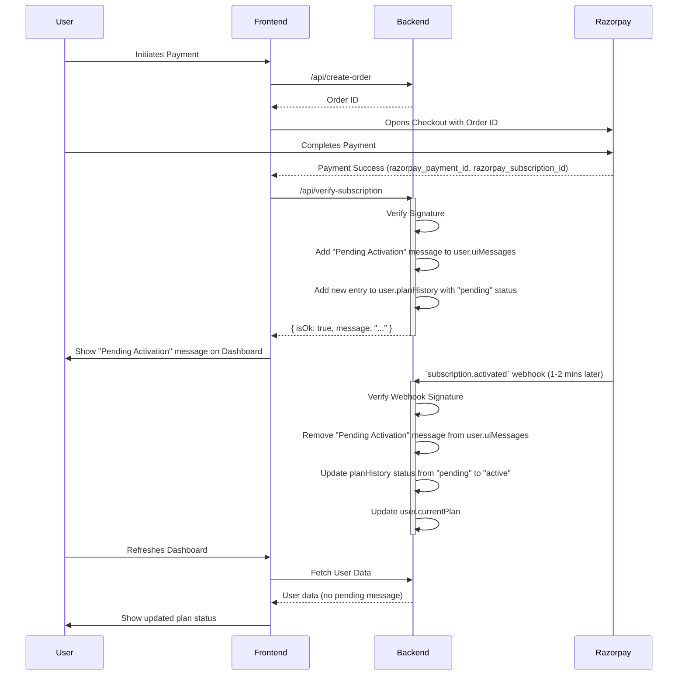

# Architectural Plan: Handling Payment to Activation Delay

This document outlines the architectural changes required to provide clear user feedback during the 1-2 minute delay between a successful payment and the `subscription.activated` webhook from Razorpay.

## Sequence Diagram



## 1. User Schema Modification (`schemas/user.ts`)

To handle UI messages dynamically, we will introduce a new field `uiMessages` to the `userSchema`.

### Proposed `IUiMessage` Interface:

```typescript
export interface IUiMessage {
  id: string; // Unique identifier for the message (e.g., a UUID)
  type: 'modal' | 'banner' | 'disclaimer'; // Type of UI element to display
  title: string;
  message: string;
  location: 'dashboard-overview' | 'manage-plan' | 'global'; // Where to display the message
  style?: { // Optional field for unique styling
    backgroundColor?: string;
    textColor?: string;
    icon?: string;
  };
}
```

### Add to `IUser` Interface and `userSchema`:

```typescript
// In IUser interface
uiMessages: IUiMessage[];

// In userSchema
uiMessages: {
  type: [new Schema<IUiMessage>({
    id: { type: String, required: true },
    type: { type: String, required: true, enum: ['modal', 'banner', 'disclaimer'] },
    title: { type: String, required: true },
    message: { type: String, required: true },
    location: { type: String, required: true, enum: ['dashboard-overview', 'manage-plan', 'global'] },
    style: {
      backgroundColor: { type: String },
      textColor: { type: String },
      icon: { type: String },
    },
  }, { _id: false })],
  default: [],
},
```

We will also modify the `IPlan` interface in `schemas/user.ts` to include a `pending` status.

### Modified `IPlan` status:

```typescript
// In IPlan interface
status: "active" | "expired" | "canceled" | "pending";

// In planSchema
status: {
  type: String,
  enum: ["active", "expired", "canceled", "pending"],
  required: true,
},
```

## 2. Backend Logic

### A. Payment Confirmation Endpoint (`app/api/verify-subscription/route.ts`)

After successfully verifying the Razorpay signature, we will update the user's document to reflect the pending state.

```typescript
// app/api/verify-subscription/route.ts

// ... imports
import { User } from "@/schemas/user";
import { v4 as uuidv4 } from 'uuid';

// ... inside POST function, after signature verification

const user = await User.findOne({ clerkUserId: userId });

if (user) {
  // 1. Add a "pending activation" message
  const pendingMessage: IUiMessage = {
    id: uuidv4(),
    type: 'banner',
    title: 'Plan Activation Pending',
    message: 'Your payment was successful. Your plan is being activated and should be ready in 1-2 minutes. Please refresh the page shortly.',
    location: 'dashboard-overview',
    style: {
        backgroundColor: '#EBF8FF', // A light blue background
        textColor: '#2C5282', // A dark blue text
        icon: 'hourglass'
    }
  };
  user.uiMessages.push(pendingMessage);

  // 2. Add a new entry to planHistory with "pending" status
  // You'll need to get plan details from the request or fetch them
  const newPlan = {
      planId: "ID_OF_THE_PLAN", // Get this from request or fetch
      name: planType,
      startDate: new Date(),
      endDate: null,
      price: 0, // Get this from request or fetch
      currency: "INR", // Get this from request or fetch
      status: "pending",
      subscriptionId: { razorpay: razorpay_subscription_id },
      serviceLimits: {}, // Populate with pending plan limits if needed
  };
  user.planHistory.push(newPlan);

  await user.save();
}

return NextResponse.json({ isOk: true, message: "Subscription initiated successfully. Your plan will be updated shortly." });
```

### B. Webhook Handler (`app/api/webhooks/razorpay/route.ts`)

In the `subscription.activated` event handler, we will remove the pending message and update the plan status.

```typescript
// app/api/webhooks/razorpay/route.ts

// ... inside `subscription.activated` case

if (!user) {
  // ...
}

// 1. Remove the "pending activation" message
user.uiMessages = user.uiMessages.filter(
  (msg: IUiMessage) => msg.location !== 'dashboard-overview' || !msg.message.includes('pending')
);

// 2. Update the plan status in planHistory
const pendingPlan = user.planHistory.find(
  (plan: IPlan) => plan.subscriptionId?.razorpay === subscription.id && plan.status === 'pending'
);

if (pendingPlan) {
  // The `updateUserPlan` service should handle moving the plan from planHistory to currentPlan
  // and setting the status to 'active'. If not, we need to adjust it here.
}

// The existing `updateUserPlan` call should handle the rest of the plan activation.
// We need to ensure it correctly updates the plan from pending to active.
await updateUserPlan(
  // ...
);

// No need to save the user here if `updateUserPlan` does it.
```

## 3. Frontend Logic

### A. Dashboard Overview (`/dashboard`)

The frontend will fetch the user data and display any UI messages.

```javascript
// Example in a React component for the dashboard

const [user, setUser] = useState(null);

useEffect(() => {
  // Fetch user data from your API
  fetch('/api/user')
    .then(res => res.json())
    .then(data => setUser(data.user));
}, []);

return (
  <div>
    {user?.uiMessages?.map(msg => {
      if (msg.location === 'dashboard-overview') {
        return (
          <div key={msg.id} style={msg.style}>
            {/* Render banner/modal based on msg.type */}
            <h4>{msg.title}</h4>
            <p>{msg.message}</p>
          </div>
        );
      }
      return null;
    })}
    {/* Rest of the dashboard */}
  </div>
);
```

### B. Manage Plan Component

This component will display the pending status from the `planHistory`.

```javascript
// Example in a React component for managing plans

const [user, setUser] = useState(null);

useEffect(() => {
  // Fetch user data
}, []);

const pendingPlan = user?.planHistory?.find(p => p.status === 'pending');

return (
  <div>
    <h3>Your Plan</h3>
    {pendingPlan ? (
      <div>
        <p>Current Plan: {user.currentPlan.name}</p>
        <p>Next Plan: {pendingPlan.name} (Pending confirmation, might take 2-3 mins)</p>
      </div>
    ) : (
      <p>Current Plan: {user.currentPlan.name}</p>
    )}
    {/* Rest of the manage plan component */}
  </div>
);