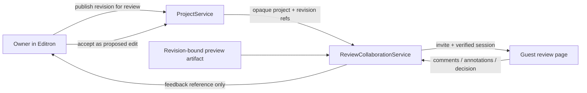

# Editron guest review links and comments plan

Date: 2026-08-14

Branch: `infrastructure-improvs-+Editron`

Status: `PLANNED_NOT_IMPLEMENTED`

Authority: normative collaboration addendum to the agency and production-house
gates in `EDITRON_FINAL_EXECUTION_PLAN_2026-08-10.md`.

## Product outcome

An Editron owner can publish a draft for review before the final delivery
render, invite guests by email, and copy one stable review URL. A guest can play
the published preview, add frame/range comments and annotations, reply, and mark
feedback complete. A guest cannot modify the project or timeline.

The interaction should feel like Google sharing:

1. click **Share review**;
2. enter one or more email addresses;
3. choose **Viewer** or **Commenter**;
4. optionally set expiration and download policy;
5. notify invitees and copy the same stable link;
6. manage access, resend, revoke, or publish a newer review version later.

"View only" means no edit authority. A commenter receives playback plus the
review-comment capability, not timeline access.

## Code-grounded current truth

- `ProjectService` already has `visibility: private | org | shared`,
  `sharedWith: userId[]`, and `canAccessProject`. That is authenticated project
  access, not a guest-review role or revision-bound external share.
- `lib/shared/project-links.ts` links ThinkForge, storyboard, Editron and
  rendered-video identities. Its `plink_*` identifier is internal lineage, not
  a public capability URL and not a permission owner.
- No Editron route, durable model or UI was found for external review shares,
  timecoded guest comments, annotations, version comparison or client approval.
- The Adobe/Frame.io capability census already classifies frame comments,
  version stacks, comparison, external shares, review approval and secure
  stakeholder sharing as missing; granular project roles are only partial.

Therefore this plan reuses ProjectService and render identities but does not
pretend an existing review system is complete.

## Authority split



- **ProjectService** remains the only project/revision/mutation authority.
- **Render/preview owner** produces and proves the review artifact.
- **ReviewCollaborationService** owns shares, invite principals, comment
  threads, annotations, review decisions and audit activity.
- A comment never mutates a timeline. If an owner accepts feedback, Editron
  creates a normal expected-revision proposal and applies it through
  ProjectService.
- ReviewCollaborationService stores opaque owner-issued references; it cannot
  decode or advance raw project revisions.

## Stable link and invitation contract

The visible URL is:

```text
<app-origin>/review/<opaque-share-id>
```

The identifier must contain at least 128 bits of cryptographic entropy. It must
not contain a project ID, user ID, email, organization ID, render path or media
credential. An unguessable ID is defense in depth, not authorization.

Launch access is `INVITE_ONLY`:

1. Owner enters an email and role.
2. The service stores the normalized email identity through the platform's
   protected identity mechanism and sends the stable review URL.
3. An unauthenticated visitor requests a short-lived email PIN for that share.
4. Successful PIN verification creates an HttpOnly, Secure, SameSite review
   session bound to share, invite, tenant and role.
5. Every API and media request rechecks session, invite, share status,
   expiration, tenant and publication binding.
6. Revocation ends existing sessions and invalidates media URLs.

There is no permanent bearer secret in a query string. `ANYONE_WITH_LINK` is
not part of launch scope; it needs a separate threat review, explicit owner
warning and tenant policy.

## Version-bound review publication

Publishing for review creates an immutable `ReviewPublicationV1` that binds:

- opaque `projectId` reference;
- ProjectService-issued project and timeline revision references;
- exact project timebase identity;
- preview artifact ID, content hash and proof reference;
- raster, audio layout, duration and frame/tick mapping;
- publication number and predecessor;
- approved rights/privacy scope;
- watermark, download and retention policy;
- published-by identity and timestamp.

The guest never watches a silently changing live timeline. If the owner keeps
editing, the existing URL remains on the published revision and displays
**Newer draft available** after another publication. The owner may switch the
share's default publication deliberately, while old comments remain bound to
their original version.

"Before render" means before the final master/delivery render. Review playback
uses an immutable, lower-cost review proxy or preview render. It is visibly
labelled **Draft preview, not final master** and cannot be used as final proof.

## Core records

### `ReviewShareV1`

- `shareId`, `tenantId`, opaque project reference;
- `accessMode: INVITE_ONLY`;
- allowed roles: `VIEWER | COMMENTER`;
- current publication and permitted publication IDs;
- comment, download, watermark and branding policy;
- expiry, revocation, creator and audit timestamps;
- schema/policy versions.

### `ReviewInviteV1` and `ReviewPrincipalV1`

- share, normalized identity binding and assigned role;
- invitation, verification, expiry, revocation and last-access state;
- no raw project role and no ProjectService mutation permission.

### `ReviewCommentV1`

- publication and preview hash;
- author principal and immutable created-at identity;
- exact project-timebase tick or frame plus optional bounded range;
- optional semantic anchor for safe reprojection;
- normalized annotation coordinates plus source raster/orientation;
- body, mentions, attachments, replies and edit history;
- open/resolved/reopened status and actor receipts;
- stale/reprojection status after a newer publication.

### `ReviewDecisionV1`

- `APPROVED | NEEDS_CHANGES | IN_REVIEW`;
- authorized principal, publication/hash, timestamp and optional note;
- supersession chain and immutable audit receipt.

Approval of publication N never approves publication N+1. A final render must
show whether its project revision differs from the last approved publication.

## Comment and playback behavior

- Clicking the picture creates a pinned annotation at the current exact frame.
- Dragging the timeline creates a range comment.
- Drawings use normalized coordinates but retain the reviewed raster and
  orientation so reprojection can be validated.
- Replies remain one thread; owners can resolve/reopen feedback.
- Filtering supports timecode, author, unresolved, mentions and annotation.
- Copy-comment links resolve only inside an authorized review session.
- Guests see only approved review proxies, captions and metadata, never raw
  sources, project JSON, hidden overlays, provider URLs or internal receipts.
- Short-lived signed HLS/MP4 URLs are minted after authorization; download is
  separately gated and off by default.

## Security, privacy and rights gates

- tenant isolation and object-level authorization on every request;
- email verification, brute-force protection, rate limiting and session expiry;
- CSRF protection, strict CSP, output encoding and sanitized comment content;
- no third-party embeds or remote comment attachments without controlled ingest;
- `noindex`, no public sitemap and no sensitive values in analytics/referrers;
- share/activity audit for invite, open, view, comment, download, revoke and
  decision events;
- immediate revocation, retention/deletion controls and incident trace;
- rights/privacy check before publication; external sharing fails closed if any
  included range or asset forbids it;
- optional static or viewer/session watermark policy, with a clean-copy
  privilege held only by authorised owners.

## Required proof matrix

1. Wrong/uninvited email receives no project, metadata, thumbnail or media.
2. Expired/revoked invite and share fail on page, API and already-issued media
   URLs.
3. Copying the stable URL to another browser does not bypass email identity.
4. Reviewer access never satisfies a ProjectService mutation route.
5. Comments bind to exact rational timebase ticks and remain correct at
   `24000/1001`, `24`, `25`, `30000/1001`, `30`, `50`, `60000/1001` and `60`
   only after those rates are actually certified.
6. New project edits cannot silently change a published review artifact.
7. Comments/annotations stay on the original publication or receive an
   explicit verified reprojection/stale disposition.
8. Concurrent replies, resolve/reopen and publication changes are conflict-safe.
9. Approval is invalidated or shown stale when the final render binds a
   different project revision.
10. Raw media, project state, credentials and internal proof records never
    appear in guest payloads, logs or URLs.
11. Watermark/download policy is enforced on playback, scrub thumbnails and
    downloads where enabled.
12. Accessibility covers keyboard playback, focus, captions, screen-reader
    comment navigation, contrast and reduced motion.

## Implementation sequence

Each slice is limited to five files and must pass focused adversarial tests,
typecheck and repository lint before the next slice.

1. **GR-0 contract freeze:** share/publication/principal/comment/decision
   schemas, owner boundary, threat model and failing tests. No route wiring.
2. **GR-1 publication:** revision-bound review proxy registration and read-only
   guest projection. No email or comments yet.
3. **GR-2A invite security:** invite persistence, email-PIN exchange, session,
   expiration and revocation.
4. **GR-2B sharing UI:** owner dialog, email notification, access management and
   stable review URL.
5. **GR-3 comments:** exact-time comments, annotations, replies, mentions,
   resolve/reopen and audit.
6. **GR-4 versions and decisions:** publish-new-version, compare, stale/reproject
   behavior, approve/needs-changes and final-render mismatch gate.
7. **GR-5 production certification:** load, accessibility, security review,
   retention, watermark/download enforcement and real agency pilot.

This track may begin contract work while model benchmarking continues, but
runtime publication depends on canonical ProjectService revision refs and an
honest preview-render proof. It must not become a second project, timeline,
checkpoint, render-proof or mutation authority.

## Primary evidence

- [Google Drive sharing roles and restricted/general access](https://support.google.com/drive/answer/2494822)
- [Google visitor sharing with email verification](https://support.google.com/drive/answer/9195194)
- [Frame.io shares, permissions, expiry and activity](https://help.frame.io/en/articles/9105232-shares-in-frame-io)
- [Frame.io timecoded comments and annotations](https://help.frame.io/en/articles/9105278-comments-panel-overview)
- [Frame.io version comparison viewer](https://help.frame.io/en/articles/9952618-comparison-viewer)
- [Frame.io session/static watermarking](https://help.frame.io/en/articles/9948588-watermarking-in-v4)
- [OWASP session management](https://cheatsheetseries.owasp.org/cheatsheets/Session_Management_Cheat_Sheet.html)
- [OWASP object-level access control / IDOR prevention](https://cheatsheetseries.owasp.org/cheatsheets/Insecure_Direct_Object_Reference_Prevention_Cheat_Sheet.html)
