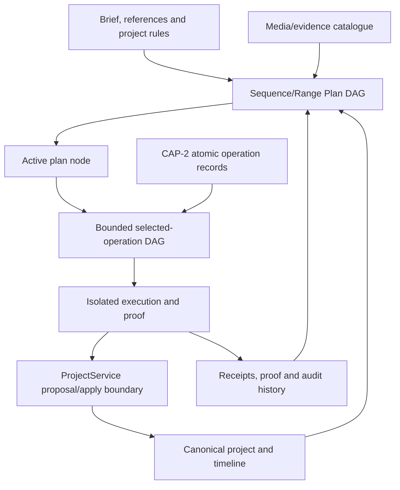

# Editron agentic editorial planning and benchmark reconciliation

Date: 2026-08-17

Branch: `infrastructure-improvs-+Editron`

Status: **governing architecture and experiment correction; plan-only; not a
production runtime or a model-selection verdict**

Authority: this document refines the open-ended-editing portion of the
[final execution plan](../../EDITRON_FINAL_EXECUTION_PLAN_2026-08-10.md). Code
and executable evidence remain the authority for implementation status.

## Decision in plain language

Editron needs three different planning artifacts, not one giant graph:

1. a durable **Sequence/Range Plan DAG** says which parts of a project need to
   be understood, edited, reviewed and finished;
2. a bounded **Operation DAG** says which exact Editron operations are proposed
   for one currently active part; and
3. an append-only **agent/tool transcript** records the model turns, tool
   results, failures and repairs used to produce that proposal.

The canonical project and timeline remain owned by `ProjectService`. None of
the three artifacts becomes another project or timeline database.

For a five-hour production, the first graph may contain tens or hundreds of
manageable story/sequence/delivery nodes. Only a currently active node receives
a detailed operation graph. Old conversational tool chatter may be compacted,
while the durable plan, evidence, receipts and full audit transcript remain
available independently.

This architecture is strongly supported as a production pattern. It is **not
yet implemented in Editron**, and it does not prove that Luna, Terra, Qwen or
another model can make good editorial plans. That ability must be measured by
the corrected whole-episode benchmark below.

## The Sequence/Range Plan DAG, simply

Think of it as the project's server-side job board.

For an event recap, the board may look like this:

```text
Understand brief and reference
  |-- map music structure
  |-- organise source media
  `-- assemble the story
        |-- opener
        |-- workshop montage
        |-- filmstrip hero moment
        `-- outro
              |
        picture-stable sequence
              |
        final mix / captions / QC
```

Each box is a job with a measurable result. `Workshop montage` does not mean
"the model may edit anything." It says, for example:

- objective: build a rising sequence of arrival, participation and activity;
- scope: named source collections plus an intended timeline region;
- dependencies: source identity, usable speech ranges and music phrase map;
- evidence: eligible source windows, dialogue and continuity observations;
- preservation: do not remove the client's required speaker or repeat one shot
  accidentally;
- state: waiting, ready, proposing, previewing, needs review, complete or stale;
- proof: the accepted preview, ProjectService receipt and remaining unchecked
  items.

If later inspection shows that the job is too broad, it can expand into
`speaker arrival`, `audience engagement` and `activity crescendo`. This is
append-style expansion under the existing node; it is not an LLM rewriting the
whole project plan.

A node does not need a guessed timeline range before the footage is understood.
It can begin with a semantic or source scope such as `find the workshop opening`
and gain an exact source/timeline range only after evidence resolves it. Once a
range is known, it is tied to exact source and project revisions.

## Who creates and owns the Sequence/Range Plan

The editorial model **proposes** the initial plan and later expansions. A
server-side `PlanService` validates, versions and owns the accepted plan. The
user is a first-class co-author who may correct objectives, reorder priorities,
lock work or require approval. Analysis workers contribute evidence; they do
not silently rewrite editorial objectives. `ProjectService` still owns the
timeline and accepts only approved, revision-safe mutations.

The bootstrap flow is:

```text
1. User/project intake
   request + deliverable + sources + script + references + brand + constraints
                              |
2. Project-direction compilation
   preserve raw instructions and compile explicit must/should/may/must-not rules
                              |
3. Baseline source/reference observations
   identity, rights, duration, transcript/music/shot structure and uncertainty
                              |
4. Editorial model proposes a coarse Sequence/Range Plan
   objectives, dependencies, semantic/source scopes and unresolved questions
                              |
5. PlanService validates and versions it
   tenant/project scope, acyclicity, node limits, authority, budgets and refs
                              |
6. User reviews or corrects material assumptions
                              |
7. Ready nodes expand only as evidence and actual results justify them
```

The validator in step 5 does not decide that an opener should be energetic or
that the reel needs a filmstrip. Those are editorial choices attributable to
the model or user. It checks whether the proposed plan is structurally legal,
honest about unknowns, within scope and tied to real project/evidence records.

For a simple request such as `trim two seconds from this selected clip`, the
coarse plan may contain one node. The hierarchy is not mandatory ceremony. For
a documentary, campaign or multi-hour production, the model can propose
sequence/reel nodes and defer exact ranges until source evidence resolves them.

Node expansion follows append-and-supersede rules:

- the model may propose child nodes only inside the active node's declared
  expansion boundary;
- `PlanService` rejects cycles, duplicate objectives, excessive fan-out,
  unauthorized scope widening and dependencies on nonexistent artifacts;
- an accepted correction creates a new node/plan version rather than rewriting
  audit history;
- user-authored objectives and preservation locks outrank model suggestions;
- evidence workers may mark a requirement satisfied, failed or stale, but may
  not invent new creative work;
- a plan node cannot become `VERIFIED` merely because its child agent says it is
  finished.

Whether candidate models can make useful initial plans and sensible expansions
is unproven. The whole-episode benchmark must score both, including unnecessary
node creation, missed dependencies, invented ranges and user correction time.

Current code truth: there is no production `SequenceRangePlan` or durable
`PlanService` in this worktree. Existing moment/storyline planners are narrower
editing paths and must not be relabelled as this control plane.

## What the editorial model must actually produce

`Cut the silence`, `make a filmstrip` and `add captions` are operation or form
labels. They are not an editorial plan and are not evidence of editorial
quality.

For a reference-led event reel, the editorial model must first produce a
versioned `EditorialPlanV1` whose claims are observable and reviewable. At a
minimum it must explain:

- the audience, deliverable and intended viewer response;
- the story or information progression across the whole piece;
- why each sequence exists and what the viewer should know or feel afterward;
- which performances, actions, statements, people, products or required facts
  must be preserved;
- the intended pacing/rhythm curve and relationship to dialogue and music;
- the reference's global editorial language, recurring design grammar and
  unique hero moments, including what must **not** be copied literally;
- coverage gaps, uncertainties, rejected alternatives and decisions requiring
  user/editor approval; and
- the measurable acceptance predicates for each sequence node.

A useful opener node is therefore closer to:

```text
Establish the event, place and human anticipation before the first music lift.
Use arrival/preparation material with a clear subject and preserve the sponsor
mark. Reach the first activity beat by the end of the opening phrase. Avoid
repeating the hero participant reserved for the closing sequence. The exact
visual form remains unresolved until source evidence is inspected.
```

It is not `make opener` or `use filmstrip`. A filmstrip may later be one
candidate form for a bounded hero moment if the reconstructed target,
reference-fidelity instruction and available footage warrant it. It is never a
default substitute for editorial reasoning.

The architecture separates four judgments even when one provider performs more
than one during an early experiment:

1. **reference/source observer:** records what is visibly/audibly present and
   its uncertainty;
2. **editorial planner:** proposes story, sequence objectives, selection logic,
   pacing and preservation;
3. **operation planner/executor:** selects exact eligible `CAP-2` operations for
   the currently active node; and
4. **render critic:** compares the actual bounded output with the target claims
   and returns pass, fail or unverifiable evidence.

No model is currently certified for the editorial-planner role. Luna, Terra,
Qwen and any later candidate must be benchmarked on editorial quality
separately from schema compliance and tool execution. The benchmark must use
owned held-out projects with and without references, across short-form,
interview/podcast, event/brand, documentary/narrative and long-form sequence
shapes. Blind reviewers score narrative clarity, performance/shot selection,
emotional and informational progression, pacing, audiovisual reasoning,
reference influence without literal copying, brand/brief adherence,
preservation, unnecessary complexity, uncertainty honesty, rendered outcome
and editor correction time. An exploratory run may use one disclosed reviewer;
a production claim requires independent qualified reviewers and adjudication.

The winning architecture may use different observer, editorial, execution and
critic models. Model routing must preserve one accepted `EditorialPlanV1`; a
specialist result is evidence or a proposal, not a competing project plan.

## Four different sources of truth



| Artifact | What it owns | What it must never own |
| --- | --- | --- |
| Sequence/Range Plan DAG | durable objectives, dependencies, range/revision scope, progress, invalidation, approval and proof references | clips, tracks, overlays or canonical timeline state |
| Bounded Operation DAG | exact model-selected operations and dependencies for one active node/base revision | a second registry, project store or hidden compiler-authored edit |
| Agent/tool transcript | raw requests, responses, tool results, retries, costs and compaction lineage | authoritative project state or the only copy of the plan |
| ProjectService | canonical saved project, revision/CAS, accepted mutations and writer receipts | model reasoning, media-analysis blobs or a private planning journal |

This separation is the key long-form scaling rule. A large editorial plan is
not flattened into millions of frame operations, and a model's context window
is not treated as durable workflow storage.

## How certain is this architecture?

| Claim | Confidence | Why |
| --- | --- | --- |
| Long projects must be divided into manageable reels/sequences/ranges | High | Adobe Productions explicitly divides films, documentaries and TV into manageable projects/reels and uses locking and shared media. |
| Durable plan state must survive worker/session loss and context compaction | High | JCode uses a server-owned versioned task DAG; Cline keeps canonical full history separate from compacted working context; durable workflow systems persist checkpoints and replayable history. |
| Only active ranges should receive detailed operation graphs and previews | High as an engineering requirement | Whole-project model context and whole-project rerenders are unnecessary, expensive and conflict-prone. Premiere preserves unaffected preview segments rather than rerendering everything. |
| The exact Editron node schema, expansion rules and scheduler are correct | Medium | The contract below is a reasoned design, not an implemented or load-tested runtime. |
| A tested model can reliably decompose and edit real client projects this way | Unproven | Previous Editron runs did not provide a fair connected whole-episode test. |

Therefore this is a production-oriented architecture proposal, not a claim of
production readiness. It earns that status only after contract tests, chaos
tests, model benchmarks, long-form load tests and real editor/client pilots.

## Production contract for a plan node

Every durable node needs more than a title and dependency list:

```text
identity
  tenantId, projectId, planId, nodeId, nodeVersion, parentId

objective
  observable target claims, preservation claims, success and stop conditions

scope
  source ranges, timeline ranges, composition ranges, deliverables
  source versions, base project revision and coordinate/timebase identities

dataflow
  dependsOn, reads, writes, requires, produces, invalidates

execution state
  status, attempt, idempotency key, lease owner/expiry, cancellation state
  retry/failure disposition and last progress reason

evidence and decisions
  requirement refs, observation refs, unresolved facts, alternatives
  what has not been checked

resources and authority
  eligible operation-set hash, provider/model policy, privacy/egress policy
  time/token/cost/analysis/render/repair budget reservations

review and proof
  approval requirements, preview refs, proof obligations, receipts
  stale/reconform state and final disposition
```

### Required lifecycle

```text
DRAFT
  -> NEEDS_EVIDENCE
  -> READY
  -> PLANNING
  -> PROPOSED
  -> PREVIEWING
  -> NEEDS_REVIEW | READY_TO_APPLY
  -> APPLIED_PENDING_PROOF
  -> VERIFIED

Any state may become:
  STALE | NEEDS_REBASE | CONFLICT | UNVERIFIABLE | FAILED | CANCELLED
```

`VERIFIED` is allowed only after the server evaluates the declared proof. The
model cannot mark itself complete. A changed source, overlapping manual edit,
changed composition program, released picture lock or delivery-spec change
invalidates only the dependent nodes and artifacts declared by the contracts.

### Scheduler invariants

- The graph is server-owned, versioned and acyclic.
- A node may append children under its own expansion boundary; it may not
  rewrite unrelated branches.
- A node becomes runnable only after requirements and dependencies pass.
- Overlapping writes, read-after-write dependencies and invalidation edges are
  ordered; range-disjoint work may run concurrently.
- Attempts are idempotent and leased. A crashed worker cannot cause a second
  accepted mutation.
- Depth, fan-out, active-node count and total expansion are bounded by project
  policy. Editron should borrow JCode's typed graph and handoffs, but not its
  deliberately unbounded deep-research recursion.
- A dependent receives typed artifact references, not a concatenation of every
  upstream conversation.
- `whatHasNotBeenChecked` is mandatory. An empty value on a complex unfinished
  node is a review signal, not proof of completeness.

## Web deployment, not a desktop authority

The browser is a client of durable services:

```text
web editor / chat / review UI
        |
authenticated project + planning APIs
        |
durable Plan service ---- durable queue/leases ---- analysis/render workers
        |                           |
ProjectService                 object storage + evidence catalogue
        |
canonical project/timeline database
```

No Git worktree, local filesystem, terminal session or browser tab owns a real
customer plan. Coding-agent projects are useful behavioural references, not
storage architecture. The web UI streams node status, previews and receipts;
the server enforces tenant scope, permissions, cancellation and revisions.

The timeline remains playable while background analysis/planning/rendering
runs. A proposal is bound to its base revision and affected ranges. A manual
edit in a disjoint range leaves it eligible; an overlapping edit produces
`NEEDS_REBASE` or `CONFLICT`, never a silent overwrite.

## Where project direction and `EDITRON.md` live

`EDITRON.md` is per project, but because Editron is a web product it is **not a
file on the user's PC** and not a blob of prompt text stored only in chat. It is
the human-readable projection of a server-side, tenant/project-scoped,
versioned `ProjectDirectionRevisionV1` record owned by the planning control
plane.

The planned record contains:

```text
identity
  tenantId, projectId, directionRevisionId, schemaVersion

provenance
  createdBy actor, createdAt, baseProjectRevision
  raw user messages/intake fields and source references

production intent
  deliverable, audience, story/script, quality target, deadline
  reference-fidelity strength and target observations

creative and preservation rules
  user must/should/may/must-not rules
  brandRevisionRef, available-font refs and approved examples
  facts/people/phrases/shots that must survive

policy
  media rights, privacy/model egress, accessibility, review/approval
  quality, latency, cost and delivery constraints

compiled projection
  normalized typed instructions, unresolved conflicts, source citations
  compilerVersion and contentHash
```

Brand assets and rules remain owned by Brand Vault and are referenced through a
versioned brand record; they are not copied into an untraceable prompt. Media
analysis remains in the evidence catalogue. Timeline state remains in
`ProjectService`. The direction record owns only the project's editorial
constitution.

Every plan node pins the exact `directionRevisionId` it used. Editing the
human-readable direction creates a new revision, recompiles structured rules
and computes which nodes are stale. It does not silently rewrite already
accepted timeline work. The user may explicitly keep, re-evaluate or revert
affected work.

Current code truth: the active `Project` interface stores `brandId`, sharing,
dashboard state, overlays and generated compositions, but no canonical project
direction revision. The older evidence document defines `EDITRON.md`
conceptually; this section freezes where it belongs. The exact persistence
schema and owner still require implementation in `V2-1R` and must not be hidden
inside a provider prompt or browser local storage.

## Parallel migration without two timeline authorities

The new agent system should be developed beside the current product, but the
lanes describe **control and rollout**, not two competing project stores:

| Lane/stage | New system may do | Canonical mutation rule |
| --- | --- | --- |
| Research | run frozen fixtures and isolated project clones | zero production mutation |
| Shadow | read a consented production project, make a plan/proposal and compare it with real user work | zero mutation; metrics only |
| Assist | show a bounded proposal/preview for explicit approval | only the approved command applies through `ProjectService` |
| Guarded auto-apply | apply certified reversible operations inside user-granted ranges/budgets | one ProjectService CAS command/receipt; high-risk steps still ask |
| Family cutover | route a certified task family to the new control plane | exactly one lane is writer for that command/range |
| Legacy retirement | remove the old family path after saved-project compatibility, rollback and scorecard gates pass | no hidden fallback writer remains |

The current path and new path must never both execute the same user request and
race to save. A versioned route decision selects one writer before execution;
shadow evaluation is read-only. Cutover occurs capability family by capability
family, with rollback, false-success, user-correction, latency and cost gates.

This is related to the previously reserved simpler auto-edit checkpoint. It
does not authorize expanding today's fragmented auto-edit path. After the fair
whole-episode benchmark, that checkpoint must decide how a user starts,
reviews, pauses, steers, cancels and resumes an automatic production run.

### Vibe-style user control modes

Editron can expose control modes similar to coding agents:

| Mode | Agent authority |
| --- | --- |
| Manual | user edits directly; agent may answer/explain but cannot propose tools unless asked |
| Suggest | read, analyse, plan and show diffs/previews; never apply |
| Approve each | prepare freely within budget; ask before every ProjectService mutation |
| Guarded auto-apply | automatically apply only certified, reversible, proof-covered operations in pre-authorized ranges |
| Full project agent | broad access to certified project operations, background planning and bounded repairs within explicit project policy |

`Full project agent` does not mean root access. It cannot bypass tenant scope,
rights, ProjectService, revision conflicts, operation eligibility, spend limits,
proof or mandatory human approvals. Manual timeline editing remains available
in every mode; a user lock/preserve marker prevents later AI overwrite unless
the user explicitly releases it.

## Exactly what the model receives

An editing turn is built from a versioned `PlannerEnvelope`. It contains the
following and nothing is silently inferred from model memory:

1. **platform agent rules:** fixed authority, safety, completion and tool-use
   rules, normally context-cached;
2. **compiled project direction:** the relevant portion of `EDITRON.md`, user
   request, deliverable, brand, reference-fidelity strength, musts, must-nots,
   rights and approval rules;
3. **active plan node:** objective claims, scope, dependencies, base revisions,
   status, accepted upstream artifacts and `whatHasNotBeenChecked`;
4. **current bounded state:** the exact project/timeline slice, source identity,
   coordinate/timebase mappings and preservation baseline needed for this node;
5. **retrieved evidence:** cited observations, coverage/uncertainty reports and
   authorised image/audio/video windows, not an uncited summary of hours of
   media;
6. **capability truth:** complete atomic records for every currently eligible
   operation, plus a compact directory of all known supported, unavailable and
   forbidden operations so absence is visible;
7. **previous results:** exact tool results, proof failures, user corrections
   and the last accepted local plan artifact;
8. **authority and conflict policy:** tenant/project/actor scope, permissions,
   current revision, allowed ranges, approval points and failure dispositions;
9. **remaining budget:** explicit remaining reservations for model turns,
   tokens, analysis, previews, repairs, wall time and money; and
10. **resume binding:** hashes of the canonical plan, state, evidence, tool
    records and compacted-context prefix.

The model does **not** receive secrets, raw database keys, another tenant's
material, hidden evaluator answers, every frame of a five-hour source, tools it
is authorized to execute only under a different policy, or an unbounded web
browser.

### Full operation knowledge without an enormous repeated prompt

`CAP-2` is the required canonical per-operation packet. The provider-facing
exposure uses two lossless levels:

1. a complete compact directory lists every atomic operation ID/version,
   family, support/certification status and unavailability reason; and
2. complete closed records are included for all operations eligible for the
   active node. A read-only expansion call can retrieve another record from the
   same `CAP-2` authority before it can be selected.

This is not semantic search silently hiding tools. The complete directory lets
the model see that a capability exists or is missing. Execution is impossible
until the exact record is present and allowed. The benchmark must compare this
two-level packet with a full exact packet to prove that packet reduction does
not lower tool-selection recall. Stable records may be provider-context-cached;
project state and evidence remain request-scoped.

### Current code truth: the temporary 40-operation research packet

The current
[`operator-specs-v2.json`](../../../tests/fixtures/editron/open-ended-planner-v2/operator-specs-v2.json)
contains exactly 40 research rows:

- reads: `read_project_file`, `get_timeline_view`,
  `get_video_transcription`, `find_transcript_moment`, `find_visual_moment`,
  `find_audio_moment`, `list_user_assets`, `search_user_assets`,
  `inspect_user_asset`, `search_stock_footage`;
- resolvers: `resolve_transcript_edit`, `resolve_visual_edit`,
  `resolve_keyframe_edit`, `resolve_audio_edit`,
  `resolve_user_asset_overlay`;
- mutation/proxy rows: `add_overlay`, `update_overlay`,
  `batch_update_overlays`, `split_overlay`, `trim_overlay`, `delete_overlay`,
  `close_gaps`, `cut_section`, `apply_audio_ducking`,
  `apply_camera_shake`, `apply_speed_ramp`, `apply_fade`, `reorder_layer`,
  `move_retime_overlay`, `add_captions`, `add_transition`,
  `sync_cuts_to_beats`, `set_keyframes`, `apply_filter`, `reframe_project`,
  `use_matching_footage`, `add_sfx`;
- legacy/generated rows: `generate_html_scene`, `add_motion_graphic`,
  `generated_composition_program`.

Many are `ISOLATED_PROXY_ONLY`, `NOT_COMPILABLE`, fragmented, legacy or
research-only. The packet is not all Editron functionality and certifies none
of it. The current [CAP-0 census](../capability-census/editron-capability-census-v1.md)
also found 66 central chat descriptors, 59 compatibility-bundle entries and
substantial manual/chat divergence. `CAP-2A` must reconcile manual UI,
shortcuts, chat, Director, workers and APIs into one detailed atomic truth set
before another model comparison is authoritative.

Conceptual names such as `retrieve_source_windows`,
`render_bounded_preview`, `inspect_geometry_and_continuity` and
`update_exposed_parameter` are **not automatically current Editron tools**.
Each must either map to a verified existing owner and receive a `CAP-2` record,
or remain explicitly missing/research-only. The planner cannot receive prose
that pretends a desired operation already exists.

## What `remaining budget` means

It is a set of ceilings and reservations, not a vague instruction to be cheap:

```text
planning:  remaining model turns, input/output/reasoning tokens and provider USD
tools:     remaining calls, parallel calls and retry allowance
analysis:  remaining decoded seconds, frames, master-pixel work and accelerator time
preview:   remaining preview count, duration, raster/FPS and render compute
repair:    remaining schema retries, semantic repairs and alternative branches
time:      interactive deadline and asynchronous job deadline
storage:   derivative/output bytes and egress allowance
human:     approval required before the next spend/risk threshold
```

The server reserves a budget before an expensive call and decrements it only
from recorded usage. Each allowed attempt receives its declared wall-clock and
token allocation; a repair must not inherit only the unused tail of the first
attempt unless that was explicitly pre-registered.

A hard quality, preservation, rights or proof requirement is never weakened to
fit the remaining money. If the budget is insufficient, the correct outcome is
`BUDGET_EXHAUSTED`, a smaller explicitly approved scope, or a user approval
request. Cost is a tie-break only after required quality and safety pass.

## The actual iterative editing loop

The model does not write one coarse plan and disappear. It alternates between
planning, exact tools and observed results while the server owns state:

```text
1. Load the active plan node and pinned project/range state.
2. Reconstruct or refresh observable target claims.
3. Compare target claims with current state/proof and compute the DeltaSet.
4. Retrieve missing evidence or ask a necessary clarification.
5. Select exact eligible operator IDs and explicit dependencies.
6. Bind their closed inputs from cited evidence and current revisions.
7. Reject invalid/ambiguous plans; do not invent missing creative operations.
8. Execute on an isolated clone or bounded generated-composition sandbox.
9. Run the cheapest proof level sufficient for the changed claim.
10. Return actual state/render/proof results to the model.
11. Repair, replan, ask, stop on a capability gap, or propose application.
12. Apply only through ProjectService CAS and record receipt/proof status.
13. Update the durable node and invalidate only declared dependents.
```

The generic binder in step 6 may fill exact values that are already selected
and evidenced: project revision, range, typed output reference and coordinate
mapping. It must add **zero catalog operations** and drop **zero
model-selected operations**. Mandatory schema, policy, sandbox and proof gates
are platform control flow outside the creative operation graph; they cannot add
a transition, cut, grade, mask, source choice or other edit.

### Filmstrip example

The durable node is `filmstrip hero moment`. Its target claims may require
unequal panels, a fixed title, opposed panel movement and continuity into the
next full-screen shot.

The model may select source-search/inspection/resolution operations followed by
`generated_composition_program`, while the surrounding source selection,
continuation shot, timeline, audio, colour and delivery remain native. The
bounded filmstrip island is generated; the complete reel is hybrid.

The isolated render returns measured geometry, legibility and boundary
continuity. If the title collides, the model may update an exposed parameter and
rerender that island. It does not regenerate the whole reel, rewrite the
timeline, or claim success because the TypeScript compiled.

## Preventing spiral, sloppy plans and bad edits

The solution is bounded agency plus independent acceptance, not trusting a
stronger prompt.

### Structural controls

- Maximum plan depth, child fan-out, active branches, tool calls, repairs,
  preview renders, elapsed time and spend are explicit per project/node.
- A turn must shrink the `DeltaSet`, produce required evidence, resolve a
  material uncertainty or return a typed stop. Otherwise it has made no
  progress.
- The same normalized tool call against the same revisions/evidence cannot run
  twice unless the previous disposition explicitly permits retry.
- Two repeated failures of the same predicate force clarification, review or a
  capability gap according to policy; they do not start an endless rewrite.
- The model cannot widen source/range scope without an accepted plan-node
  expansion and new budget/policy check.
- Only operations present, eligible and fully described in the current
  `CAP-2` envelope can run.
- High-risk, destructive, rights-sensitive, expensive or low-confidence steps
  require human approval.
- ProjectService CAS, idempotency and range conflicts ensure a stale proposal
  changes nothing.

### Quality controls

- Hard preservation, rights, timebase, accessibility and proof gates run before
  taste ranking.
- Deterministic state/geometry/audio checks run before another model judges the
  render.
- The model receives the exact failed predicate and evidence, not hidden
  evaluator topology or a vague `try again`.
- Alternative edits are isolated and compared; rejected previews never become
  canonical state.
- Completion is server-evaluated. The model cannot turn `UNVERIFIABLE` into
  `PASS`.
- Production rollout is shadow/canary by certified task family, with false
  success, correction time, user rejection, latency and spend monitored.

These controls implement the same broad lesson as OpenCode's permission-gated
tools and doom-loop guard, Cline's Plan/Act separation and canonical history,
JCode's typed server-owned DAG, NIST's documented test/evaluation/validation
and human oversight, and OWASP's warning against excessive functionality,
permissions and autonomy.

## User edits, AI edits and semantic change reconciliation

The agent must not learn project state by comparing occasional screenshots or
remembering what it previously did. Every accepted manual or AI mutation needs
a canonical `ChangeSetReceiptV1` emitted with the ProjectService receipt:

```text
identity
  projectId, actorId, actorKind USER | AGENT | SYSTEM
  commandId/operatorId or MANUAL_EDITOR_CHANGE, planNodeId

revision
  beforeProjectRevision, afterProjectRevision, committedAt

exact change
  affected project paths, timeline/source/composition ranges
  created/changed/deleted identities and before/after values
  semantic anchor refs where already known

consequence
  invalidated evidence/previews/proofs/plan nodes
  preservation/lock changes, undo reference and proof requirement

interpretation
  explicit user reason when supplied
  optional inferred semantic hypothesis, confidence and evidence refs
```

Structural facts are exact: `clip A moved from frame X to Y`, `caption text
changed`, or `generated composition parameter gutterWidth changed`. Semantic
meaning may be uncertain. Moving a title could mean `fix a collision`, `prefer
more negative space` or merely experimentation. The system stores that as an
inference, never as a confirmed user preference, unless the user says so or a
separate learning policy accumulates sufficient reviewed evidence.

Before the agent edits a range again it loads the receipts since its base
revision and recomputes the node `DeltaSet`:

1. If the user edit already satisfies the target, preserve it and mark that
   predicate satisfied.
2. If the change is range/path disjoint, continue against the new revision.
3. If it overlaps but has a declared coordinate transform and preserves the
   user's work, propose a rebase and revalidate.
4. If it overlaps ambiguously, stop with `CONFLICT` and show keep-user,
   replace-with-proposal or compare/merge choices.
5. If the user locked the range/object, do not modify it without a new explicit
   instruction.

An AI edit follows the same rules on the next turn. The agent receives what it
actually changed and what the user subsequently changed, not its earlier prose
description of either.

Current code has pieces, not this contract. The save route uses ProjectService
CAS and dispatches an overlay diff, but that diff is non-authoritative and may
fail after the save. `ProjectMutationReceiptV1` currently contains only project
ID, revision and commit time. `decision-tracker.ts` compares a narrow set of
system overlay placements against later overlays using an explicitly
uncalibrated frame tolerance. These paths are useful inputs, not a production
semantic change ledger.

### Where the current edit state actually comes from

Editron does not normally store a newly encoded video after each timeline
change. It stores source-media references plus editable project/timeline state
in ProjectService. The web player evaluates that state against the media to
show the current result. A cached proxy or rendered master may exist, but it is
a derived artifact and can be stale after the next edit.

There are therefore three state objects in the production agent flow:

1. `ProjectSnapshotV1`: a server-created, revision-bound projection of the
   canonical ProjectService project, relevant timeline ranges, source identities
   and evidence references;
2. `ClientDraftDeltaV1`: optional unsaved browser changes, bound to the
   ProjectSnapshot base revision, exact paths/ranges and a draft hash; and
3. `ProposalStateV1`: the accepted plan-node proposal, exact selected operations,
   projected state hash and proof state, still non-authoritative until applied
   through ProjectService.

The model receives bounded typed projections of these objects. It never reads
MongoDB directly, scrapes arbitrary browser memory or assumes that the last
chat message describes the current timeline.

Current code is stricter but much less concurrent: before sending a chat edit,
`ai-chat-panel.tsx` calls the editor save function and sets the global
AI-processing lock. `use-autosave.ts` then pauses autosave because the agent
mutates ProjectService directly. This keeps stale client state from overwriting
the agent but prevents the background editing experience requested here.

The replacement flow is revision-safe without locking the whole editor:

```text
browser draft D7 over canonical R42
  -> flush D7 through ProjectService, or submit a hash-bound ClientDraftDelta
  -> agent proposes P9 against the exact resulting base
  -> user continues on another/disjoint range and produces R43
  -> server compares R42/R43 receipts with P9 reads/writes/invalidations
       disjoint       => rebase, revalidate and keep both
       same objective => preserve the user result if it already satisfies it
       safe transform => reproject coordinates and revalidate
       ambiguous overlap => keep-user / replace / compare choices
       locked range   => agent cannot apply
```

This is also how the system knows what the user changed while the project is
being built. Exact changes come from ProjectService receipts; semantic meaning
is recorded only as an explicit user reason or an uncertain evidence-bound
hypothesis. The browser's current overlay array is useful for immediate display,
but it is not allowed to outrank the server revision ledger.

## Render and model-inspection economics

Editron must not render five hours after every edit or send every preview frame
to a frontier model. It uses an escalating proof ladder:

| Level | Work | Typical use |
| --- | --- | --- |
| 0 | schema, policy, timebase, range and revision checks; no media render | reject impossible or stale plans |
| 1 | in-memory/projected state diff and deterministic owner validation | trims, metadata, track/order invariants |
| 2 | sparse before/after/end-point stills, waveforms or short audio windows | layout, cut endpoint, caption collision, gain envelope |
| 3 | low-resolution bounded proxy plus handles | motion, transition, mask, generated island, audiovisual timing |
| 4 | sequence/reel milestone preview | story, pacing, continuity, mix and client review |
| 5 | full-resolution affected-range proof | colour, edges, VFX, mastering-critical changes |
| 6 | full master/package/QC | approval and delivery, not every agent turn |

The proof policy chooses the minimum sufficient level; a model cannot choose a
weaker one to save money. Deterministic probes select the uncertain or changed
frames for multimodal inspection. A visual/audio model is used where those
measurements cannot establish the claim, and a human remains the authority for
high-stakes taste or approval.

Preview artifacts are cached by project revision, plan/operation hash, source
versions, generated-program hash, renderer version and proof specification.
Only dirty ranges are invalidated. Adobe Premiere follows the same economic
principle by preserving unchanged preview segments. Remotion can distribute a
render across functions, but its documented concurrency and function limits
confirm that parallelism is bounded infrastructure, not free compute.

### Playback without exporting a video

There are two meanings of `render`:

1. **interactive composition/playback:** the browser evaluates the timeline and
   draws the current frame as the playhead moves; it does not encode an MP4; and
2. **proof/export rendering:** a stable image, audio window, proxy video or
   delivery file is materialized so another process can inspect and reproduce
   it.

Editron already has the first mechanism. The editor's `VideoPlayer` uses
Remotion Player with the current overlays as input, so the user can play most
saved or locally proposed timeline changes immediately. This is still browser
frame rendering in the technical sense, but it avoids an export job.

The production agent should use two views in that same web editor:

- **canonical view:** the last accepted ProjectService revision; and
- **proposal view:** a derived, non-authoritative projection of a bounded
  operation graph against its pinned base revision.

The user can play/scrub the proposal without saving it. Accepting it sends the
same typed command to ProjectService; rejecting it discards the projection. The
proposal view is not a second timeline database because it is reproducibly
derived from a canonical revision plus a signed proposed change and cannot
commit itself.

### How the model sees an edit

A model does not automatically see the user's browser screen. It receives the
least expensive observation sufficient for the claim:

- the exact projected state diff for structural changes;
- selected before/after/boundary frames for placement, crop and legibility;
- an ordered frame burst or bounded low-resolution clip for motion, easing,
  tracking, transition and continuity;
- a decoded audio window, waveform and measured facts for speech/music/SFX;
- deterministic geometry, collision, range, loudness and continuity results;
- a milestone proxy only when local observations cannot establish sequence
  pacing, story or audiovisual quality.

The current chat UI already has a narrow proof of this concept: a
`visual_inspect_frame` request seeks the live Remotion player, captures one or
more authorised frames with `html2canvas` and attaches bounded visual evidence.
It is useful for an interactive turn but is not sufficient production proof: it
depends on an open browser, captures presentation pixels, is not a durable
server-owned renderer and does not establish motion/audio by itself.

`Cheap client capture + deterministic server observation` means:

- **client capture:** reuse pixels the browser has already decoded and composed
  for the user. This is fast and avoids starting a remote render, so it can
  answer an interactive question such as `is this title covering the face?`;
- **server observation:** load a pinned ProjectService/proposal revision and
  source versions, evaluate the same composition contract on a worker and
  materialize hash-bound stills, audio windows or a short proxy. This survives
  tab closure, can be repeated and is suitable for background work and
  acceptance evidence.

`Deterministic` describes the observation inputs and renderer binding: the same
pinned state, media versions, renderer version and proof specification must
produce the same evidence artifact. It does not claim that a multimodal model's
taste judgment is deterministic.

Editron already has more server plumbing than the browser-capture description
alone suggests. `phase0-rendered-evidence-worker.ts` can dispatch through QStash,
render selected Remotion Lambda stills, retain their durable URLs, and render/
compare bounded PCM audio windows. That is reusable server-owned proof plumbing.
It is not yet the complete `PreviewObservationService`: its primary visual
evidence is sparse stills rather than a generic bounded motion proxy; some
legacy requests may omit a subject receipt; configuration can make dispatch
unavailable; and it is not bound to a canonical `ProposalStateV1`/plan node.

The production service extends this existing owner rather than creating another
renderer. It adds an ordered frame-burst/short-proxy artifact for motion claims,
proposal and receipt bindings, browser/server parity fixtures, dirty-range cache
invalidation and explicit `PASS | FAIL | UNVERIFIABLE` proof disposition. The
model receives only the selected observations; the complete short proxy remains
available to the user and auditor.

Production therefore needs a shared `PreviewObservationService` contract. A
fast client capture may satisfy an interactive low-risk question when it is
hash-bound to project/proposal/player versions. Background work and acceptance
proof use deterministic server-side observation from the same canonical
composition contract. A visual/audio model inspects only the selected evidence;
the complete proxy is retained for audit or human playback without being sent
frame-by-frame to the model.

### Re-editing something that was already edited

The active node and change receipts make repeated editing explicit:

```text
original state R10
  -> AI proposal P1 against R10
  -> accepted as R11 with receipt C1
  -> user changes the same title at R12 with receipt C2
  -> next agent turn receives R12 + C1 + C2 + invalidated proof
```

The next agent does not replay P1 blindly. It determines whether C2 satisfies,
modifies or rejects the node's target. Ambiguous meaning requires a comparison
or question. An explicit user correction becomes a preservation rule for the
active task; a weak inferred preference remains advisory. Preview/proof caches
whose inputs overlap C2 become stale, while disjoint cached ranges survive.

## Can Editron simply repurpose JCode?

JCode is MIT-licensed, and its current Rust workspace exposes useful separable
concepts/crates for plans, task types, provider adapters, agent runtime, storage,
tooling and a harness API. Reusing code is legally possible subject to its
license notice. Its server-owned task graph, streaming sessions, typed handoffs,
permissions, cancellation and compaction are valuable references.

But adopting the entire product is not `a few tweaks`:

- JCode's primary object is a code workspace with files, commands, terminal/UI
  state and coding-agent memory;
- Editron's primary objects are tenant-scoped media, source/timecode identity,
  project revisions, temporal ranges, render workers, proofs and delivery;
- JCode is a large Rust TUI/desktop/server workspace, while Editron is a
  Next.js/web application with existing authentication, storage and services;
- JCode's shell/file mutation authority must not become a second timeline or
  media authority;
- its recursive swarm behavior, memory retrieval and provider credentials need
  independent security, privacy, licensing and multi-tenant review.

The correct next step is a bounded build-versus-adapt spike after `CAP-2A`, not
a wholesale fork. Test three options against the same editing episode:

1. wrap JCode's headless/provider/session runtime behind an Editron adapter;
2. port or reuse only its MIT task/permission/session primitives while Editron
   owns the web UI and all media/project tools; and
3. implement the small required control plane natively, using JCode/OpenCode as
   protocol references.

The spike passes only if the imported shell can replace its file/shell tool
authority completely, persist canonical plans in Editron's server stores,
enforce tenant/project/range permissions, stream/cancel/resume jobs, survive
compaction and expose exact cost/provenance without shadowing ProjectService.
Until measured otherwise, the recommended direction is **reuse selected
patterns or isolated components, not the entire JCode product**. OpenCode's
headless HTTP server and web client demonstrate that a server/client split is
possible, but its project/file/VCS APIs likewise need replacement rather than
promotion to Editron authority.

### Current Editron session/runtime truth

The repository already contains several kinds of persistence, but they must not
be conflated:

- `chat-service.ts` persists user/assistant messages and completed tool records
  in a project-scoped Mongo chat session;
- `agent-graph.ts` runs the current model/tool loop in memory inside the chat
  streaming request. It compiles without a durable graph checkpointer, and the
  route's background async task remains coupled to that request/stream;
- `chat-server-workflow.ts` is a deterministic per-turn licensed-step scheduler,
  not a durable editorial session despite its name;
- `chat-operation-recovery.ts` can poll the durable checkpoint status after a
  client disconnect, but it observes/reloads the operation rather than resuming
  a persisted model loop;
- `chat-editorial-intent-job.ts` and `chat-reference-style-job.ts` are genuine
  durable QStash/Mongo jobs with leases, retries, checkpoints, rollback and
  render-proof dispatch; and
- analysis, dubbing, upload and render families have their own durable jobs.

The nearest existing headless editorial path is the editorial-intent job. It
survives the browser, invokes the current Director planner and can wait for
motion-graphic child jobs. It still owns one queued intent/job, not a persisted
multi-sequence `EditorialPlanV1`, active range node, iterative model/tool state,
approval suspension, compaction/resume lineage or cross-node scheduling.

OpenCode is already used in one tightly bounded research adapter:
`qwen-agent-shell-adapter-v2.ts` starts it in a temporary directory with all
permissions denied and asks Qwen for one schema-only benchmark response. This
proves a provider transport option; it does not prove that OpenCode owns or
runs an Editron editorial session.

The implementation spike must therefore compare these concrete options:

1. **evolve the current Editron job spine:** add PlanService, durable node state,
   resumable events and bounded agent steps on top of the existing Mongo/QStash
   owners;
2. **adopt a web-native durable workflow runtime:** keep ProjectService and
   PlanService authoritative while a workflow runtime persists tool steps,
   retries, streams and approval waits; and
3. **adapt JCode/OpenCode:** retain only the session/tool/permission UI or
   protocol pieces that beat the first two choices without importing their
   file/VCS authority.

Vercel's current `ToolLoopAgent` is a useful typed in-memory tool-loop pattern,
while `WorkflowAgent`/Workflows add process-surviving steps, resumable streams
and approval waits. The repository currently declares AI SDK v5 and does not
declare the Workflow runtime, so neither current API can be assumed compatible
or silently installed. The spike must include a version/upgrade audit, fake-tool
replay, crash/redeploy recovery, approval pause, tenant isolation, cost tracing
and a proof that workflow event state never becomes another project/timeline
authority.

Default recommendation pending that spike: retain Editron's Next.js web UI and
domain services, and add the smallest durable orchestration layer that passes
the episode benchmark. Do not fork an IDE merely to obtain a chat pane, task
list or tool loop.

## What DEV-01 through DEV-04 actually tested

There is no `DEV-00` in the current V2 task fixture.

| Task | Actual requested result | Intended execution form | What it was supposed to test |
| --- | --- | --- | --- |
| `DEV-01` | remove exact dead air, add a post-cut product push-in and duck BGM without cutting speech | native | multi-operation native planning, coordinate/identity remap and audiovisual preservation |
| `DEV-02` | reconstruct a six-second stacked moving-panel reference and continue the final centre image into full-screen | generated island plus hybrid section/reel | reference reconstruction, route choice, generated composition and native continuity handoff |
| `DEV-03` | align montage cuts to measured beats, protect dialogue and add restrained final shake | native | audio/video evidence, operation ordering and native proxy proof |
| `DEV-04` | put a title behind a changing moving-person silhouette | capability gap in current packet | honest missing moving-matte/tracking behaviour with zero mutation |

DEV-02 was therefore neither a pure native-editor test nor merely a
composition-form test. The moving filmstrip itself was the generated island;
the requested section and full reel were hybrid. DEV-01 and DEV-03 were the
native-edit tests. DEV-04 tested whether the system refused to fake missing
rotoscoping/matte capability.

The hand-authored mechanics proxies proved that isolated owners/renderers can
perform synthetic versions of DEV-01 through DEV-03. They did not by themselves
prove that a model selected and connected the correct operations.

## Transcript-grounded benchmark postmortem

The active task transcript was streamed and JSON-parsed through
`2026-08-17T15:03:26.597Z`: 71,673 valid records, including 219 user messages,
3,059 assistant messages, 12,033 tool calls, 151 compactions, 10 aborted turns
and eight rollbacks. The audit uses observable prompts, responses, tool calls,
files and receipts. It does not expose or rely on private model chain-of-thought
or secrets.

### Why I drifted from the agreed plan

The immediate cause was not that the vision was unclear. The observable record
shows that I repeatedly treated the newest passing DEV-specific code and tests
as the governing specification instead of re-grounding each benchmark change
in the master plan and immutable experiment contract.

The deeper causes were:

1. **No one immutable experiment manifest.** Task, model packet, schema,
   evaluator, compiler, timeout, renderer, review protocol and provider roster
   changed at different times.
2. **Three artifacts were conflated.** Editorial intent, exact operation graph
   and runtime/proof plumbing were scored as one graph.
3. **Task-specific code encoded expected answers.** DEV-specific compilers and
   evaluators became hidden recipes.
4. **Passing tests validated the implementation, not the premise.** Tests went
   green against flawed or contradictory expectations, and I optimized toward
   completing Stage 4-6 rather than preserving the original model-selection
   question.
5. **Historical and current runs were mixed.** Canonical/editor-approved
   handoffs, replayed artifacts, repaired model outputs and direct connected
   runs were summarized together.
6. **Reporting vocabulary was imprecise.** `executable`, `failed`, `passed
   through render` and `model pass` were used for materially different facts.
7. **Long-context fragmentation amplified the error.** The eight-day,
   357-MB-scale task underwent 151 compactions. That explains the risk but does
   not excuse it; durable rules and the master plan should have been re-read at
   every protocol change.

The corrective rule is now explicit: an experiment cannot begin until one
versioned manifest freezes every interpretation-bearing component. A later fix
creates a new experiment version; it never silently rescored or continues the
old cohort as comparable evidence.

### Complete material error ledger

| Error | What happened | Correct disposition |
| --- | --- | --- |
| Mislabelled `executable pass` | Early `0/45`, `0/45`, `1/45` totals meant one-shot verifier-clean serialization, not executed/rendered editing. | Preserve raw counts; prohibit using them as editing competence scores. |
| Impossible withheld-evidence rows | DEV-01 visual and DEV-03 beat evidence were removed while hidden predicates still required evidence-bound mutations. | `INVALID_EVIDENCE`; a condition may not require deliberately withheld evidence. |
| Wrong DEV-02 route | The early packet demanded a low-level native graph and lacked the generated-composition path. | Invalid test of the agreed filmstrip architecture. |
| Open/incompatible port contracts | Resolver outputs could not always satisfy mutation inputs, while model output accepted open objects. | Contract/compiler defect, not automatically model failure. |
| Ambiguous Stage-2 node | `candidateCapabilityIds[]` mixed executed tools and alternatives. | Replace with one `selectedOperatorId` plus separate alternatives per node. |
| Prompt/evaluator contradiction | Models were told compiler-owned adapters could be omitted; Terra was failed for omitting `find_transcript_moment`. | Terra row is `INVALID_EVIDENCE`. |
| Task-specific lowering | DEV-01/02/03 compilers encoded task topology instead of generically binding `OperatorSpec` schemas. | Replace with one zero-add/drop binder. |
| Hidden compiler planning | A later patch inserted seven read/search/proof catalog nodes after model output. | Architectural drift; compiler/binder may add zero catalog operations. |
| Canonical handoff substitution | Stage 2/3 and Stage 4-6 often consumed editor-approved canonical artifacts rather than the preceding model artifact. | Valid isolated-stage/mechanics evidence only; invalid as connected orchestration evidence. |
| Mutable provenance | Issued Stage 2-4 packets were rebuilt from mutable current preflight; a Gemini roster/date change rewrote historical identities. | Historical provenance contaminated until pinned issued snapshots; new runs need immutable manifests. |
| DEV-01 fixture mismatch | Product was visible from frame 180 while evidence named frame 205. | Fixture/evidence defect; old visual predicate cannot establish truth. |
| DEV-01 audio proof mismatch | Speech-like tone and music initially shared one asset, so lowering it could not prove dialogue intelligibility. | Proves a gain envelope only; later separate sources are mechanics evidence. |
| Missing post-cut coordinate contract | Cut output lacked the original-to-child identity/time mapping needed by the push-in. | Operator contract gap; compiler must not guess target ID/frame. |
| Zoom-form mismatch | Current form could emit 1.16 despite a <=1.12 fixture bound and dropped the focal anchor. | Owner/fixture mismatch; no model should be scored against an impossible proxy claim. |
| DEV-03 authored beat recipe | Predicates used 120/240/360/480 while the real analyzer measured 119/239/359/479. | Bind predicates to measured receipt, not authored round numbers. |
| Broken alternate beat caller | `five-track-analysis.ts` passes a URL as decoded audio then falls back near 120 BPM. | Live production debt; not unified beat evidence. |
| Timeout misclassified as editing failure | Luna's first response completed; its repair inherited roughly 14.4 seconds of a shared 40-second budget and timed out. | `UNVERIFIABLE / PROVIDER_TIMEOUT`; each allowed attempt needs a fair declared budget. |
| Dropped model selections | A Qwen replay removed selected operations before compilation. | Invalid transformation; raw selected operations must survive unchanged. |
| Disclosed hidden topology during repair | Qwen received evaluator-specific dependency guidance not present in the first-pass packet. | Useful diagnostic, not comparable first-pass model evidence. |
| Human-review pack defects | Initial DEV-01/03/04 review inputs were empty. The user was the only reviewer despite earlier two-reviewer language. | Retain the user's ordinal pilot; do not claim two-reviewer agreement or production ranking. |
| Mechanics/model conflation | One canonical render or hand-authored proxy was described as though each provider produced it. | Mechanics/render evidence and model-planning lineage must remain separate. |
| Aggregate leaderboards across protocols | Isolated stages, connected continuations, repairs, replays, timeouts and canonical artifacts were combined. | No current provider winner; old aggregate rankings are invalid for routing. |

The historical files and raw receipts remain valuable diagnostics. They must
not be deleted or rewritten. Their production interpretation is superseded by
this postmortem and the authoritative execution ledger.

## Corrected whole-episode benchmark

The existing seven stage scorecards remain useful, but they must run inside a
stateful editing episode instead of becoming seven disconnected one-shot JSON
tests.

### Pre-registration gate

Before any paid provider call, freeze one manifest containing:

- task and media bytes/hashes, original request, reference and evidence arms;
- project/source/timebase state and conflict injection schedule;
- full capability-directory and eligible exact-record hashes;
- provider-native model ID, route, modalities and retention/egress policy;
- system prompt, tool descriptions, output schemas and context-cache inputs;
- per-attempt token, time, tool, analysis, preview, repair and cost budgets;
- target gold/acceptable alternatives and condition-aware predicates;
- generic binder, validator, operator-owner, renderer and proof versions;
- human-review protocol, reviewer count, blinding and adjudication rules;
- stop, retry, exclusion and `GO/MODIFY/NO-GO` criteria.

Any interpretation-bearing change creates a new version. Historical artifacts
are never silently migrated into the new cohort.

### Episode flow

1. Reconstruct the user/reference target, including uncertainty.
2. Produce a coarse project/sequence plan with dependencies and ranges where
   already known.
3. Select and expand the next ready node.
4. Retrieve/inspect only the evidence required for that node.
5. Select exact eligible operator IDs and dependencies.
6. Bind and validate without adding/dropping catalog operations.
7. Execute an isolated bounded proposal and run the proof ladder.
8. Inspect real output; make one predeclared repair/replan attempt when legal.
9. Inject a manual edit or stale revision and verify unaffected work survives
   while overlap conflicts safely.
10. Compact working context and resume from durable plan/evidence/receipts.
11. Finish only when server proof passes or with an honest clarification,
    budget stop, policy block, conflict or capability gap.

### Test layers

- **Atomic DEV cases:** repaired DEV-01/02/03/04 continue to test native,
  generated/hybrid, audiovisual and truthful-gap mechanics.
- **Editorial episode:** an owned multi-sequence project tests opener, montage,
  hero moment, outro, dependencies, user correction and milestone review.
- **Scale surrogate:** a multi-hour source manifest tests sharded retrieval,
  active-node context, interruption, compaction, dirty-range invalidation and
  budget control without pretending a full five-hour master must be rendered
  on every trial.
- **Held-out real-shape tasks:** untouched tasks cover mixed rates, source-frame
  mapping, invalidation, native/generated/hybrid routing and unfamiliar but
  expressible operation combinations.

### Separately published scores

- target precision/recall, preservation capture and false invention;
- sequence decomposition coverage, dependencies and invalidation correctness;
- exact selected-operation precision/recall with valid-alternative credit;
- evidence discipline and truthful uncertainty/gap behavior;
- adaptation after tool/render/user/conflict results;
- generic binding and runtime/renderer defects, attributed separately;
- false-success rate, which must be zero at the fatal boundary;
- rendered technical quality and blind editor preference;
- editor correction time and hidden manual-rescue minutes;
- compaction/resume fidelity and stale-revision handling;
- provider/tool/render/human latency and cost.

No single aggregate hides a failed stage. Provider timeout is `UNVERIFIABLE`,
not an editorial failure. A valid graph with a poor render is not a model pass.
A beautiful canonical render that did not descend from the model's actual
selected operations is not model evidence.

### Model cohort

Luna, Terra and Qwen remain candidates; Gemini may remain a comparison route
once its exact current model/transport is valid. No model is selected today.
Every route receives byte-equivalent semantics, comparable modality where
supported, fair per-attempt budgets and raw-output preservation. A
text-only/non-video route is evaluated in a declared evidence arm rather than
being pretended equivalent to a native-video route.

## Current plan position and next work

This does not replace the current three-slice queue; it makes the acceptance
criteria precise:

1. **CAP-2A — atomic executable tool truth.** Finish the complete per-operation
   owner/schema/effect/evidence/proof/policy/parity packet across manual and
   automated Editron surfaces.
2. **V2-1R — immutable benchmark and planning-contract reset.** In separately
   verified phases, freeze `ProjectDirectionRevision`, `EditorialPlanV1`,
   `SequenceRangePlan`, `ProjectSnapshotV1`, `ClientDraftDeltaV1`,
   `ProposalStateV1`, selected-operation nodes, `ChangeSetReceipt`, proposal
   playback/`PreviewObservation`, access and migration lanes, budgets,
   anti-spiral rules, the generic zero-add/drop binder, proof ladder and
   whole-episode manifest. Separate editorial-quality, operation-selection,
   execution and render-critic scores. Run the bounded current-job-spine versus
   WorkflowAgent/Workflow versus JCode/OpenCode build/adapt spike against these
   contracts; do not let a borrowed shell redefine them.
3. **V2-1F — fair connected smoke.** Run actual models through the complete
   episode on owned media, preserve their raw lineage, execute only isolated
   proposals, obtain honestly described human review and publish
   `GO/MODIFY/NO-GO`.

Only after a fair pass should Editron design a shadow production agent route.
That route still cannot mutate outside ProjectService or claim Adobe-class
replacement before the relevant native operations and workflows are certified.

## Primary sources and what they support

- [Adobe Productions](https://helpx.adobe.com/premiere/desktop/collaborate-with-others/collaborate-using-productions/about-productions.html): large films/documentaries/TV can be divided into manageable projects/reels with shared media and locking.
- [Adobe preview reuse](https://helpx.adobe.com/uk/premiere/desktop/render-and-export/render-sequences-for-playback/use-preview-files-when-rendering.html): unchanged preview segments are retained while changed segments are invalidated.
- [OpenTimelineIO shot ranges and handles](https://opentimelineio.readthedocs.io/en/latest/use-cases/animation-shot-frame-ranges.html): shots, source ranges, handles and changed ranges are explicit post-production data.
- [OpenCode agents and permissions](https://opencode.ai/docs/agents/): plan/build separation, typed tools and permission-gated agency.
- [OpenCode compaction](https://opencode.ai/v2/docs/compaction): compact working context is separate from durable earlier session messages.
- [OpenCode server](https://opencode.ai/docs/server/) and [web client](https://opencode.ai/docs/web/): a headless HTTP/OpenAPI server can support multiple clients and browser sessions, but its native APIs remain code-project/file/VCS oriented.
- [Vercel AI SDK `ToolLoopAgent`](https://ai-sdk.dev/docs/reference/ai-sdk-core/tool-loop-agent): a typed multi-step in-memory tool loop with explicit tools, active-tool restriction and stop conditions.
- [Vercel Workflows](https://vercel.com/blog/a-new-programming-model-for-durable-execution) and [WorkflowAgent guidance](https://vercel.com/kb/guide/what-is-workflowagent): durable steps, retries, resumable streams and long-lived approval waits; these are candidate orchestration primitives, not evidence that they fit Editron without a version and authority spike.
- [Cline Plan and Act](https://github.com/cline/cline/blob/main/docs/core-workflows/plan-and-act.mdx): planning and execution are distinct modes over persistent context.
- [Cline SDK architecture](https://github.com/cline/cline/blob/main/sdk/ARCHITECTURE.md): canonical full transcript and independently validated compaction state.
- [JCode task DAG](https://github.com/1jehuang/jcode/blob/master/docs/SWARM_TASK_GRAPH.md): a server-owned versioned DAG, append-style node expansion, typed artifacts, dependency hydration and explicit unchecked work.
- [JCode repository](https://github.com/1jehuang/jcode), [workspace manifest](https://raw.githubusercontent.com/1jehuang/jcode/master/Cargo.toml) and [MIT license](https://raw.githubusercontent.com/1jehuang/jcode/master/LICENSE): its current Rust workspace separates plan/task/provider/runtime/storage/harness concerns, but its primary product and authority model remain a coding harness.
- [Azure durable orchestration](https://learn.microsoft.com/en-us/azure/durable-task/common/durable-task-orchestrations): durable identity, checkpoints, history, deterministic orchestration and bounded retry patterns for long-running web services.
- [Remotion concurrency](https://www.remotion.dev/docs/lambda/concurrency) and [limits](https://www.remotion.dev/docs/lambda/limits): distributed rendering is shardable but bounded by concurrency, memory, storage and execution limits.
- [NIST AI RMF Core](https://airc.nist.gov/airmf-resources/airmf/5-sec-core/): documented scope, human oversight and objective/repeatable test, evaluation, verification and validation.
- [OWASP Excessive Agency](https://genai.owasp.org/llmrisk/llm062025-excessive-agency/): limit functionality, permissions and autonomy available to an LLM agent.

These sources validate design patterns and risks. They do not validate Editron's
specific implementation or model quality; only the frozen benchmark and real
production pilots can do that.

## Acceptance statement

The planning architecture is ready for implementation only when an auditor can
answer:

```text
which durable plan node was active and why;
what exact objective and ranges/revisions it owned;
what complete capability truth the model could see;
which exact operations the model selected and which it merely considered;
what the generic binder filled without adding or deleting operations;
which evidence and proof policies authorized each step;
what budget remained and what was actually spent;
what state/render result changed the next decision;
what did not get checked;
why the loop stopped;
how a user edit, crash, retry or context compaction was recovered;
and which ProjectService receipt proves the accepted canonical change.
```

If the answer depends on a hidden task recipe, a canonical graph substituted
for the model, a conversation summary as the only state, or "the model seemed
confident," the system is not production-ready.
