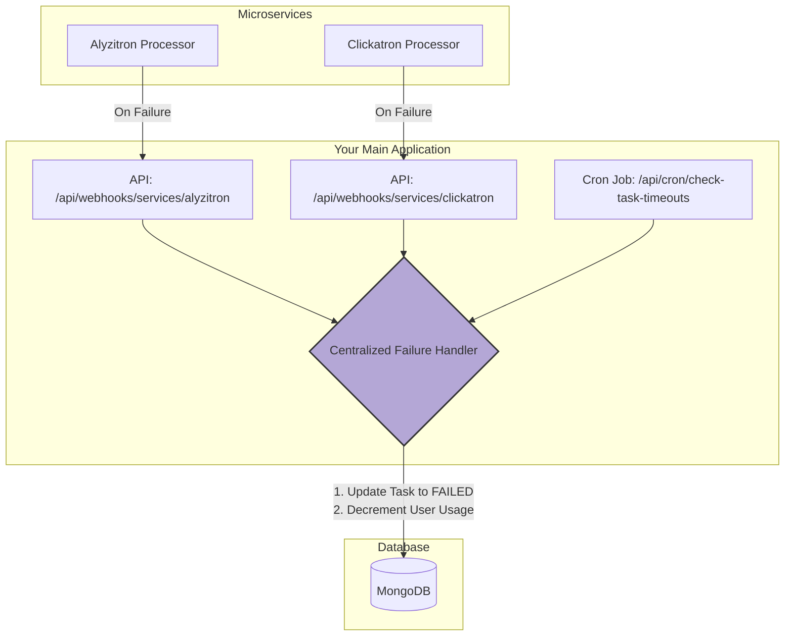

# Refactoring Plan: Task Failure & Timeout Handling

## 1. Executive Summary

This document outlines the plan to refactor the task failure and timeout handling mechanism for all integrated services, starting with `alyzitron` and `clickatron`. The current system relies on reactive, "on-fetch" logic that is unreliable, does not properly account for usage refunds, and is difficult to scale.

The proposed solution is a proactive, centralized architecture composed of two key components:
1.  **Webhook Endpoints:** For microservices to report immediate, definitive failures.
2.  **Scheduled Cron Job:** To proactively find and handle tasks that have timed out.

This new architecture will ensure that all failures are handled reliably, usage credits are refunded accurately, and the system is easily extensible for future services.

## 2. Core Problems with Current Implementation

- **Unreliable Triggers:** Failure and timeout logic is currently located in API routes that fetch task lists (e.g., `/api/services/clickatron/history`, `/api/services/alyzitron/analyses`). This logic only runs when a user happens to visit their dashboard, not when the failure actually occurs.
- **No Usage Refund:** The current timeout logic marks a task as `failed` but **does not** refund the usage credit that was debited when the task started.
- **Logic Duplication:** Similar, but not identical, timeout logic is duplicated across different service API routes.
- **Poor Scalability:** Adding a new service requires remembering to implement this non-obvious failure handling logic in a new place.

## 3. Proposed Architecture

We will implement a single, centralized `handleTaskFailure` utility. This utility will be the sole authority for processing a failed task. It will be triggered by two new mechanisms:

1.  **Service Webhooks:** New endpoints (`/api/webhooks/services/...`) will receive failure notifications directly from the processing microservices.
2.  **Cron Job:** A single cron job (`/api/cron/check-task-timeouts`) will run periodically to find tasks that are "stuck" (i.e., timed out) and pass them to the failure handler.

## 4. Implementation Checklist

This checklist will be executed by creating subtasks for a `code` role.

-   [x] **Phase 1: Foundation**
    -   [x] **1.1:** Create the shared `handleTaskFailure` utility function in `lib/services/tasks/handle-failure.ts`. This function will contain the core transactional logic for marking a task as failed and refunding user usage.
    -   [x] **1.2:** Add a `refunded: boolean` field to the `ClickatronTask` and `AlyzitronAnalysis` schemas.

-   [x] **Phase 2: Proactive Failure Reporting**
    -   [x] **2.1:** Create the webhook endpoint for `alyzitron` at `app/api/webhooks/services/alyzitron/route.ts`. This endpoint will validate the request and call the `handleTaskFailure` utility.
    -   [x] **2.2:** Create the webhook endpoint for `clickatron` at `app/api/webhooks/services/clickatron/route.ts`.

-   [x] **Phase 3: Timeout Handling**
    -   [x] **3.1:** Create the cron job endpoint at `app/api/cron/check-task-timeouts/route.ts`. This job will find stuck tasks for all services and call `handleTaskFailure` for each.

-   [x] **Phase 4: Cleanup**
    -   [x] **4.1:** Remove the old timeout logic from `app/api/services/clickatron/history/route.ts`.
    -   [x] **4.2:** Remove the old timeout logic from `app/api/services/alyzitron/analyses/route.ts`.
    -   [x] **4.3:** Remove the client-side timeout simulation from `components/dashboard/Alyzitron/InProgressAnalyses.tsx`.