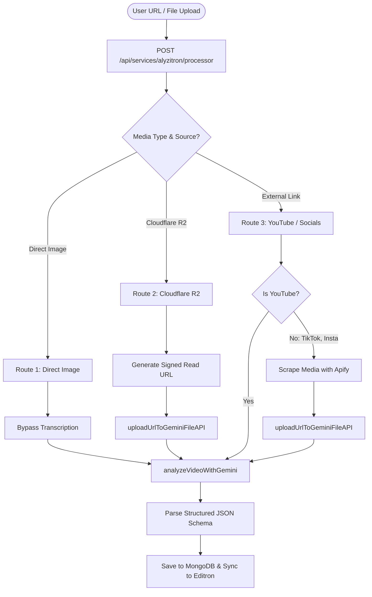
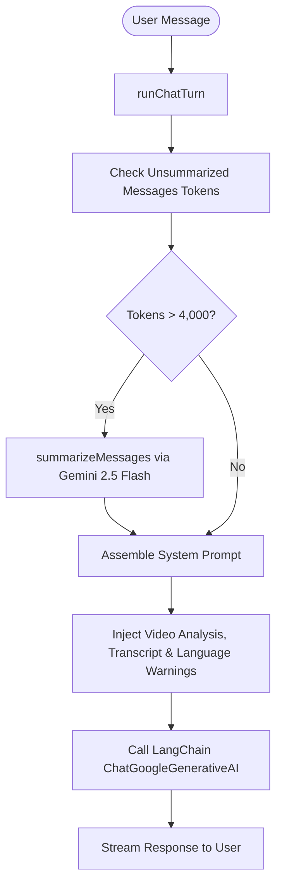

# Alyzitron Service Pipeline Overview

Alyzitron is the video analysis, transcription, and contextual chat subsystem of Insturix. This document explains the step-by-step pipeline from video ingestion to multimodal Gemini analysis and subsequent interactive chat sessions.

---

## 1. High-Level Architecture Flow

Alyzitron is split into two primary phases: **Ingestion & Multimodal Analysis** (which runs asynchronously when a video is added) and **Interactive Chat** (which runs dynamically when a user asks questions about the video).

### A. Ingestion & Analysis Pipeline Flow

### B. Interactive Chat Pipeline Flow

---

## 2. Asynchronous Ingestion & Analysis Pipeline

When a video/media is submitted, a job is triggered at `POST /api/services/alyzitron/processor`. The system sets the task status to `processing` and routes the media through one of three routes:

### Route 1: Direct Image Upload
*   **Trigger:** File extension ends with an image suffix (`.jpg`, `.png`, etc.) or mimeType starts with `image/`.
*   **Logic:**
    1.  Bypasses audio transcription completely (marks deepgram requestId as `"image-bypass"`).
    2.  Sends the image URL directly to Gemini.
    3.  Runs analysis and returns visual metadata.

### Route 2: Cloudflare R2 Path (Local File Uploads)
*   **Trigger:** File resides in Cloudflare R2 storage (detected via domain or metadata flag).
*   **Logic:**
    1.  Generates a signed read URL via `AlyzitronR2Manager.getSignedReadUrl` if it's a private URL.
    2.  Uploads the media to the **Gemini File API** (`uploadUrlToGeminiFileAPI`) to get a native Google cloud `fileUri`.
    3.  Calls `analyzeVideoWithGemini` with the File API URI.
    4.  Extracts the transcript and speaker diarization directly from the Gemini multimodal response.

### Route 3: External Links (YouTube, Instagram, TikTok, etc.)
*   **Sub-Route 3A: YouTube (Direct)**
    *   Gemini handles YouTube URLs natively. The system passes the YouTube URL directly to `analyzeVideoWithGemini` without any pre-downloading or scraping.
*   **Sub-Route 3B: Other Social Links (TikTok, Instagram, etc.)**
    *   Uses Apify (`extractMediaUri`) to scrape the platform-specific CDN URLs for video and/or audio.
    *   Uploads the scraped media files directly to the **Gemini File API**.
    *   If a separate audio track is present, uploads both video and audio tracks to Gemini File API and sends them as dual-file inputs to Gemini.

---

## 3. Gemini Multimodal Analysis Structure

The multimodal analysis is executed inside `vertexAiService.ts` via the `analyzeVideoWithGemini` function.

*   **Primary Model:** `gemini-3.1-flash-lite-preview`
*   **Fallback Model:** `gemini-2.5-flash`
*   **API Configuration:**
    *   `responseMimeType`: `"application/json"`
    *   `responseSchema`: Strict JSON schema specifying analysis metrics, timestamps, and speaker transcripts.
    *   `thinkingConfig`: High level preview reasoning enabled.

### A. Strict Response Schema
Gemini is instructed to return a structured JSON response containing:
1.  `category`: (String) e.g., Entertainment, Education.
2.  `overall_score`: (Integer, 1-100) Calculated using weighted categories: Visual Quality (25%), Audio Quality (20%), Content Value & Clarity (20%), Engagement (15%), Pacing (10%), Platform (5%), Compliance (5%).
3.  `overview`: (String) 2-3 sentence video summary.
4.  `remarks`: Brief professional assessment considering the location context.
5.  `target_audience`: Target demographic details.
6.  `titles` / `descriptions`: Suggested viral titles (3) and descriptions (2).
7.  `strengths` / `weaknesses`: Arrays of video pros and cons.
8.  `analysis`: Category-wise metrics (e.g. Visual Pacing, Animation Clarity) with 1-100 scores.
9.  `compliance_risks`: Platform and location compliance warnings with risk scores (1-100).
10. `full_transcript`: Verbatim transcript string of all dialogue.
11. `speaker_segments`: Array of object containing speaker name, text, and starting timestamp.

### B. Core System Prompt Instructions
The Gemini prompt includes regional, platform, and legal constraints:
*   **Platform Customization:** Tailor language based on the target platform (e.g., Short/Simple for Social Media, Formal/Neutral for Documentary).
*   **Location and Legal Constraints:** Checks `context.location` (e.g., India, USA, UAE). If India, checks compliance under IT Act 2000; if USA, checks COPPA. Enforces rules prohibiting insults to high authorities in jurisdictions where such speech is illegal.
*   **Face/Celebrity Recognition:** Allows naming well-known public figures only if confidence is high; otherwise, uses generic descriptors. Naming private individuals is forbidden.
*   **Timestamp Formatting:** Embeds single strict timestamps naturally in descriptions using `[HH:MM:SS]` format.

---

## 4. Interactive Chat & Context Management Pipeline

Once a video is analyzed and saved, users can chat with it in the dashboard. The chat runs through `chatEngine.ts` and `contextManager.ts` using the following steps:

### A. Rolling Context Summarization
Since video transcripts can be massive, the chat uses a rolling summarization system to fit conversations within a conservative token budget:
*   **Context Budget:** Max 8,000 tokens for chat history.
*   **Trigger:** If unsummarized message tokens exceed `4,000` (50% threshold), a summarization step is triggered.
*   **Summarization Call:**
    *   Splits history: Keeps the last 6 messages verbatim for coherence.
    *   Older messages are sent to Gemini 2.5 Flash to generate a rolling summary.
    *   **Prompt rules:** Captures questions/answers, timestamps, and confusion points in third-person, under 300 words.
    *   Uses a `thinkingBudget` of 200 tokens to ensure a high-quality summary is drafted.

### B. System Prompt Assembly
On every message, a dynamic system prompt is built containing:
1.  **Language Note Warning:** Warns the model if the transcript is in an unsupported language or has low confidence.
2.  **AI Video Analysis:** Injecting the cached summary, topics, moments, speakers, sentiment, and tags.
3.  **Full Transcript:** Injects the diarized transcript in `[MM:SS] Speaker X: text` format.
4.  **Guardrails:** Enforces citations, timestamp references, and prevents hallucination of video details.

### C. Chat Call
*   **Model:** `gemini-2.5-flash`
*   **Input:** System Prompt (containing video details & transcript) + Conversation Summary + Last 6 verbatim messages + New User Message.
*   **Streaming:** Streams chunks to the UI via LangChain and Server-Sent Events (SSE).

---

## 5. API Call & Cost Contribution

1.  **Video Ingestion & Analysis:**
    *   **1 API Call (Multimodal):** Multi-gigabyte video/audio analysis and transcript extraction using `gemini-3.1-flash-lite-preview`.
2.  **Chat Question (Normal):**
    *   **1 API Call (Streaming):** `gemini-2.5-flash` streams the answer based on the loaded transcript context.
3.  **Chat Question (Context Overflow):**
    *   **2 API Calls:** 1 Call to `summarizeMessages` (rolls old history into a paragraph) + 1 streaming call for the actual response.
