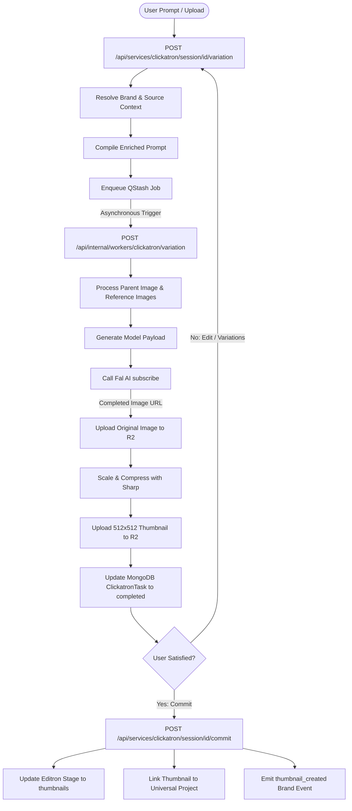

# Clickatron Service Pipeline Overview

Clickatron is the visual ideation, thumbnail generation, and image editing subsystem of Insturix. It enables users to generate high-quality images and progressively refine them using inpainting (generative fill), sketch-based annotations (sketch-to-edit), and chat-driven instructions. This document outlines the step-by-step pipeline from the initial request to worker execution, storage, and downstream asset committing.

---

## 1. High-Level Architecture Flow

Clickatron operates on a decoupled, queue-based architecture using **Upstash QStash** to process long-running Fal AI generation jobs asynchronously.

---

## 2. Ingress & Handoff Pipeline

When a user requests a variation, the request lands at `POST /api/services/clickatron/session/[id]/variation`.

### A. Parameter & Asset Resolution
1.  **Deductions:** Validates and deducts credits (3 credits per variation generation) via `checkCredits` middleware.
2.  **FormData Parsing:** Extracts prompt, model ID, aspect ratio, parent variation ID (for edits), fine-tuning weights, and metadata.
3.  **Reference Images:** Uploads any uploaded files (used as style or subject references) to Cloudflare R2 and retrieves clean, long-term storage URLs.
4.  **Idempotency Check:** Evaluates the `Idempotency-Key` header to prevent double-submitting identical requests.

### B. Prompt Enrichment
Before enqueuing, the service fetches context to make the generation brand-aware and content-aligned via `lib/clickatron/brand-prompt-context.ts`:
*   **Brand Context:** Fetches the active `UnifiedBrand` profile and compiles it into a string block (`resolveClickatronBrandContextBlock`).
*   **Source Context:** Captures details from the linking script or campaign (objective, hook, visual metaphor, text density, slides) via `buildClickatronSourceContextBlock`.
*   **Assembly:** Compiles them with negative-prompt guardrails (e.g., instructing the model to leave negative space, avoid rendering baked-in text, and only return raw backgrounds) using `buildClickatronGenerationPrompt`.

### C. Queue Dispatching
*   Updates the `ClickatronTask` MongoDB document with a new variation entry in `generating` status.
*   Dispatches the job to Upstash QStash (`enqueueClickatronJob`) which routes it to `/api/internal/workers/clickatron/variation` in production, or fires a direct local HTTP request in development.

---

## 3. Worker Execution (Fal AI & Image Processing)

The worker at `app/api/internal/workers/clickatron/variation/route.ts` handles the heavy lifting of calling Fal AI models.

### A. Context & Input Pre-processing
*   **Parent Image Resolution:** If a `parentVariationId` is present, it downloads the parent image URL and validates its accessibility.
*   **Reference Images:** Loads up to 2 reference images for image-to-image or style conditioning.
*   **Aspect Ratio Mapping:** Normalizes input aspect ratio strings (e.g. `16:9`, `9:16`, `1:1`) to exact model dimensions (e.g. `1024x576`, `576x1024`, `1024x1024`).
*   **Input Modes Logic:**
    *   **Generative Fill / Inpainting:** Expects a `parentVariationId` and a `maskUrl` (defining the edit boundary). Mapped to `fal-ai/flux-general/inpainting` or `fal-ai/flux-pro/v1/fill`.
    *   **Sketch-to-Edit:** Expects a parent image (original canvas) and reference image 1 (annotated sketch showing the changes). Appends a strict system prompt instructing the model to apply the modifications from the sketch to the original image without altering other details.
    *   **Text-to-Image:** Standard generation from the compiled prompt.

### B. Model Execution
Calls Fal AI asynchronously using `fal.subscribe(...)` with the mapped payload:
*   Enforces `enable_safety_checker: false` to prevent arbitrary "Adjust Prompt" blockages.
*   Injects a randomized numerical seed (storing it for downstream consistency).
*   Handles model routing dynamically based on features (e.g., inpainting vs. raw generation).

### C. Post-Processing & R2 Upload
1.  **Image Upload:** Downloads the generated image from Fal's temporary storage and uploads the full-resolution file to R2.
2.  **Thumbnail Generation:** Uses the `sharp` library to resize the image to `512x512` webp (quality 75, effort 4) for high-performance frontend rendering.
3.  **Task Finalization:** Updates the MongoDB variation document:
    *   Sets `status` to `completed`.
    *   Stores the raw R2 image path and thumbnail path.
    *   Saves the seed and generation parameters.

---

## 4. Committing Assets & Handoff

Once the user is satisfied with a variation, they click "Commit", hitting `POST /api/services/clickatron/session/[id]/commit`.

This marks the end of the image generation lifecycle and routes the assets to downstream consumers:
1.  **Stage Advance:** Automatically updates the linked Editron project pipeline stage to `"thumbnails"`.
2.  **Project Links:** Records the thumbnail mapping on the Universal Project document (`recordThumbnailOnLink`).
3.  **Analytics & Signal Pipeline:** Emits a `thumbnail_created` event to the brand event log (`emitBrandEvent`) which triggers downstream performance tracking.
