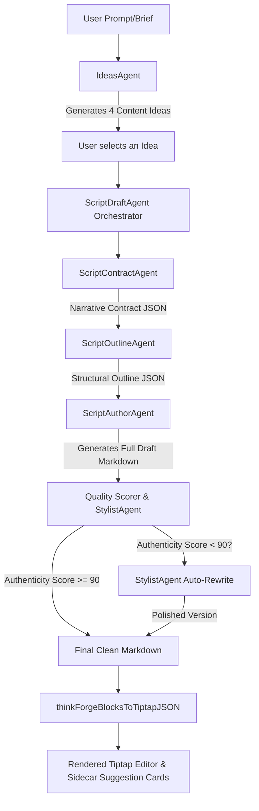

# ThinkForge Service Pipeline Overview

This document maps out the end-to-end execution pipeline of **ThinkForge** (from Idea Generation to final polished Script/Post generation).

---

## 1. End-to-End Execution Flow

Here is the architectural sequence of events in ThinkForge:



---

## 2. Step-by-Step Pipeline & Prompt Reference

### Step 1: Idea Generation (`IdeasAgent`)
*   **File:** `lib/thinkforge/agents/ideas-agent.ts`
*   **What Happens:** Takes the user's prompt and brand context, then generates exactly 4 diverse ideas matching the target platform's voice.
*   **Zod Schema Constraints:** Outputs `ideas: z.array(IdeaSchema).length(4)` (must contain exactly 4 items with `id`, `idea`, `purpose`, `style`, `format`, `platform`, `tone`).
*   **Prompt Template:**
    ```markdown
    You are a senior creative strategist. A user has described their project to you. Your job is to generate exactly 4 content ideas that are DIRECTLY rooted in what the user asked for.

    ## User's request
    "${userPrompt}"
    ${projectHint}${databankHint}

    ## Rules
    1. Every idea MUST be a concrete, actionable interpretation of the user's request — not a generic pivot away from it.
    2. Read the user's words carefully. If they said "documentary about X," all 4 ideas must be documentary-related — not social media posts or carousels.
    3. Each idea should take a DIFFERENT angle on the same core request: a different narrative structure, audience focus, visual approach, or emotional lens.
    4. The "purpose" must explain what this specific angle achieves that the others don't.
    5. Formats and platforms must match the project's actual medium. A feature film project gets screenplay treatments, not TikTok reels.
    6. Titles should be specific and evocative, not generic ("Untold Stories of X" is better than "Content about X").

    ## Output schema per idea
    - id: "idea_1" through "idea_4"
    - idea: Specific, compelling title (max 80 chars) that captures the angle
    - purpose: What this angle achieves for the project (1-2 sentences)
    - style: Visual/editorial style (e.g., "cinéma vérité", "data-driven explainer", "montage-driven narrative")
    - format: Actual deliverable format matching the project scope (e.g., "feature screenplay", "10-min documentary short", "pitch deck", "long-form essay")
    - platform: Where this lives (e.g., "Netflix", "YouTube", "Film Festival", "Internal", "Blog", "Multi-platform")
    - tone: One of: white (factual), red (emotional), black (critical), yellow (optimistic), green (creative), blue (analytical)

    Generate 4 ideas now.
    ```

---

### Step 2: Narrative Contract Creation (`ScriptContractAgent`)
*   **File:** `lib/thinkforge/agents/script-contract-agent.ts`
*   **What Happens:** Defines boundaries for narrator voice, allowed/forbidden elements, metaphors, and tone.
*   **Prompt Template:**
    ```markdown
    You generate a creative production contract for a project team. This contract guides how the document should be written—as clear, actionable direction tailored to the project's domain and needs.

    Project: ${context.projectSummary || '(No project context)'}
    User request: ${userPrompt}

    ## Output: JSON only
    Fill each field with values that guide execution-focused writing appropriate to the project type:

    - generation_mode: manual | playbook | narrative (set to manual unless user demands otherwise; narrative is legacy and should be avoided)
    - narrator_voice: one-word creative persona appropriate to the project (e.g., "strategist", "director", "producer", "researcher", "historian", "analyst")
    - medium: voiceover | slide_narration | visual_manual (choose based on the document type — visual_manual for production guides, voiceover for scripts, slide_narration for presentations)
    - tone: one word describing the creative voice (e.g., "confident", "grounded", "inspiring", "practical", "analytical", "authoritative")
    - forbidden: list of 2–3 elements to avoid (e.g., ["meta_instructions", "schema_artifacts", "filler_prose"])
    - allowed_metaphors: 2–3 short metaphors only (e.g., ["blueprint", "craft"])
    - style_notes: 2–3 short constraints emphasizing clean professional output (e.g., ["no schema artifacts", "execution-focused", "creator-first-voice", "no internal structure visible"])
    - metaphor_reuse_limit: 1
    - mode_a_usage: "opening/bridge only"
    - mode_b_usage: "default professional voice focused on immediate execution"
    - mode_switch_rules: "open in Mode A for brief framing, then Mode B for execution guidance"

    For generation_mode=manual: Write as a professional giving clear guidance. Use execution-style language, concrete direction, and remove all internal structure artifacts. Write content that enables immediate action by the intended audience—whether that's a film crew, a writer, a producer, or any other professional.

    Return JSON only.
    ```

---

### Step 3: Structural Outline Generation (`ScriptOutlineAgent`)
*   **File:** `lib/thinkforge/agents/script-outline-agent.ts`
*   **What Happens:** Generates a structured JSON outline with acts/beats tailored to the requested medium (e.g., PAS structure for short videos under 90s, AIDA for long-form).
*   **Prompt Template:**
    ```markdown
    You generate a structured outline for document authoring. Do not write prose; only supply a compact JSON outline.

    Project: ${context.projectSummary || '(No project context)'}
    User request: ${userPrompt}

    ## Output: Document outline (JSON only)
    Create 3–5 major sections or beats total. Prefer fewer, stronger sections. This outline is for internal steering only.

    Adapt the structure to the project type:
    - For video scripts/ads/reels (short-form, under 90s): use PAS structure — Hook, Problem, Solution, CTA (3-4 sections)
    - For video scripts/brand films (long-form, 90s+): use AIDA or Narrative Arc — Hook, Setup, Tension, Turn, Resolution, CTA (4-6 sections)
    - For screenplays/narratives: use dramatic beats (Setup, Tension, Turn, Resolution, Aftermath)
    - For technical documents (VFX briefs, budgets): use logical sections (Overview, Breakdown, Details, Summary, Contingency)
    - For character/world bibles: use encyclopedic sections (Introduction, Core Details, Relationships, Evolution, Edge Cases)
    - For interview guides: use flow sections (Setup, Opening, Deep-Dive, Emotional, Closing)
    - For research briefs: use analytical sections (Setup, Findings, Analysis, Resolution, Recommendations)

    Per section:
    - id: S1, S2, ... (stable)
    - title: short label (2–4 words)
    - goal: one sentence describing the purpose or intent of this section
    - beat: choose from Setup | Tension | Turn | Resolution | Aftermath | Hook | Problem | Solution | CTA | Bridge (use the best match for the content type)
    - level: act | beat (acts have no parent; beats parent an act)
    - parent_id: id of parent when level is beat
    - tone: optional one-word tone tag (e.g., "authoritative", "analytical", "tense", "practical")

    Return JSON only: { title, sections[], notes (optional one-liner on section dependencies) }.
    ```

---

### Step 4: Full Draft Generation (`ScriptAuthorAgent`)
*   **File:** `lib/thinkforge/agents/script-author-agent.ts`
*   **What Happens:** The agent acts as the primary content writer. It dynamically retrieves writing techniques based on the creative signals extracted from the prompt. It enforces strict platform constraints (LinkedIn/X character limits, hashtags, hook visibility thresholds) and outputs full-length markdown.
*   **Prompt Structure:** Synthesizes multiple components into a single large system prompt:
    1.  `<role>`: e.g., Senior Content Strategist or Video Scriptwriter.
    2.  `<task>`: Project summary and user request.
    3.  `<contract>`: Injects rules from the Narrative Contract.
    4.  `<brand_context>`: User's Brand Vault DNA.
    5.  `<writing_knowledge>`: Contextual techniques matching signals.
    6.  `<output_format>`: Formats for the specific target medium (e.g., scene-by-scene direction for videos, platform configurations for social posts).

---

### Step 5: Quality Audit & Stylist Polish (`StylistAgent` / "The Editor")
*   **File:** `lib/thinkforge/agents/stylist-agent.ts`
*   **What Happens:** Checks the output's authenticity score. If the score falls below `90`, it analyzes the draft for "AI slop" or brand misalignment, lists the violations, and triggers a targeted rewrite.
*   **Analysis Prompt:**
    ```markdown
    <role>You are the Stylist, a voice and brand guardian for a creative studio tool. Your mission: protect the creator's authentic voice and ensure output doesn't read like "AI slop."</role>

    <task>
    1. Voice Flags: find sentences that sound robotic, overly formal, generic, or off-brand. Tag each with issue type + specific rewrite.
    2. Pattern Interrupts: suggest 2-5 places for unexpected elements (joke, slang, rhythm break) to humanize the script.
    3. Tone Analysis: compare detected tone vs target tone.
    4. Overall Score: 0-100 authenticity. 90+ = sounds human. 60-89 = needs tweaks. <60 = AI slop.
    </task>

    <rules>
    - Be specific. Not "add more personality" — say exactly what to add and where.
    - Pattern interrupts must match the creator's brand, not generic humor.
    - If no brand DNA loaded, infer voice from the draft itself.
    - Every flag must have a concrete suggestion. Return valid JSON matching the schema.
    </rules>

    <input_data>
    ${context.systemBrief ? `Brand DNA / Voice Profile: ${context.systemBrief}` : 'Brand DNA: (none loaded — analyze the draft style)'}
    ${context.projectSummary ? `Project context: ${context.projectSummary}` : ''}
    Draft to analyze: ${userPrompt}
    </input_data>
    ```

*   **Rewrite Prompt (triggered if score < 90):**
    ```markdown
    <role>You are a copy editor making targeted fixes to a draft.</role>

    <task>
    Rewrite the draft below, fixing ONLY the listed issues.
    Output the COMPLETE rewritten draft — not a diff, not a summary, the full text.
    </task>

    <rules>
    - Fix each listed issue by rewriting the specific sentence or phrase.
    - Replace AI-sounding phrases with natural, specific alternatives.
    - Do NOT change sentences that are not related to the listed issues.
    - Do NOT introduce new filler words (leverage, seamless, robust, elevate, foster, empower, landscape, tapestry, etc.)
    - Preserve all markdown formatting, headings, scene headers, hashtags, and structure.
    - Preserve the overall section order and flow.
    </rules>

    <issues_to_fix>
    ${issueList}
    </issues_to_fix>

    ${brandContext ? `<brand_context>\n${brandContext}\n</brand_context>\n\n` : ''}<draft_to_fix>
    ${content}
    </draft_to_fix>
    ```

---

## 3. LLM API Call Breakdown

ThinkForge optimizes API usage, but due to its multi-agent nature, it can require multiple LLM calls. Let's break down the exact API calls made at each stage:

### A. Phase 1: Idea Generation
*   **Total API Calls: 1**
    1.  `IdeasAgent` (Gemini model) runs 1 structured generation call to return 4 ideas.

### B. Phase 2: Script/Document Creation (`chat-service.ts` + `ScriptDraftAgent` Pipeline)

Before the script writing starts, there are **Pre-Draft Phase** checks:
*   **Pre-Draft Call 1 (Conditional):** `classifyIntentFallback` (Gemini Structural tier) — If the local regex classifier is ambiguous (confidence < 0.65), an LLM call is made to classify user intent.
*   **Pre-Draft Call 2:** `runThinkingAgent` (Gemini Structural tier) — Runs right before script generation to show 3-6 quick bullet points of reasoning in the chat UI.

Once the draft generation begins (`ScriptDraftAgent`):

#### 1. Happy Path (Quality Score >= 90): **3 to 5 API Calls**
*   **Call 1:** `ScriptContractAgent` (`gemini-2.5-flash-lite`) — structured JSON generation to lock the writing rules and style.
*   **Call 2:** `ScriptOutlineAgent` (`gemini-2.5-flash`) — structured JSON generation to build the outline structure.
*   **Call 3:** `ScriptAuthorAgent` (`gemini-2.5-flash` or similar) — text generation (streaming) to write the actual content.
*(Note: Quality scoring is done locally in code and takes 0 API calls).*
*   **Total for Happy Path:** **3 calls** (if intent classification is handled locally by heuristic) or **5 calls** (if intent classifier fallback + thinking bullets are both triggered).

#### 2. Worst Case Path (Quality Score < 90 + Ambiguous Intent): **7 API Calls**
In the absolute worst-case scenario (user's intent is ambiguous, thinking bullets are rendered, and the generated content has low quality/AI-slop that needs polishing):
*   **Call 1 (Pre-Draft):** `classifyIntentFallback` — Intent classification.
*   **Call 2 (Pre-Draft):** `runThinkingAgent` — Pre-generation reasoning bullets.
*   **Call 3 (Draft):** `ScriptContractAgent` — Narrative contract creation.
*   **Call 4 (Draft):** `ScriptOutlineAgent` — Outline creation.
*   **Call 5 (Draft):** `ScriptAuthorAgent` — Raw draft creation.
*   **Call 6 (Polish):** `StylistAgent` (Voice Check) — Structured JSON audit call to review and flag voice authenticity issues.
*   **Call 7 (Polish):** `StylistAgent` (Rewrite) — Text generation call to patch/rewrite sections with quality violations.


---

## 4. Document / Post Type Handling & Pipeline Differentiation

### Is the Pipeline Different for Different Post Types?
**No, the high-level orchestration pipeline remains the same.** Whether the user wants a LinkedIn Post, a YouTube Video Script, a VFX Brief, or a Production Budget, the execution always flows sequentially through:
`ScriptDraftAgent` ➔ `ScriptContractAgent` ➔ `ScriptOutlineAgent` ➔ `ScriptAuthorAgent` ➔ `StylistAgent`.

However, the **internal behavior, rules, and generated prompt segments change dynamically** based on code-level detection.

### How ThinkForge Handles Different Formats Dynamically:

1.  **Intent & Platform Detection (Post-Output Enforcement):**
    Inside `ideas-agent.ts`, the system runs regex checks against the user's prompt (e.g., matching keywords like "LinkedIn", "TikTok", "newsletter"). It locks down the allowed platforms dynamically so that text intents only return text platforms (LinkedIn, Twitter, Medium) and video intents only return video platforms (YouTube, TikTok, Reels).

2.  **Role Play Adaptability (`inferRoleFromContext`):**
    Inside `script-author-agent.ts`, the system inspects the document type and user prompt to dynamically select a **Document Role Profile**.
    *   *LinkedIn/Twitter post:* AI becomes a *"Senior Content Strategist and Copywriter"*.
    *   *Video Script:* AI becomes a *"Senior Creative Director and Video Scriptwriter"*.
    *   *VFX Brief:* AI becomes a *"Senior VFX Supervisor and Technical Director"*.
    Each profile changes the execution benchmarks and output expectations.

3.  **Strict Formatting Blocks (`buildOutputFormatBlock`):**
    Depending on the detected medium, the prompt injected into `ScriptAuthorAgent` instructs the model differently:
    *   **For Social Posts (LinkedIn, X, FB):** It injects strict structural rules (Step 1: Hook under fold line limits, Step 2: Body paragraphs <= 3 sentences, Step 3: CTA questions, Step 4: Hashtags), character targets (e.g., 1,300-1,900 chars for LinkedIn), and formatting limits (e.g., no Markdown headings, no script descriptors).
    *   **For Video Scripts:** It injects a scene-by-scene timing structure (e.g., `## [0:00-0:08] Scene 1`), demanding exactly 7 labeled elements per scene (VO/On-Camera delivery notes, Visual, Audio SFX, Text overlay, Movie reference Mood, and Transition).
    *   **For Technical Docs (VFX Briefs/Budgets):** It defaults to standard Markdown headings (`##`, `###`) and enforces modularity, data tables, and clarity over emotional language.


