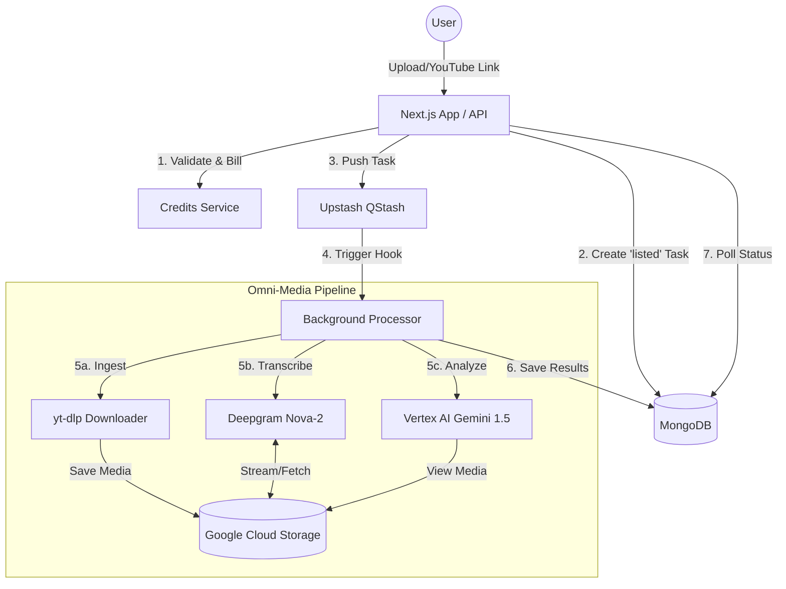

# Alyzitron: Deep-Dive Infrastructure & Architecture

This document provides a highly detailed technical breakdown of the Alyzitron engine, its distributed components, and the logic behind its omni-media pipeline.

---

## 1. System Architecture

Alyzitron follows a **Producer-Consumer** architecture decoupled by a serverless message queue (**Upstash QStash**). This ensures that heavy processing (Download, ASR, LLM) does not block the main application thread.

---

## 2. The Media Life Cycle (Latency Analysis)

The pipeline is optimized for reliability over absolute speed, prioritizing "successful completion" for large files.

### Phase 1: Ingestion (Latency: ~1s)
- **Local Upload**: Client-side signed URL upload directly to GCS. Bypasses Next.js server to avoid 4.5MB payload limits and unnecessary ingress.
- **Remote Link**: `analyze/route.ts` quickly validates the YouTube URL via API and queues the task.

### Phase 2: Orchestration (Latency: 500ms - 2s)
- **QStash**: Decouples the request. Reliability is guaranteed via retries if the worker endpoint times out.

### Phase 3: The Heavy Lifting (Latency: Variable)
- **Downloader (`yt-dlp`)**: 
    - *Logic*: Uses `yt-dlp-exec` with a pre-configured Android player client arg to bypass YouTube's strictest blocks. 
    - *Placement*: Lives in `lib/alyzitron/transcription/downloader.ts`.
    - *Optimization*: For YouTube, we only extract audio (MP3) to minimize egress costs and transcription time.
- **Deepgram ASR**: 
    - *Model*: `nova-2`.
    - *Why?*: High accuracy for Indian accents (Hindi/English) and provides speaker diarization out-of-the-box.
- **Vertex AI (Gemini 1.5 Flash)**: 
    - *Multimodal*: Gemini doesn't just "read" the transcript; it analyzes the visual signals directly from the GCS URI.

---

## 3. Storage & Delivery Strategy

Current implementation uses **Google Cloud Storage (GCS)** as the primary source of truth.

### Why GCS currently?
- **Native Integration**: Vertex AI (Gemini) can ingest `gs://` URIs directly, which is faster than downloading over public HTTP.
- **Signed URLs**: Secure, temporary access for the frontend and Deepgram.

### Insight: The "Editron" Style Upgrade (R2 & CDN)
Based on the improvements seen in Editron, Alyzitron's infra can be further optimized:
1.  **R2 Migration**: Moving from GCS to Cloudflare R2 would eliminate **egress costs** entirely. This is significant since Deepgram and Gemini both "fetch" the media.
2.  **CDN Caching (Cloudflare)**: 
    - Analysis results (JSON) are relatively static once generated.
    - Video playback for external links (Insta/X) currently streams from GCS. A CDN layer would drastically reduce latency for repeat viewers.
3.  **Edge Routing**: Using Cloudflare Workers for the initial validation layer could cut ingestion latency in half.

---

## 4. Database Schema Insight

### `analyses` (Collection)
The state machine for each task:
- `status`: `listed` -> `processing` -> `completed` / `failed`
- `results`: Stores the multi-dimensional AI analysis (Sentiment, Safety, Compliance).
- `usageMinutes`: Tracks exact billing to prevent credit leakage.

### `alyzitron_transcriptions` (Collection)
Stored separately to enable the **Video Chat** feature without re-analyzing the video.
- `speakerSegments`: Used to build the transcript window in the chat UI.
- `formattedTranscript`: The prompt-ready version of the transcript.

---

## 5. Cost Breakdown & Efficiency

| Component | Cost Driver | Optimization Used |
| :--- | :--- | :--- |
| **GCS** | Storage & Egress | Auto-deletion of temp `/alyzitron-uploads/` files. |
| **Deepgram** | Per Minute | Audio-only extraction for video files. |
| **Vertex AI** | Input Tokens (Multimodal) | Short-form summary prompts; use of Flash model for 90% of tasks. |
| **QStash** | Per Execution | Batching avoid; direct triggering. |
