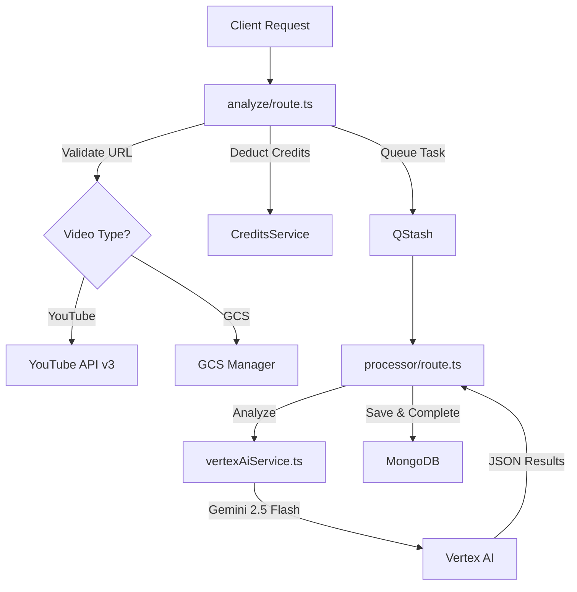

# Alyzitron Analysis Workflow Documentation

This document explains how Alyzitron ingests video links (YouTube or GCS), processes them asynchronously, and generates AI-powered analysis using Google Gemini.

---

## 🚀 High-Level Workflow

The analysis process is split into three main phases: **Ingestion**, **Orchestration**, and **Core Analysis**.

---

## 1. Video Ingestion (`app/api/services/alyzitron/analyze/route.ts`)

This endpoint is the entry point for starting a new analysis.

### Video Input Handling
- **YouTube Links:**
  - Validated via `validateYouTubeVideo` (in `utils/youtube.ts`).
  - Uses **YouTube Data API v3** to check if the video is public/unlisted and retrieve its duration.
  - Fetches the video title using the **YouTube oEmbed API**.
- **GCS Paths (`gs://`):**
  - Used for videos uploaded directly to Alyzitron.
  - Metadata (duration, filename) is typically provided by the client during the upload phase.

### Credit Management
- **Cost Calculation:** Analysis costs **2 credits per minute** of video duration.
- **Pre-deduction:** Credits are deducted *before* queueing to ensure the user has sufficient balance.

### Task Queueing
- A new document is created in the `analyses` MongoDB collection with status `listed`.
- The task is published to **Upstash QStash**, which handles reliable asynchronous delivery to the processor.

---

## 2. Orchestration & Error Handling (`app/api/services/alyzitron/processor/route.ts`)

The processor is triggered by QStash and manages the execution state.

- **Status Tracking:** Immediately updates the task status to `processing`.
- **Service Integration:** Calls the logic in `vertexAiService.ts` to perform the actual AI analysis.
- **Robust Refunds:** If the analysis fails (due to network issues, AI errors, or invalid content), the system automatically **refunds** the deducted credits to the user and marks the task as `failed`.

---

## 3. Core AI Analysis (`lib/services/vertexAiService.ts`)

This is where the "magic" happens using Google's Vertex AI platform.

### The Gemini Engine
- **Model:** `gemini-2.5-flash`
- **Native Video Ingestion:** Instead of downloading the video to the server, the **GCS URI** is passed directly to Gemini. Gemini has the native capability to "watch" videos stored in GCS.
- **Structured Output:** Uses a strict **Response Schema** (`SchemaType.OBJECT`) to force Gemini to return valid, predictable JSON.

### Prompt Engineering
The system prompt is dynamically built for every video, including:
- **Metadata:** Title and duration.
- **User Context:** 
  - **Family-Friendly Mode:** Adjusts safety thresholds and strictly forbids adult/violent themes.
  - **Platform Context:** Tailors the tone (e.g., "Short and engaging" for Social Media vs. "Professional" for Television).
  - **Location/Legal Context:** Instructs Gemini to analyze through the lens of specific regional laws (e.g., India's IT Act) and cultural norms.
- **Citation Rules:** Forces Gemini to embed timestamps in the `[HH:MM:SS]` format naturally within descriptions.

---

## 📂 Key Files Summary

| File | Responsibility |
| :--- | :--- |
| `analyze/route.ts` | Entry point, validation, credit deduction, and QStash queueing. |
| `processor/route.ts` | Orchestrator triggered by QStash; handles state updates and refunds. |
| `vertexAiService.ts` | Core AI logic; interacts with Vertex AI SDK and manages Gemini prompts/schemas. |
| `utils/youtube.ts` | YouTube URL parsing and API validation logic. |
| `utils/gcs.ts` | Utilities for managing signed URLs and file deletion in Cloud Storage. |
| `types/index.ts` | Shared TypeScript interfaces for analysis results and task states. |

---
